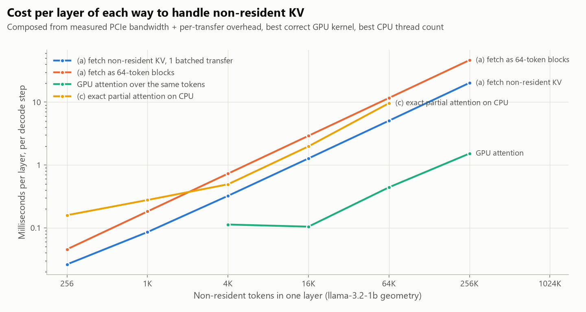
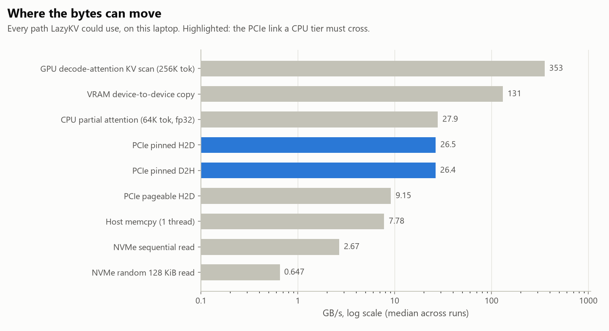
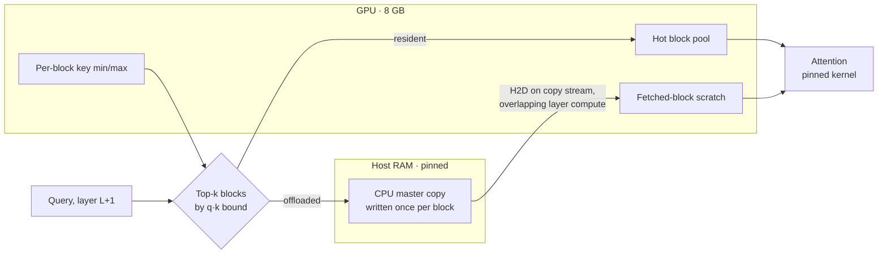

<!-- GENERATED by scripts/render_docs.py from docs/templates/README.md.tmpl. Edit the template, not this file. Numbers come from results/**/metrics.json. -->

<div align="center">

# LazyKV

**A tiered KV-cache runtime and residency-policy study for long-context LLM inference on one 8 GB laptop GPU.**

*Under a fixed GPU KV budget, how much context and quality can block residency, migration, compression, and prefetching retain?*


</div>

---

LazyKV treats GPU VRAM as a cache over a larger logical KV cache held in pinned host RAM,
and compares residency policies on equal terms: the same model, the same budget sweep, the
same prompts, and the same quality metrics. **It is not a new mechanism.** Query-aware block
selection, CPU backup and recall, and layer-ahead prefetch all exist already (Quest,
ArkVale, InfiniGen, and others; see [related work](docs/RELATED_WORK.md)). The contribution
is a careful, reproducible study of those ideas on constrained consumer hardware, with
negative results included.

> **Status: Phase 1 (trustworthy baseline) complete.** The full-GPU KV reference runs to
> 65,536 tokens, with a verified attention kernel, a per-layer timing split and a quality
> harness whose noise floor was measured, found wrong, and fixed. No offloading policy exists yet.
> Gate reports: [Phase 0](docs/phases/PHASE_0.md) · [Phase 1](docs/phases/PHASE_1.md).

## Phase 1 in brief

| | |
|---|---|
| Decode, full cache, 4,096 → 65,536 tokens | **49.7 → 52.0 tokens/s** (median of 3 runs) |
| Time to first token at 65,536 tokens | **18.3 s** |
| Per-layer window a layer-ahead prefetch can overlap | **1.33 ms–1.54 ms**, 3–13× Phase 0's lower bound |
| One layer's KV fetchable inside that window at 65,536 tokens | **27%** of the context |
| Attention kernel share of a decode layer, 4,096 → 65,536 tokens | 13% → 38% |
| cuDNN decode calls not bit-repeatable on identical inputs | **11 of 1,024** → quality is scored on a repeatable kernel |
| Latency cost of Windows moving the process to E-cores | **2.08×** median → benchmarks opt out of power throttling |

<picture>
  <source media="(prefers-color-scheme: dark)" srcset="docs/figures/p1_latency_regimes-dark.png">
  
</picture>

Both negative results were caught by validating the instruments before any policy used them.
Either one would have shown up in Phase 2 as a policy effect that was not there.

## Phase 0 in one picture

<picture>
  <source media="(prefers-color-scheme: dark)" srcset="docs/figures/design_costs-dark.png">
  
</picture>

Every line is composed from measured components. **Fetching a layer's offloaded KV costs
about an order of magnitude more than attending to it on the GPU.** Dense offload is
therefore out, and a small, query-selected set fetched inside the compute window is in.
Exact CPU-side attention lands in between, and whether it wins depends on memory layout.

## What we measured

All values are medians of 3 independent runs. [Full method and ranges →](SYSTEM_INFO.md)

| | |
|---|---|
| Pinned PCIe host→device | **26.52 GB/s** (Gen5 x8 under load) |
| VRAM device-to-device copy | **130.90 GB/s** |
| VRAM ÷ PCIe | **4.9×**: *not* the 20–40× the original brief assumed |
| Pinned H2D reaches 80% of its bandwidth at | **386 KiB** per transfer |
| KV fetch ÷ GPU attention, 65,536 tokens in one layer | **11.5×** |
| Share of those tokens fetchable while the layer computes | **≈9%** (lower bound) |
| GPU copy engines | **1**: H2D and D2H never overlap |
| Default SDPA dispatch vs cuDNN attention at 65,536 tokens | **33.1× slower** (no FlashAttention on Windows) |
| NVMe sequential read | 2.67 GB/s: an SSD tier adds capacity, not speed |

<picture>
  <source media="(prefers-color-scheme: dark)" srcset="docs/figures/bandwidth_ladder-dark.png">
  
</picture>

## The design decision

The original brief offered three ways to handle a KV block that is not in VRAM when a
layer runs. Phase 0 settled which ones hold up ([arithmetic](docs/IMPLEMENTATION_PLAN.md#3-which-design-the-measurements-support)):

| | Design | Verdict |
|---|---|---|
| (a) | Fetch all non-resident KV before the layer runs | ❌ ~11× the attention it feeds; overlap cannot hide it |
| (b) | Skip blocks; select the ones that matter with a cheap query-aware bound; prefetch only those | ✅ **Primary design.** The fetch cost scales with the selected set |
| (c) | Attend to non-resident blocks on the CPU and merge exactly | ⚠️ Exactness fallback for small sets only. It is layout-dependent: slower than a contiguous fetch, faster than gather-then-fetch |

## Planned architecture



It integrates with Hugging Face Transformers through one `Cache` subclass and one attention
override for one model class. Nothing else in Transformers is patched.

## Policy ladder (planned)

1. Full GPU KV (reference) → 2. Sliding window + attention sink → 3. LRU blocks → 4. H2O-style
attention-score eviction → 5. Quest-style query-aware selection → 6. + CPU tier, synchronous
fetch → 7. + layer-ahead async prefetch → 8. + int8 warm/cold tiers → 9. + exact CPU merge.

Every rung gets the same budget sweep (100% down to 6.25% of the KV at 32K) and the same
quality metrics: teacher-forced KL, top-1 agreement, and depth-swept needle-in-a-haystack,
all with confidence intervals.

## Repository map

| Path | What |
|---|---|
| [`CLAUDE.md`](CLAUDE.md) | Project rules: no fabricated numbers or citations, phase gates, dependency policy |
| [`docs/BRIEF.md`](docs/BRIEF.md) | Full research brief |
| [`SYSTEM_INFO.md`](SYSTEM_INFO.md) | Machine inventory and all Phase 0 microbenchmarks |
| [`docs/IMPLEMENTATION_PLAN.md`](docs/IMPLEMENTATION_PLAN.md) | Design decision, architecture, phases, risks |
| [`docs/KV_MEMORY_MODEL.md`](docs/KV_MEMORY_MODEL.md) | KV geometry of candidate models, from real `config.json` |
| [`docs/RELATED_WORK.md`](docs/RELATED_WORK.md) | Verified survey of 36 systems and papers, and LazyKV's honest delta |
| [`docs/RESEARCH_LOG.md`](docs/RESEARCH_LOG.md) | Dated findings, including measurement mistakes caught |
| `scripts/` | Benchmarks, analysis, figures, doc rendering |
| `lazykv/` | Runtime: preallocated full-GPU cache, verified attention kernels, chunked prefill, profiling, quality metrics |
| `harness/` | Stats, telemetry, GPU memory guard, host scheduling, metrics I/O, template renderer |
| [`docs/phases/`](docs/phases) | Gate report per phase |
| `results/` | Raw `metrics.json` and telemetry for every reported run |

## How numbers get into the docs

No benchmark value in any markdown file is typed by hand. Prose lives in
`docs/templates/*.md.tmpl` with placeholders such as
<code>&#123;&#123; phase0.analysis.vram.ratio_d2d_over_pinned_h2d.median | x &#125;&#125;</code>. `scripts/render_docs.py`
resolves them from `results/**/metrics.json`, and a missing value renders as *not measured*.
A test fails if a committed doc drifts from its data.

## Reproduce Phase 0

Windows 11, Python 3.12, NVIDIA driver with CUDA 13 support.

```powershell
uv venv --python 3.12 .venv
uv pip install --python .venv\Scripts\python.exe -r requirements.lock `
  --index-url https://download.pytorch.org/whl/cu130 `
  --extra-index-url https://pypi.org/simple --index-strategy unsafe-best-match

# ~2 min per run; launch detached and poll the log
.venv\Scripts\python.exe scripts\00_feasibility.py --run-id 1 > logs\feasibility_run_1.log 2>&1
.venv\Scripts\python.exe scripts\kv_memory_model.py
.venv\Scripts\python.exe scripts\analyze_phase0.py
.venv\Scripts\python.exe scripts\make_figures.py
.venv\Scripts\python.exe scripts\render_docs.py
.venv\Scripts\python.exe -m pytest
```

Use `--quick` for a smoke test. Its output is kept out of the repo and never reported.

## Reproduce Phase 1

Weights download from the Hugging Face mirror on first use (about 2.5 GB). Each command is a
few minutes; launch detached and poll the log.

```powershell
.venv\Scripts\python.exe scripts\01_baseline.py --run-id 1 > logs\baseline_run_1.log 2>&1   # also 2, 3
.venv\Scripts\python.exe scripts\01_quality.py > logs\quality.log 2>&1
.venv\Scripts\python.exe scripts\01_kernel_repeatability.py > logs\kernel_repeatability.log 2>&1
.venv\Scripts\python.exe scripts\01_latency_regimes.py > logs\latency_regimes.log 2>&1
.venv\Scripts\python.exe scripts\01_affinity.py > logs\affinity.log 2>&1
.venv\Scripts\python.exe scripts\analyze_phase1.py
.venv\Scripts\python.exe scripts\make_figures.py
.venv\Scripts\python.exe scripts\render_docs.py
```

## Measurement discipline

This is a laptop: it throttles, downclocks within seconds of idling, and retrains its PCIe
link on demand. Every benchmark therefore:

- Discards warmup iterations and reports **median and IQR**, then repeats the whole run as **independent processes** and reports the range across runs.
- **Interleaves and randomizes** conditions so thermal drift cannot line up with a condition.
- **Spins up the GPU** before timed GPU regions, and logs temperature, power, clock, and PCIe link state throughout.
- Times GPU work with **CUDA events** and deliberate synchronization.
- Checks that every fast kernel is also **correct**, compared against a reference implementation, and checks the quality path is **bit-repeatable**.
- Opts timing processes out of **Windows power throttling**, which otherwise moves a detached benchmark onto E-cores.

## Limitations and scope (v1)

Out of scope: multi-request or continuous batching, cross-request prefix caching, multi-GPU,
training any predictor, custom CUDA/Triton kernels, and beating vLLM on throughput. **No SSD
tier in the latency path:** it is at most a capacity-only demonstration, because NVMe is
9.9× slower than the PCIe path
sequentially and 41.0× slower for
block-sized random reads.

All results are specific to one machine (see [`SYSTEM_INFO.md`](SYSTEM_INFO.md)). The
primary model's full 64K KV cache fits in this GPU's free VRAM, so the KV budget in LazyKV
experiments is an **imposed** constraint that makes policies comparable. It is not a
physical necessity for that model.
