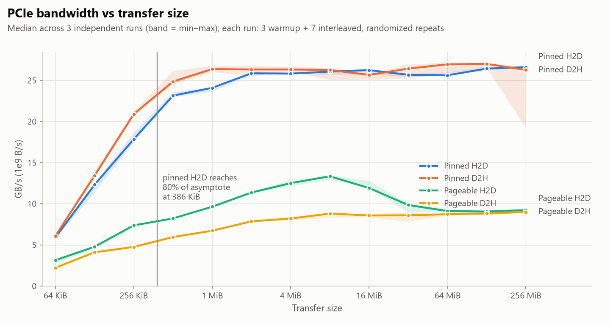
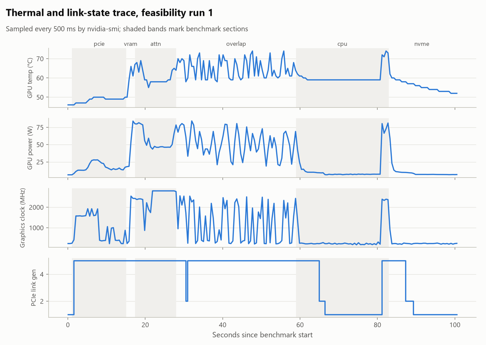

<!-- GENERATED by scripts/render_docs.py from docs/templates/SYSTEM_INFO.md.tmpl. Edit the template, not this file. Numbers come from results/**/metrics.json. -->

# System info

The machine every LazyKV result is conditional on. **Every value on this page is rendered
from `results/phase0/**/metrics.json`** by `scripts/render_docs.py`. Nothing here is
typed by hand. Raw collection code: `harness/sysinfo.py`. Benchmarks: `scripts/00_feasibility.py`.

## Host

| | |
|---|---|
| OS | Microsoft Windows 11 Home (version 10.0.26200, build 26200) |
| CPU | Intel(R) Core(TM) i7-14700HX: 20 cores, 28 logical processors (hybrid P/E cores) |
| RAM | 16 GiB in **1 DIMM** (see below) |
| Power | Power Scheme GUID: 381b4222-f694-41f0-9685-ff5bb260df2e  (Balanced); battery status code 2 (2 = on AC) |
| Hardware-accelerated GPU scheduling (`HwSchMode`) | registry value absent (Windows default) |

| Slot | Capacity | Rated | Configured | Part |
| --- | ---: | ---: | ---: | --- |
| Controller1-ChannelA-DIMM0 | 16 GiB | 5600 MT/s | 5600 MT/s | Kingston LV56S46BS8MD-16KI |

> **Single-channel memory.** One DIMM means single-channel DDR5, which halves host memory
> bandwidth compared with a dual-channel pair. That limits pageable copies, host-side
> gathers, and any CPU-side attention (design (c) in `docs/BRIEF.md` §B1). The measured
> single-thread host memcpy is 7.78 GB/s.

| Disk | Bus | Media | Size |
| --- | --- | --- | --- |
| SAMSUNG MZAL81T0HFLB-00BL2 | NVMe | SSD | 954 GiB |
| Seagate Portable | USB | Unspecified | 1.82 TiB |

## GPU

| | |
|---|---|
| GPU | NVIDIA GeForce RTX 5060 Laptop GPU |
| Compute capability | (12, 0) |
| VRAM total (CUDA) | 7.96 GiB |
| VRAM free when benchmark started | 6.56 GiB (the rest is held by the Windows desktop and other apps) |
| Torch CUDA arch list | ['sm_75', 'sm_80', 'sm_86', 'sm_90', 'sm_100', 'sm_120'] |

| nvidia-smi field | Value |
| --- | --- |
| `name` | NVIDIA GeForce RTX 5060 Laptop GPU |
| `driver_version` | 610.47 |
| `memory.total` | 8151 |
| `pcie.link.gen.max` | 5 |
| `pcie.link.gen.hostmax` | 5 |
| `pcie.link.width.max` | 16 |
| `power.limit` | [N/A] |
| `power.max_limit` | 115.00 |
| `vbios_version` | 98.06.34.00.ed |
| `driver_model.current` | WDDM |

`pcie.link.width.max` is what the GPU supports. The link width actually observed under load
is recorded in the telemetry table below, and on this laptop it is narrower than the maximum.

### `torch.cuda.get_device_properties(0)`, in full

| Field | Value |
| --- | --- |
| `L2_cache_size` | `33554432` |
| `clock_rate` | `1560000` |
| `gcnArchName` | `NVIDIA GeForce RTX 5060 Laptop GPU` |
| `is_integrated` | `0` |
| `is_multi_gpu_board` | `0` |
| `major` | `12` |
| `max_threads_per_block` | `1024` |
| `max_threads_per_multi_processor` | `1536` |
| `memory_bus_width` | `128` |
| `memory_clock_rate` | `12001000` |
| `minor` | `0` |
| `multi_processor_count` | `26` |
| `name` | `NVIDIA GeForce RTX 5060 Laptop GPU` |
| `pci_bus_id` | `1` |
| `pci_device_id` | `0` |
| `pci_domain_id` | `0` |
| `regs_per_multiprocessor` | `65536` |
| `shared_memory_per_block` | `49152` |
| `shared_memory_per_block_optin` | `101376` |
| `shared_memory_per_multiprocessor` | `102400` |
| `total_memory` | `8546484224` |
| `uuid` | `3eac7ce9-ac1a-082a-402c-862e71944dc8` |
| `warp_size` | `32` |

### CUDA driver attributes

Read directly with `cuDeviceGetAttribute` from `nvcuda.dll`, because torch does not expose
`asyncEngineCount`. Attributes with independently known values (`PCI_BUS_ID`, `TCC_DRIVER`
= 0 under WDDM, `INTEGRATED` = 0) confirm that the enum mapping is correct.

| Driver attribute (cuDeviceGetAttribute) | Value |
| --- | ---: |
| `CU_DEVICE_ATTRIBUTE_GPU_OVERLAP` | 1 |
| `CU_DEVICE_ATTRIBUTE_KERNEL_EXEC_TIMEOUT` | 1 |
| `CU_DEVICE_ATTRIBUTE_INTEGRATED` | 0 |
| `CU_DEVICE_ATTRIBUTE_CAN_MAP_HOST_MEMORY` | 1 |
| `CU_DEVICE_ATTRIBUTE_CONCURRENT_KERNELS` | 1 |
| `CU_DEVICE_ATTRIBUTE_PCI_BUS_ID` | 1 |
| `CU_DEVICE_ATTRIBUTE_TCC_DRIVER` | 0 |
| `CU_DEVICE_ATTRIBUTE_ASYNC_ENGINE_COUNT` | 1 |
| `CU_DEVICE_ATTRIBUTE_UNIFIED_ADDRESSING` | 1 |

**asyncEngineCount = 1.** This GPU has one copy
engine: an H2D copy and a D2H copy cannot run at the same time, as measured below.

## Software

| | |
|---|---|
| Python | 3.12.10 |
| torch | 2.12.0+cu130 (CUDA 13.0, cuDNN 92000) |
| transformers | 5.16.1 |
| numpy | 2.5.2 |
| torch CPU threads (default) | 28 |

| Variable | Value during benchmarks |
| --- | --- |
| `PYTORCH_CUDA_ALLOC_CONF` | (unset) |
| `CUDA_VISIBLE_DEVICES` | (unset) |
| `OMP_NUM_THREADS` | (unset) |
| `MKL_NUM_THREADS` | (unset) |

**`expandable_segments:True` probe:** the allocation succeeded = True,
and PyTorch warned "not supported on this platform" = **True**.
The §B6 fragmentation experiment with expandable segments cannot run on this Windows build,
so LazyKV should use preallocated block pools.

---

# Phase 0 microbenchmarks

**Method.** Runs [1, 2, 3] are independent process-level runs
executed back to back with the machine otherwise idle. Each run uses
3 discarded warmup rounds and
7 timed repeats. Within every repeat the
conditions are interleaved in a freshly randomized order. Each run reports per-condition
medians. **Tables show the median of those per-run medians, with the min–max across runs
in parentheses.** GPU sections begin with a two-second spin-up, because the GPU drops to a
low clock within seconds of idling (see the telemetry figure). Transfers use wall time with
explicit synchronization; CUDA-event timings are recorded as a cross-check. GB/s means
10⁹ bytes per second; sizes use binary units.

| Run | Finished (UTC) | Commit | Uncommitted tracked changes |
| --- | --- | --- | --- |
| 1 | 2026-09-14T15:04:47+00:00 | `191df58` | no |
| 2 | 2026-09-14T15:07:12+00:00 | `191df58` | no |
| 3 | 2026-09-14T15:09:37+00:00 | `191df58` | no |

## 1. PCIe bandwidth

<picture>
  <source media="(prefers-color-scheme: dark)" srcset="docs/figures/pcie_bandwidth-dark.png">
  
</picture>

GB/s per transfer size:

| Transfer size | Pinned H2D | Pinned D2H | Pageable H2D | Pageable D2H |
| ---: | ---: | ---: | ---: | ---: |
| 64 KiB | 5.88 (5.87–5.94) | 6.07 (6.05–6.08) | 3.14 (2.78–3.30) | 2.22 (2.22–2.28) |
| 128 KiB | 12.32 (11.41–12.48) | 13.42 (13.17–14.04) | 4.77 (4.58–4.82) | 4.10 (4.00–4.12) |
| 256 KiB | 17.85 (17.61–18.70) | 20.90 (20.84–21.31) | 7.38 (7.16–7.44) | 4.75 (4.65–4.75) |
| 512 KiB | 23.14 (23.00–23.59) | 24.86 (24.52–26.16) | 8.22 (8.21–8.34) | 5.95 (5.87–5.96) |
| 1 MiB | 24.09 (23.65–24.18) | 26.38 (26.03–26.81) | 9.64 (9.64–9.77) | 6.72 (6.61–6.74) |
| 2 MiB | 25.86 (25.67–25.90) | 26.33 (25.56–26.77) | 11.36 (11.34–11.54) | 7.86 (7.84–8.08) |
| 4 MiB | 25.82 (25.80–26.05) | 26.33 (26.08–26.65) | 12.50 (12.16–12.87) | 8.20 (8.00–8.43) |
| 8 MiB | 26.07 (25.72–26.09) | 26.26 (25.08–26.55) | 13.35 (12.95–13.41) | 8.81 (8.32–8.89) |
| 16 MiB | 26.25 (25.75–26.28) | 25.66 (25.11–25.84) | 11.91 (11.91–12.80) | 8.58 (8.35–8.74) |
| 32 MiB | 25.68 (25.46–25.81) | 26.43 (25.26–26.93) | 9.85 (8.97–10.00) | 8.60 (7.83–8.98) |
| 64 MiB | 25.62 (25.57–25.99) | 26.95 (25.93–27.20) | 9.11 (9.10–9.35) | 8.72 (8.58–8.80) |
| 128 MiB | 26.42 (26.32–26.68) | 27.01 (26.49–27.06) | 9.06 (8.66–9.08) | 8.82 (8.65–9.01) |
| 256 MiB | 26.61 (26.43–26.66) | 26.27 (19.24–26.64) | 9.23 (8.93–9.25) | 9.01 (8.93–9.15) |

Knees and the per-transfer overhead fit (t = t0 + size / B, relative-error weighted). The
empirical knee is the answer to "where does pinned H2D reach 80%". The two-parameter fit
saturates more gently than the real curve, so its knee sits later. It is useful for
estimating t0, not for locating the knee.

| Path | Asymptotic bandwidth | 50% knee (empirical) | 80% knee (empirical) | Per-transfer overhead t0 (fit) | 80% knee (fit) |
| --- | ---: | ---: | ---: | ---: | ---: |
| Pinned H2D | 26.52 GB/s (26.37 GB/s–26.67 GB/s) | 145 KiB (140 KiB–154 KiB) | 386 KiB (379 KiB–407 KiB) | 6 µs (6 µs–7 µs) | 683 KiB (678 KiB–705 KiB) |
| Pinned D2H | 26.38 GB/s (23.13 GB/s–26.85 GB/s) | 125 KiB (103 KiB–131 KiB) | 265 KiB (201 KiB–269 KiB) | 5 µs (5 µs–5 µs) | 568 KiB (537 KiB–598 KiB) |
| Pageable H2D | 9.15 GB/s (8.79 GB/s–9.16 GB/s) | 115 KiB (112 KiB–128 KiB) | 249 KiB (247 KiB–253 KiB) | 15 µs (14 µs–16 µs) | 678 KiB (623 KiB–681 KiB) |
| Pageable D2H | 8.87 GB/s (8.83 GB/s–9.08 GB/s) | 199 KiB (181 KiB–204 KiB) | 1.25 MiB (1.24 MiB–1.39 MiB) | 21 µs (21 µs–21 µs) | 697 KiB (691 KiB–713 KiB) |

- **Pinned H2D asymptote: 26.52 GB/s**, with the link trained at the generation and width shown in the telemetry table.
- **Pinned H2D reaches 80% of its asymptote at 386 KiB** (empirical, interpolated in log-size). Below the 50% knee (145 KiB), per-transfer overhead dominates. The fitted overhead is 6.4 µs per transfer.
- Pinned memory gives 2.9× the asymptotic H2D bandwidth of pageable memory.
- Pageable H2D is not monotonic: it peaks in the middle of the size sweep and falls back at the largest sizes. The cause was not isolated in Phase 0, and it does not matter for LazyKV, which will only transfer from pinned pools.

## 2. VRAM bandwidth

- **Device-to-device copy (1 GiB): 130.90 GB/s** (130.14 GB/s – 131.18 GB/s).

Decode attention over one layer's KV, per SDPA path. Llama-3.2-1B geometry: 32 query
heads, 8 KV heads, head_dim 64, bf16, one query token. Every path's output is compared
with the math kernel.

| Context (tokens, 1 layer) | SDPA path | Time per call | KV scanned (GB/s) | Max rel. error vs math | Within tolerance |
| ---: | --- | ---: | ---: | ---: | --- |
| 4,096 | `default_dispatch_gqa` | 0.901 ms (0.9 ms–0.98 ms) | 9.3 (8.6–9.3) | 0.0e+00 | yes |
| 4,096 | `math_gqa` | 0.941 ms (0.927 ms–0.944 ms) | 8.9 (8.9–9.0) | 0.0e+00 | yes |
| 4,096 | `cudnn_gqa` **(best)** | 0.113 ms (0.109 ms–0.114 ms) | 74.3 (73.9–77.1) | 5.0e-03 | yes |
| 4,096 | `efficient_expanded` | 0.481 ms (0.477 ms–0.481 ms) | 17.5 (17.4–17.6) | 5.0e-03 | yes |
| 4,096 | `manual_grouped_matmul` | 0.409 ms (0.369 ms–0.55 ms) | 20.5 (15.3–22.7) | 5.0e-03 | yes |
| 16,384 | `default_dispatch_gqa` | 3.68 ms (3.68 ms–3.7 ms) | 9.1 (9.1–9.1) | 0.0e+00 | yes |
| 16,384 | `math_gqa` | 3.71 ms (3.69 ms–3.71 ms) | 9.1 (9.0–9.1) | 0.0e+00 | yes |
| 16,384 | `cudnn_gqa` **(best)** | 0.104 ms (0.0988 ms–0.107 ms) | 321.4 (315.0–339.5) | 4.3e-03 | yes |
| 16,384 | `efficient_expanded` | 1.72 ms (1.71 ms–1.76 ms) | 19.5 (19.0–19.6) | 4.3e-03 | yes |
| 16,384 | `manual_grouped_matmul` | 1.69 ms (1.69 ms–2.56 ms) | 19.8 (13.1–19.8) | 5.2e-03 | yes |
| 65,536 | `default_dispatch_gqa` | 14.6 ms (14.6 ms–14.6 ms) | 9.2 (9.2–9.2) | 0.0e+00 | yes |
| 65,536 | `math_gqa` | 14.7 ms (14.3 ms–14.7 ms) | 9.2 (9.1–9.4) | 0.0e+00 | yes |
| 65,536 | `cudnn_gqa` **(best)** | 0.441 ms (0.43 ms–0.447 ms) | 304.1 (300.4–312.0) | 4.9e-03 | yes |
| 65,536 | `efficient_expanded` | 6.72 ms (6.69 ms–6.73 ms) | 20.0 (19.9–20.1) | 4.9e-03 | yes |
| 65,536 | `manual_grouped_matmul` | 6.93 ms (6.92 ms–6.96 ms) | 19.4 (19.3–19.4) | 4.9e-03 | yes |
| 262,144 | `default_dispatch_gqa` | 303 ms (248 ms–357 ms) | 1.8 (1.5–2.2) | 0.0e+00 | yes |
| 262,144 | `math_gqa` | 301 ms (250 ms–355 ms) | 1.8 (1.5–2.1) | 0.0e+00 | yes |
| 262,144 | `cudnn_gqa` **(best)** | 1.52 ms (1.52 ms–1.54 ms) | 353.0 (348.3–353.3) | 5.6e-03 | yes |
| 262,144 | `efficient_expanded` | 31.7 ms (31.7 ms–31.7 ms) | 16.9 (16.9–17.0) | 5.6e-03 | yes |
| 262,144 | `manual_grouped_matmul` | 78.6 ms (76.2 ms–79.7 ms) | 6.8 (6.7–7.0) | 7.1e-03 | yes |

> **Kernel-selection trap.** This Windows torch build has no FlashAttention compiled in, and
> default SDPA dispatch with `enable_gqa=True` falls back to the math kernel. At 65,536
> tokens the default path is **33.1×**
> slower than the best correct kernel (`cudnn_gqa`),
> and at 262,144 tokens it is 199.3× slower.
> A full-GPU baseline left on default dispatch would be artificially slow, which would make
> every offloading policy look better than it is. Phase 1 must pin the attention backend.

## 3. The ratio

**VRAM device-to-device copy ÷ pinned H2D = 4.9×**
(min 4.88, max 4.97 across runs).

The brief assumed 20–40× before any measurement. **That assumption is refuted on this
machine.** The consequences are worked through in `docs/IMPLEMENTATION_PLAN.md` §3.

<picture>
  <source media="(prefers-color-scheme: dark)" srcset="docs/figures/bandwidth_ladder-dark.png">
  
</picture>

| Path | GB/s, median (min–max) across runs |
| --- | ---: |
| VRAM device-to-device copy | 130.90 (130.14–131.18) |
| GPU decode attention KV scan (`cudnn_gqa`, 262,144 tokens) | 353.03 (348.32–353.27) |
| PCIe pinned H2D (asymptote) | 26.52 (26.37–26.67) |
| PCIe pinned D2H (asymptote) | 26.38 (23.13–26.85) |
| PCIe pageable H2D (asymptote) | 9.15 (8.79–9.16) |
| Host memcpy, 1 thread | 7.78 (7.49–8.61) |
| CPU partial attention KV rate (fp32, 65,536 tokens, best threads) | 27.86 (27.80–28.60) |
| NVMe sequential read | 2.67 (2.66–2.86) |
| NVMe random 128 KiB read | 0.65 (0.55–0.68) |

## 4. Async overlap

A compute kernel (fp16 matmul, calibrated to about the same duration as the copy) runs on
one CUDA stream while a pinned copy runs on another. The overlap fraction is
(T_compute + T_copy − T_both) / min(T_compute, T_copy): 1 means wall time equals the longer
of the two, and 0 means wall time equals their sum.

| Concurrent pair (separate CUDA streams) | Overlap fraction (1 = max, 0 = sum) |
| --- | ---: |
| Compute kernel + pinned H2D | 0.99 (0.99–0.99) |
| Compute kernel + pinned D2H | 1.00 (0.99–1.00) |
| Pinned H2D + pinned D2H | -0.00 (-0.02–0.01) |

- Compute and copy overlap almost completely. A layer's compute can hide a transfer of equal duration.
- **H2D and D2H do not overlap at all**, which matches asyncEngineCount = 1. Any D2H write-back scheduled while a prefetch is in flight delays that prefetch by its full duration.

## 5. CPU-side attention

Exact partial attention for merge: scores, log-sum-exp, and a softmax-weighted sum over
values. It returns only O(head_dim) bytes. The data is float32 with Llama-3.2-1B GQA
geometry (8 KV heads × 4 query heads each, head_dim 64). `torch.set_num_threads` is set
explicitly, and Windows chooses P- versus E-core placement. Time per call at each thread
count (median across runs):

| Tokens / layer | 1 thr | 4 thr | 8 thr | 16 thr | 20 thr | 28 thr |
| ---: | ---: | ---: | ---: | ---: | ---: | ---: |
| 256 | 0.26 ms | 0.193 ms | 0.191 ms | 0.162 ms | 0.201 ms | 0.209 ms |
| 1,024 | 0.689 ms | 0.316 ms | 0.291 ms | 0.282 ms | 0.283 ms | 0.306 ms |
| 4,096 | 2.46 ms | 0.782 ms | 0.571 ms | 0.493 ms | 0.522 ms | 0.516 ms |
| 16,384 | 11.5 ms | 4.11 ms | 2.66 ms | 2.07 ms | 1.98 ms | 2.09 ms |
| 65,536 | 56.5 ms | 16.9 ms | 11.6 ms | 9.68 ms | 9.63 ms | 9.9 ms |

Best thread count against the same operation on the GPU:

| Tokens / layer | CPU best | Best thread count per run | GPU (same op, fp32) | CPU / GPU |
| ---: | ---: | --- | ---: | ---: |
| 256 | 0.159 ms (0.13 ms–0.162 ms) | 4, 16, 16 | 0.298 ms (0.255 ms–0.732 ms) | 0.5× (0.2×–0.5×) |
| 1,024 | 0.277 ms (0.262 ms–0.282 ms) | 28, 16, 20 | 0.26 ms (0.247 ms–0.268 ms) | 1.0× (1.0×–1.1×) |
| 4,096 | 0.493 ms (0.402 ms–0.524 ms) | 16, 16, 20 | 0.272 ms (0.239 ms–0.279 ms) | 1.9× (1.4×–2.1×) |
| 16,384 | 1.98 ms (1.9 ms–2.09 ms) | 20, 20, 28 | 0.514 ms (0.512 ms–3.46 ms) | 3.9× (0.5×–4.1×) |
| 65,536 | 9.63 ms (9.38 ms–9.66 ms) | 20, 20, 20 | 1.87 ms (1.8 ms–14.4 ms) | 5.2× (0.7×–5.2×) |

The GPU reference column has one slow outlier run at the larger sizes (see the max of its
range). It is reported rather than dropped, and the median is robust to it.

Adding threads stops helping before the logical CPU count, and larger thread counts
sometimes lose. One *hypothesis*, not tested in Phase 0, is that single-channel memory
bandwidth rather than core count limits the large cases.

## 6. NVMe

Unbuffered reads (`FILE_FLAG_NO_BUFFERING`, queue depth 1) of a
1 GiB file written to the system NVMe drive.

| Pattern (QD1, unbuffered) | Throughput | IOPS |
| --- | ---: | ---: |
| Sequential, 1 MiB reads | 2.67 GB/s (2.66 GB/s–2.86 GB/s) | – |
| Random 4 KiB | 54 MB/s (43 MB/s–57 MB/s) | 13,126 (10,573–13,847) |
| Random 128 KiB (one 64-token layer block) | 647 MB/s (554 MB/s–685 MB/s) | 4,936 (4,229–5,223) |

Pinned PCIe H2D is **9.9×** faster than
sequential NVMe reads and **41.0×** faster
than random 128 KiB reads. An SSD tier can add capacity, never speed (§B9).

## Thermal and link-state control

| Run | GPU temp | GPU power | Graphics clock | PCIe link gen seen | Width |
| --- | --- | --- | --- | --- | --- |
| 1 | 46–74 °C | 6–84 W | 172–2797 MHz | Gen1, Gen2, Gen5 | x8 |
| 2 | 49–74 °C | 6–91 W | 195–2797 MHz | Gen1, Gen2, Gen5 | x8 |
| 3 | 49–74 °C | 6–90 W | 187–2797 MHz | Gen1, Gen2, Gen5 | x8 |

<picture>
  <source media="(prefers-color-scheme: dark)" srcset="docs/figures/telemetry_run1-dark.png">
  
</picture>

The link idles at a low PCIe generation and trains up under load. The graphics clock falls
to its floor within seconds whenever the GPU is idle, including during the CPU section.
This is why every GPU section starts with a spin-up. One smoke test run earlier the same
day, before these fixes, measured a pinned H2D figure far below the runs reported here.
Neither two later quick runs nor the three full runs reproduced it, and its cause is not
known. Smoke-test outputs are not retained (`.gitignore`), so no number is quoted for it.
It is the reason between-run spread is reported at all.
