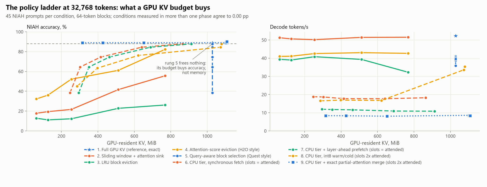

<!-- GENERATED by scripts/render_docs.py from docs/templates/FINDINGS.md.tmpl. Edit the template, not this file. Numbers come from results/**/metrics.json. -->

# Findings: what a GPU KV budget actually buys

This is the whole study in one place. The research question, from `CLAUDE.md`:

> Under a fixed GPU KV budget, how much context and quality can be retained by intelligent block
> residency, migration, compression and prefetching?

**The short answer, at 32,768 tokens on one 8 GB laptop GPU.** Quality
degrades gracefully and predictably with the budget, and the best *approximating* policy holds
98.8% of the full cache's retrieval accuracy at a
75% budget — but **no approximating policy on
the ladder retains 99% of full-cache accuracy at any budget below 100%**, which was the bar the brief
set. Memory can be bought back almost linearly; the last percent of accuracy cannot be, by skipping.

It can be bought another way. Rung 9 does not skip the non-resident blocks: it attends to them on the
CPU and merges the two partial attentions exactly, so it reproduces the full cache at a
6.25% budget and is the one rung that clears
the bar. It decodes 6.2× slower than simply
keeping the KV in VRAM. **The study's answer is therefore that the accuracy is available and the
currency is compute, not memory.**

Separately, and not anticipated by the design, every mechanism that reduces *bytes moved* failed to
reduce *latency*, because this decode is bound by the host work that decides what to move rather than
by moving it — and rung 9 is that finding again, at a larger scale.

Individual gate reports carry the detail and the provenance:
[Phase 0](phases/PHASE_0.md) · [Phase 1](phases/PHASE_1.md) · [Phase 2](phases/PHASE_2.md) ·
[Phase 3](phases/PHASE_3.md) · [Phase 4](phases/PHASE_4.md) · [Phase 5](phases/PHASE_5.md) ·
[Phase 6](phases/PHASE_6.md) · [Phase 7](phases/PHASE_7.md).

## 1. The headline number (brief §B8)

> Minimum GPU KV budget at which policy P retains >= 99% of baseline NIAH accuracy at 32K context,
> and the tokens/sec at that point.

| Rung | Policy | Smallest budget retaining >= 99% | Best retention measured | at budget | Resident KV, MiB | Tokens/s there |
| ---: | --- | ---: | ---: | ---: | ---: | ---: |
| 1 | Full GPU KV (reference, exact) | 100% | 100.0% | 100% | 1,028 | 52.3 |
| 2 | Sliding window + attention sink | **none** | 62.5% | 75% | 768 | 51.5 |
| 3 | LRU block eviction | **none** | 29.4% | 75% | 768 | 32.2 |
| 4 | Attention-score eviction (H2O style) | **none** | 92.5% | 75% | 768 | 42.6 |
| 5 | Query-aware block selection (Quest style) | **none** | 98.8% | 75% | 1,028 | 35.9 |
| 6 | CPU tier, synchronous fetch | **none** | 98.8% | 75% | 865 | 18.2 |
| 7 | CPU tier + layer-ahead prefetch | **none** | 98.8% | 75% | 913 | 10.8 |
| 8 | CPU tier, int8 warm/cold | **none** | 98.8% | 75% | 1,078 | 35.4 |
| 9 | CPU tier + exact partial-attention merge | 6.25% | 101.3% | 75% | 1,108 | 8.4 |

**No approximating rung clears the bar below a full budget.** Rungs 5 to 8 come closest and stop at
98.8% retention at a
75% budget — under the bar by
about a percentage point, on 45 prompts, which is one or two prompts'
worth. The brief asked for this number specifically because it is not gameable, and reporting it as
"near-perfect retention at 75%" would be the gameable version.

**One rung clears it, and it is the one that does not approximate.** Rung 9 computes attention over
the non-resident blocks where they already live — on the CPU — and merges the two partial results
with their log-sum-exp normalizers, which is exact. It meets the target at a
6.25% budget, the tightest the sweep
measured, because being exact makes its accuracy independent of the budget entirely.

| Rung | Policy | Smallest budget meeting the target | Retention there | Resident KV, MiB | Tokens/s |
| ---: | --- | ---: | ---: | ---: | ---: |
| 9 | CPU tier + exact partial-attention merge | 6.25% | 100.0% | 316 | 8.4 |

The cost is 8.4 tokens/s against the full cache's
52.3, a factor of
6.2, plus host RAM the memory axis does not
show. [Phase 7](phases/PHASE_7.md) measures where that goes.

One number in §3 needs saying out loud rather than leaving in a table. Rung 9's best-scoring budget
is 75%, where it reads
101.3% of the full cache — *above* the cache it
reproduces. **That is not an improvement and cannot be one.** Rung 9's GPU half runs the bf16 kernel
and its CPU half runs float32, so a prompt sitting on a near-tie can land either way; here one did,
in the flattering direction. The same care was taken with rung 8's apparent gain in Phase 5, and for
the same reason: a study that reports rounding as a win has stopped being a measurement.

So the honest reading of §B8 is two sentences, not one. *Skipping* non-resident KV cannot hold the
last percent of accuracy at any budget this study measured. *Computing* it elsewhere can hold all of
it, at a price in latency and host RAM that no one would pay for a context that still fits in VRAM.

That also stops this being a null study in a second way. The accuracy curve is smooth and the memory
curve is steep, so the interesting question among the approximate rungs turns out not to be "which
policy clears 99%" but "what does each percentage point of accuracy cost in VRAM" — which §2
answers. And the latency result in §4 was not predicted by anyone's arithmetic, including the
brief's.

## 2. The frontier

<picture>
  <source media="(prefers-color-scheme: dark)" srcset="figures/ladder_pareto-dark.png">
  
</picture>

Read the left panel as the study's answer: up and to the left is better. Three shapes matter.

**Rung 5 is a vertical line.** Query-aware selection attends to the top-K blocks but keeps every
block resident, so sweeping its budget moves accuracy and not memory at all. That is not a drawing
error, it is the finding that motivated Phases 4 and 5: rung 5's budget buys accuracy, and only the
CPU tier turns it into a memory budget.

**The cheap baselines are not close.** A sliding window with an attention sink is the strong cheap
baseline the brief insisted on including, and it tops out at
62.5% retention. LRU block eviction is worse than that
(29.4%), for the reason Phase 2 measured: a block-granular LRU
evicts a block before it can observe a use, so it degenerates to a window without a sink.
Attention-score eviction reaches 92.5%. Query-aware selection is
the only family that gets near the full cache.

**Rung 9 is a horizontal line at the top.** Being exact, its accuracy does not move with the budget,
so it runs flat across the whole memory axis at the full cache's accuracy. That is the shape the
whole ladder was reaching for, and the right panel is where it is paid for: rung 9 sits at the
bottom of it.

**The right panel is where the design premise breaks.** Every tier rung sits low and flat: the
curves barely respond to how much KV is resident. §4.

## 3. Every rung, every budget

The VRAM-slot column matters. Phase 4 ran the tier twice — with slots for exactly the attended set
and for twice it — and only the first frees VRAM at the larger budgets. Rungs 8 and 9 were run only
at the 2× setting, so their memory columns are not directly comparable to rungs 6 and 7's.

| Rung | Policy | VRAM slots | Budget | NIAH accuracy [95% CI] | Retention | Resident KV, MiB | Tokens/s | Measured in |
| ---: | --- | --- | ---: | ---: | ---: | ---: | ---: | --- |
| 1 | Full GPU KV (reference, exact) | - | 100% | 88.9% [82, 95] | 100.0% | 1,028 | 52.3 | Phase 5 |
| 2 | Sliding window + attention sink | - | 75% | 55.6% [43, 68] | 62.5% | 768 | 51.5 | Phase 2 |
| 2 | Sliding window + attention sink | - | 50% | 41.7% [29, 54] | 46.9% | 512 | 51.4 | Phase 2 |
| 2 | Sliding window + attention sink | - | 25% | 21.7% [12, 32] | 24.4% | 254 | 50.2 | Phase 2 |
| 2 | Sliding window + attention sink | - | 12.5% | 19.4% [9, 30] | 21.9% | 126 | 50.6 | Phase 2 |
| 2 | Sliding window + attention sink | - | 6.25% | 17.8% [8, 28] | 20.0% | 62 | 51.2 | Phase 2 |
| 3 | LRU block eviction | - | 75% | 26.1% [15, 39] | 29.4% | 768 | 32.2 | Phase 2 |
| 3 | LRU block eviction | - | 50% | 22.8% [12, 36] | 25.6% | 512 | 39.3 | Phase 2 |
| 3 | LRU block eviction | - | 25% | 12.2% [4, 22] | 13.8% | 254 | 40.8 | Phase 2 |
| 3 | LRU block eviction | - | 12.5% | 11.1% [2, 20] | 12.5% | 126 | 39.0 | Phase 2 |
| 3 | LRU block eviction | - | 6.25% | 12.8% [4, 22] | 14.4% | 62 | 39.4 | Phase 2 |
| 4 | Attention-score eviction (H2O style) | - | 75% | 82.2% [73, 91] | 92.5% | 768 | 42.6 | Phase 3 |
| 4 | Attention-score eviction (H2O style) | - | 50% | 61.1% [49, 73] | 68.8% | 512 | 43.0 | Phase 3 |
| 4 | Attention-score eviction (H2O style) | - | 25% | 52.2% [40, 64] | 58.8% | 254 | 42.5 | Phase 3 |
| 4 | Attention-score eviction (H2O style) | - | 12.5% | 36.1% [24, 48] | 40.6% | 126 | 41.1 | Phase 3 |
| 4 | Attention-score eviction (H2O style) | - | 6.25% | 32.2% [20, 44] | 36.3% | 62 | 41.0 | Phase 3 |
| 5 | Query-aware block selection (Quest style) | - | 75% | 87.8% [81, 94] | 98.8% | 1,028 | 35.9 | Phase 4 |
| 5 | Query-aware block selection (Quest style) | - | 50% | 84.4% [76, 92] | 95.0% | 1,028 | 41.0 | Phase 4 |
| 5 | Query-aware block selection (Quest style) | - | 25% | 74.4% [63, 85] | 83.8% | 1,028 | 40.3 | Phase 4 |
| 5 | Query-aware block selection (Quest style) | - | 12.5% | 64.4% [52, 76] | 72.5% | 1,028 | 38.8 | Phase 4 |
| 5 | Query-aware block selection (Quest style) | - | 6.25% | 38.3% [26, 52] | 43.1% | 1,028 | 39.6 | Phase 4 |
| 6 | CPU tier, synchronous fetch | 2x attended | 75% | 87.8% [81, 94] | 98.8% | 1,108 | 35.3 | Phase 5 |
| 6 | CPU tier, synchronous fetch | = attended | 75% | 87.8% [81, 94] | 98.8% | 865 | 18.2 | Phase 4 |
| 6 | CPU tier, synchronous fetch | 2x attended | 50% | 84.4% [76, 92] | 95.0% | 1,103 | 32.9 | Phase 5 |
| 6 | CPU tier, synchronous fetch | = attended | 50% | 84.4% [76, 92] | 95.0% | 641 | 17.7 | Phase 4 |
| 6 | CPU tier, synchronous fetch | 2x attended | 25% | 74.4% [63, 85] | 83.8% | 652 | 19.2 | Phase 5 |
| 6 | CPU tier, synchronous fetch | = attended | 25% | 74.4% [63, 85] | 83.8% | 415 | 17.7 | Phase 4 |
| 6 | CPU tier, synchronous fetch | 2x attended | 12.5% | 64.4% [52, 76] | 72.5% | 428 | 19.2 | Phase 5 |
| 6 | CPU tier, synchronous fetch | = attended | 12.5% | 64.4% [52, 76] | 72.5% | 303 | 18.7 | Phase 4 |
| 6 | CPU tier, synchronous fetch | 2x attended | 6.25% | 38.3% [26, 52] | 43.1% | 316 | 18.7 | Phase 5 |
| 6 | CPU tier, synchronous fetch | = attended | 6.25% | 38.3% [26, 52] | 43.1% | 247 | 18.8 | Phase 4 |
| 7 | CPU tier + layer-ahead prefetch | 2x attended | 75% | 87.8% [81, 94] | 98.8% | 1,173 | 24.2 | Phase 4 |
| 7 | CPU tier + layer-ahead prefetch | = attended | 75% | 87.8% [81, 94] | 98.8% | 913 | 10.8 | Phase 4 |
| 7 | CPU tier + layer-ahead prefetch | 2x attended | 50% | 84.4% [76, 92] | 95.0% | 1,167 | 24.2 | Phase 4 |
| 7 | CPU tier + layer-ahead prefetch | = attended | 50% | 84.4% [76, 92] | 95.0% | 689 | 10.9 | Phase 4 |
| 7 | CPU tier + layer-ahead prefetch | 2x attended | 25% | 74.4% [63, 85] | 83.8% | 716 | 12.8 | Phase 4 |
| 7 | CPU tier + layer-ahead prefetch | = attended | 25% | 74.4% [63, 85] | 83.8% | 463 | 11.6 | Phase 4 |
| 7 | CPU tier + layer-ahead prefetch | 2x attended | 12.5% | 64.4% [52, 76] | 72.5% | 492 | 12.7 | Phase 4 |
| 7 | CPU tier + layer-ahead prefetch | = attended | 12.5% | 64.4% [52, 76] | 72.5% | 351 | 11.8 | Phase 4 |
| 7 | CPU tier + layer-ahead prefetch | 2x attended | 6.25% | 38.3% [26, 52] | 43.1% | 380 | 12.3 | Phase 4 |
| 7 | CPU tier + layer-ahead prefetch | = attended | 6.25% | 38.3% [26, 52] | 43.1% | 295 | 11.9 | Phase 4 |
| 8 | CPU tier, int8 warm/cold | 2x attended | 75% | 87.8% [81, 94] | 98.8% | 1,078 | 35.4 | Phase 5 |
| 8 | CPU tier, int8 warm/cold | 2x attended | 50% | 84.4% [76, 92] | 95.0% | 1,073 | 33.6 | Phase 5 |
| 8 | CPU tier, int8 warm/cold | 2x attended | 25% | 76.1% [66, 86] | 85.6% | 622 | 16.7 | Phase 5 |
| 8 | CPU tier, int8 warm/cold | 2x attended | 12.5% | 63.3% [51, 76] | 71.2% | 398 | 16.9 | Phase 5 |
| 8 | CPU tier, int8 warm/cold | 2x attended | 6.25% | 45.0% [32, 58] | 50.6% | 286 | 16.5 | Phase 5 |
| 9 | CPU tier + exact partial-attention merge | 2x attended | 75% | 90.0% [83, 96] | 101.3% | 1,108 | 8.4 | Phase 7 |
| 9 | CPU tier + exact partial-attention merge | 2x attended | 50% | 88.9% [82, 95] | 100.0% | 1,103 | 8.6 | Phase 7 |
| 9 | CPU tier + exact partial-attention merge | 2x attended | 25% | 88.9% [82, 95] | 100.0% | 652 | 8.1 | Phase 7 |
| 9 | CPU tier + exact partial-attention merge | 2x attended | 12.5% | 88.9% [82, 95] | 100.0% | 428 | 8.3 | Phase 7 |
| 9 | CPU tier + exact partial-attention merge | 2x attended | 6.25% | 88.9% [82, 95] | 100.0% | 316 | 8.4 | Phase 7 |

## 4. The result the design did not predict

The brief's §B1 arithmetic was that PCIe is 20–40× slower than VRAM, so dense refetch is impossible
and selection is mandatory. That reasoning is correct and still holds. What it did not predict is
what happens *after* selection makes the transfers small: they stop being the cost.

Five independent attacks on bytes moved, none of which made decode faster:

| Attack | Phase | Result |
|---|---|---|
| Double the VRAM slots, cutting on-demand fetches roughly tenfold | 4 | ~5% faster |
| Layer-ahead prefetch, hiding 100% of copies inside the compute window | 4 | **slower** than synchronous fetch |
| int8 warm/cold tier, halving the bytes on the wire | 5 | **1.14× slower** |
| Removing the per-layer host sync entirely (replay ablation) | 6 | 1.11–1.16× faster, and that is the ceiling |
| Removing the transfer altogether: attend to the cold blocks where they are (rung 9) | 7 | **2.28–4.23× slower**, and exact |

The last row is the argument's end point. Rung 9 moves no KV at all — only
113.8 KiB per token comes back from the CPU
— and it is the slowest rung on the ladder. Whatever this decode is bound by, it is not the link.

The cause is the same each time. Every selecting layer must bring its top-K block indices to the CPU
before it can decide what to fetch, and that round trip costs more than the transfer it authorizes.
At a 25% budget the tier moves
4.5 MiB per token — under a millisecond of
link time at the Phase 0 pinned-H2D asymptote — while host select time is
20–28 ms
per token.

**The ceiling on fixing it is measured, not guessed.** A replay ablation records each layer's
selection and decodes again driven by that record, so the bound and its sync never run while the
blocks fetched stay identical. Removing them is worth
1.11–1.16×.
Removing *all* host select time would be
1.63–1.90×,
but that figure is arithmetic rather than measured and this project has twice found such arithmetic
wrong. Either way the full cache decodes a token in
21.7 ms, so a device-side residency decision would close
part of the tier's own gap and never the gap to keeping KV in VRAM.

## 5. Why these phases can be put on one frontier

The rungs were measured weeks apart in four separate gates, so combining them is a claim that needs
evidence rather than an assumption. Adjacent phases deliberately overlap, and every overlapping
condition is compared here.

Sweeps comparable (same context, block size, prompt count, full-cache accuracy):
**True**. Overlapping conditions:
17. Largest accuracy disagreement across phases:
**0.00 pp**.

| Condition | Budget | Phases | Largest accuracy gap | Largest tokens/s ratio |
| --- | ---: | --- | ---: | ---: |
| Block pool, 100% | 100% | P2, P3, P4, P5, P7 | 0.00 pp | 1.042x |
| Full cache (rung 1) | 100% | P2, P3, P4, P5, P7 | 0.00 pp | 1.120x |
| Quest-style (rung 5) | 75% | P3, P4 | 0.00 pp | 1.125x |
| Quest-style (rung 5) | 50% | P3, P4 | 0.00 pp | 1.001x |
| Quest-style (rung 5) | 25% | P3, P4 | 0.00 pp | 1.012x |
| Quest-style (rung 5) | 12.5% | P3, P4 | 0.00 pp | 1.036x |
| Quest-style (rung 5) | 6.25% | P3, P4 | 0.00 pp | 1.010x |
| CPU tier, sync fetch (rung 6) | 75% | P4, P5, P7 | 0.00 pp | 1.014x |
| CPU tier, sync fetch (rung 6) | 50% | P4, P5, P7 | 0.00 pp | 1.127x |
| CPU tier, sync fetch (rung 6) | 25% | P4, P5, P7 | 0.00 pp | 1.058x |
| CPU tier, sync fetch (rung 6) | 12.5% | P4, P5, P7 | 0.00 pp | 1.018x |
| CPU tier, sync fetch (rung 6) | 6.25% | P4, P5, P7 | 0.00 pp | 1.027x |
| Window + sink (rung 2) | 75% | P2, P3 | 0.00 pp | 1.010x |
| Window + sink (rung 2) | 50% | P2, P3 | 0.00 pp | 1.000x |
| Window + sink (rung 2) | 25% | P2, P3 | 0.00 pp | 1.015x |
| Window + sink (rung 2) | 12.5% | P2, P3 | 0.00 pp | 1.011x |
| Window + sink (rung 2) | 6.25% | P2, P3 | 0.00 pp | 1.065x |

Accuracy is reproducible to the last prompt across the whole study, which is what licenses the
combined frontier. Decode speed is not: it varies by up to
1.13× for the same condition measured in
different phases, which is thermal and run-to-run variation on a laptop and is why every latency
claim in this study is quoted with a range over independent runs.

## 6. Limitations

- **One model, one context, one task.** Llama-3.2-1B at 32,768 tokens,
  scored on needle-in-a-haystack with 45 prompts per condition. The 3B
  stress model in the brief was never run, so nothing here speaks to a regime where KV dominates
  VRAM more aggressively.
- **45 prompts is a wide confidence interval.** The per-condition CIs in
  §3 span several percentage points. Differences smaller than that are not resolvable, which is why
  Phase 5's apparent int8 improvement is reported as noise with a paired test rather than as a win.
- **Rung 9 is exact in the algebra, not in the bits.** Its GPU half runs the bf16 kernel and its CPU
  half runs float32, so it agrees with the full cache to a teacher-forced KL of about
  1e-03 nats rather than to zero, and its
  top-1 agreement is
  97.9%–98.6%.
  That is between
  3× and
  114× closer than the rung it
  replaces, depending on the budget, and it is not nothing.
- **Rung 9 costs host RAM that the memory axis does not show.** Its float32 mirror of the sealed KV
  is 1,848 MiB, on top of the tier's pinned pools. The
  frontier's x axis is GPU-resident KV, so rung 9 looks free there and is not.
- **Rungs 8 and 9 were measured at one slot count**, so their memory columns are not comparable to
  rungs 6 and 7.
- **Prefill is not tiered.** Peak VRAM during prefill is still the full KV; the tier governs
  decode-time residency only.
- **The fast kernel is not bit-repeatable** for single-query decode, so quality is measured on a
  separate deterministic kernel and agreement is reported rather than assumed.
- **This is a laptop.** Thermal behaviour is controlled for by interleaving and repeating, not
  eliminated; see §5's speed variation.
