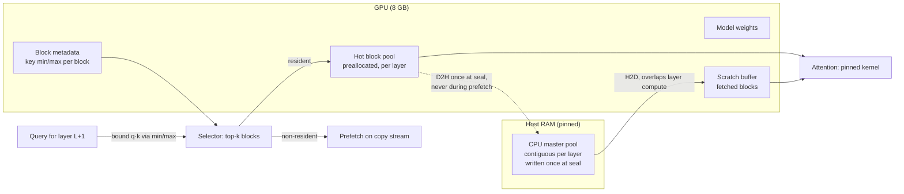

<!-- GENERATED by scripts/render_docs.py from docs/templates/IMPLEMENTATION_PLAN.md.tmpl. Edit the template, not this file. Numbers come from results/**/metrics.json. -->

# Implementation plan

Status: **written at the end of Phase 0, before any LazyKV system code.** Numbers are
rendered from `results/phase0/analysis/metrics.json` (median across
3 independent runs). The prose
judgments in §3 were written against that run set. If the results are regenerated and the
judgments stop matching the numbers, the numbers win and this section must be revised.

## 1. Goal

Measure how much context and quality a single 8 GB laptop GPU can retain under a fixed GPU
KV budget, across a ladder of residency policies (`docs/BRIEF.md` §B8), and publish the
comparison with honest quality deltas and ablations. The contribution is the study, not a
new mechanism (`docs/RELATED_WORK.md`, Delta).

## 2. What Phase 0 established

| Question | Answer on this machine | Source |
|---|---|---|
| Pinned PCIe H2D bandwidth | 26.52 GB/s | `SYSTEM_INFO.md` §1 |
| Size where pinned H2D reaches 80% of that | 386 KiB | §1 |
| VRAM device-to-device copy | 130.90 GB/s | §2 |
| **VRAM ÷ PCIe ratio** | **4.9×** | §3 |
| Copy engines (`asyncEngineCount`) | 1 | §4 |
| Compute + H2D overlap / H2D + D2H overlap | 0.99 / -0.00 | §4 |
| Host memcpy, 1 thread (single-channel RAM) | 7.78 GB/s | §5 |
| NVMe sequential read | 2.67 GB/s | §6 |
| Default SDPA dispatch vs best kernel (65,536 tokens) | 33.1× slower | §2 |
| `expandable_segments` on this platform | not supported: True | `SYSTEM_INFO.md`, Software |

## 3. Which design the measurements support

The brief (§B1) names three ways to handle a KV block that is not in VRAM when a layer runs:
**(a)** fetch it first, **(b)** skip it (eviction), **(c)** attend to it on the CPU and merge
the partial outputs exactly. It predicted that (a) is an "arithmetic impossibility" because
VRAM bandwidth exceeds PCIe by 20–40×.

### 3.1 The premise's number is wrong on this machine

Measured VRAM copy ÷ pinned H2D is **4.9×**
(4.88–4.97
across runs), not 20–40×. The link trains at PCIe Gen5, per the telemetry, and pinned
transfers reach 26.52 GB/s, roughly
twice the brief's guess. **Stated plainly: the quantitative premise of §B1 is refuted here.**

### 3.2 The conclusion about dense fetch survives, for a different reason

VRAM copy bandwidth was never the right comparison. What matters is how long a fetch takes
compared with **the GPU compute it would have to hide behind**. Using the best correct
attention kernel measured in Phase 0 (`cudnn_gqa`):

Per layer, Llama-3.2-1B geometry, 2 KiB of bf16 KV per token per layer:

```
t_fetch(N)  = t0 + N × 2,048 B / B_pcie
t0          = 6.4 µs      (fitted per-transfer overhead)
B_pcie      = 26.52 GB/s   (pinned H2D asymptote)
```

| Non-resident tokens in the layer | t_fetch (one contiguous transfer) | GPU attention over them | fetch ÷ attention |
|---:|---:|---:|---:|
| 16,384 | 1.27 ms | 0.10 ms | **12.2×** |
| 65,536 | 5.07 ms | 0.44 ms | **11.5×** |
| 262,144 | 20.25 ms | 1.52 ms | **13.3×** |

Across all 16 layers with 65,536 tokens non-resident, dense
fetch costs **81.09 ms per decoded token**
in transfer alone, against 7.06 ms
of attention compute. That is the best case: one transfer per layer from already-contiguous
pinned memory.

Compute and H2D overlap almost perfectly (0.99),
so a prefetch is free *up to the length of the compute it overlaps*. Within one GPU-attention
duration, the link moves about:

| Context in the layer | Tokens fetchable within GPU attention time | Share of the layer's tokens |
|---:|---:|---:|
| 16,384 | 1,269 | 7.7% |
| 65,536 | 5,631 | 8.6% |
| 262,144 | 19,607 | 7.5% |

This is a **lower bound**. The real overlap window is the whole layer (projections and
MLP, too), which Phase 0 did not measure because no model was loaded. Phase 1 measures it,
and the number could move this conclusion.

**Verdict on (a):** fetching *all* non-resident KV every step is not viable as a latency
design. It costs roughly an order of magnitude more than the attention it feeds, and
overlap cannot hide more than a small share of it. Fetching a *small, selected* set each
step fits in the overlap window. That is option (b) plus query-aware selection with
selective prefetch, the combination §B1 proposed. The conclusion holds; the brief's
justification did not.

### 3.3 Exact CPU partial attention (c) is layout-dependent, not free

The same N non-resident tokens, attended on the CPU (best thread count, float32) versus
fetched:

| Non-resident tokens / layer | KV bytes (bf16) | (a) 1 transfer, already contiguous | (a) 1-thread gather + 1 transfer | (a) 64-token block transfers | GPU attention (best kernel) | contiguous fetch ÷ GPU attn | (c) CPU partial attention | (c) ÷ contiguous fetch | (c) ÷ block fetch |
| ---: | ---: | ---: | ---: | ---: | ---: | ---: | ---: | ---: | ---: |
| 256 | 512 KiB | 0.0262 ms | 0.0936 ms | 0.0456 ms | not measured | – | 0.159 ms | 6.1× | 3.5× |
| 1,024 | 2 MiB | 0.0855 ms | 0.355 ms | 0.182 ms | not measured | – | 0.277 ms | 3.2× | 1.5× |
| 4,096 | 8 MiB | 0.323 ms | 1.4 ms | 0.729 ms | 0.113 ms | 2.9× | 0.493 ms | 1.5× | 0.7× |
| 16,384 | 32 MiB | 1.27 ms | 5.59 ms | 2.92 ms | 0.104 ms | 12.2× | 1.98 ms | 1.6× | 0.7× |
| 65,536 | 128 MiB | 5.07 ms | 22.3 ms | 11.7 ms | 0.441 ms | 11.5× | 9.63 ms | 1.9× | 0.8× |
| 262,144 | 512 MiB | 20.3 ms | 89.3 ms | 46.6 ms | 1.52 ms | 13.3× | not measured | – | – |

- Against **fetch from already-contiguous pinned memory**, CPU attention is **slower at every measured size** (from 1.5× to 6.1×).
- Against a fetch that must first **gather scattered blocks with a single-thread host memcpy** (7.78 GB/s, which is 3.4× slower than the link), CPU attention is **faster** from 1,024 tokens up (0.4× at 65,536). Multi-threaded gather was **not measured**.
- Against **one transfer per 64-token block** (no gather, but each copy pays t0 and sits below the knee), CPU attention is also faster from 4,096 tokens up (0.7× at 4,096, 0.8× at 65,536).
- Against the GPU, CPU attention is 3.9× slower at 16,384 tokens and 5.2× slower at 65,536.
- In absolute terms, exact attention over 65,536 non-resident tokens in every layer costs **154.15 ms per decoded token** on the CPU. Over 4,096 tokens it costs 7.89 ms.

**Verdict on (c):** (c) cannot be the main path for long contexts: its cost scales with
*all* non-resident tokens, because exactness forbids skipping any. It is a credible
*exactness fallback* when the non-resident set is modest (a few thousand tokens per layer),
and whether it beats fetching depends on CPU-tier memory layout. Rung 9 stays in the ladder
as **one measured experiment with a stated expected outcome**, not a build target. Two
caveats: its CPU threads will compete with the Python cache manager, and bf16 storage
would add a cast that the fp32 benchmark did not include.

### 3.4 Design constraints the measurements impose

1. **One copy engine.** H2D and D2H serialize completely (overlap -0.00). KV is immutable once written, so each block gets **one** D2H copy to its CPU master when it is sealed, and never a write-back on eviction. Seal-time copies must be scheduled outside prefetch windows.
2. **Per-layer transfers are below the PCIe knee at small block sizes.** A 64-token block of one layer is 128 KiB, which reaches only 43% of asymptotic bandwidth as a single transfer. 80% needs about 193 tokens per layer per transfer, and 50% needs about 72. Two ways out, to be measured against each other in Phase 4: (i) keep the CPU tier in **contiguous per-layer pinned pools** and send runs of adjacent selected blocks as one transfer; (ii) use larger CPU-tier blocks than the GPU selection granularity. A host-side gather is not a free way out, because single-thread memcpy is slower than the link.
3. **Pin the attention kernel.** The Phase 1 baseline must call the best correct SDPA path explicitly, and verify it against math at startup, or every comparison against it will be inflated.
4. **Preallocated pools, not expandable segments.** Unsupported on this platform.
5. **Laptop measurement discipline is mandatory, not optional.** The GPU clock and PCIe link generation both drop within seconds of idle. Every timed GPU region needs a spin-up, and every result needs independent runs.
6. **No SSD tier in the latency path.** Pinned PCIe is 9.9× faster than sequential NVMe and 41.0× faster than random 128 KiB reads. At most a capacity-only demonstration (§B9).

### 3.5 Summary

| Design | Supported? | Why (measured) |
|---|---|---|
| (a) dense fetch of all non-resident KV | **No** | Fetch is 11.5× the attention it feeds at 65,536 tokens; overlap hides ≈9% of it |
| (b) skip + query-aware block selection, with selective prefetch from a pinned CPU tier | **Yes, the primary design** | The fetch cost scales with the selected set, which can fit inside the compute/H2D overlap window |
| (c) exact CPU partial attention + merge | **Only as a small-set exactness fallback** | 154.15 ms per token at 65,536 non-resident tokens; competitive with fetching only for some layouts |

The research direction in the brief stands. Its quantitative justification is replaced
by the arithmetic above. Per CLAUDE.md rule 8, this correction is flagged to the project
owner rather than silently absorbed.

## 4. Architecture (Phase 1–4 target)



Transformers integration follows §B4 unchanged:

- A `LazyKVCache(transformers.Cache)` owns block tables, pools, and residency.
- A single attention override lives in `lazykv/models/patch_llama.py`.
- `transformers==5.16.1` stays pinned.

## 5. Phases and gates

Every phase ends with the CLAUDE.md gate: tests, one real experiment, `docs/phases/PHASE_N.md`, a commit, then **stop**.

| Phase | Scope | Gate experiment |
|---|---|---|
| **1: Trustworthy baseline** | Llama-3.2-1B bf16 generation; chunked prefill with last-position logits; explicit, verified attention kernel; CUDA-event TTFT and per-token latency distribution; per-layer decode time split into attention / MLP / other; teacher-forced KL and top-1 harness (reference against itself); telemetry and interleaving harness reused from Phase 0 | Full-cache baseline at 4K–32K (64K if it runs), 3 independent runs, **plus the per-layer compute window that §3.2 is waiting for** |
| **2: Blocks + GPU-only policies** | Block table, preallocated GPU pool, rung 2 (sliding window + sink), rung 3 (LRU); NIAH harness (single/multi needle, depth sweep) | Budget sweep for rungs 1–3 at 32K: tokens/s and NIAH accuracy |
| **3: Query-aware selection** | Rung 5 (Quest-style min/max bound, no offload), rung 4 (H2O-style) | First Pareto plot; **README becomes presentable** |
| **4: CPU tier + prefetch** | Pinned contiguous CPU pools, seal-time D2H, rung 6 (sync fetch), rung 7 (layer-ahead async prefetch); overlap and thrash instrumentation; block-size sweep justified by §3.4.2 | Rungs 5–7 on the same sweep; measured overlap fraction inside real decode |
| **5: Precision + exactness** | Rung 8 (int8 warm/cold), rung 9 (CPU partial-attention merge, expected result stated in §3.3); ablations | Full ladder Pareto frontier plus ablations |
| **6: Failure analysis + write-up** | Profiling evidence, negative results, paper draft | Headline number (§B8) with confidence intervals |

## 6. Risks and open questions

| Risk | Why it matters | Mitigation |
|---|---|---|
| Per-layer MLP time is unknown | It sets the real prefetch window in §3.2 | First measurement of Phase 1 |
| Gated Llama 3.2 weights | Phase 1 needs weights, not just configs | Owner provides an HF token, or approves the `unsloth` mirror with a checksum note |
| Transformers' SDPA integration may use default dispatch | Would silently re-create the kernel-selection trap | Custom attention function in `patch_llama.py`, verified against math at startup |
| 3B stress model needs NF4 | `bitsandbytes` is a new dependency; Blackwell/Windows support unverified | Ask before Phase 5; the 1B study stands alone without it |
| Unexplained low PCIe smoke-test result | Might recur mid-experiment | Log link gen/width during every run; independent runs; flag outliers instead of dropping them |
| Python manager overhead | Per-layer, per-step bookkeeping on a batch-1 decode path | Measure manager wall time as a fraction of decode (§B6) from Phase 2 on |
| Thermal drift across long sweeps | Laptop throttles | Interleave conditions; keep telemetry; clock-vs-time plot per phase |

## 7. Recommended Phase 1 scope

Build only the **trustworthy full-cache baseline** and its measurement instruments:

1. **Weights.** Load Llama-3.2-1B-Instruct in bf16 (source to be confirmed by the owner, see §6).
2. **Chunked prefill.** Last-position-only logits; the full-logits alternative is a 15.7 GiB tensor at 64K.
3. **Attention kernel.** Select the best correct kernel explicitly, fall back loudly, and log the choice.
4. **Decode timing.** Per-token latency distribution, TTFT, and a per-layer attention/MLP/other split from CUDA events. This split replaces the lower bound in §3.2 with the real overlap window.
5. **Quality harness.** Teacher-forced KL and top-1 agreement, validated by comparing the baseline with itself (expected: zero KL, 100% agreement, or report the deviation).
6. **Phase 1 gate.** Contexts 4K, 8K, 16K, 32K (64K if it runs), three independent runs, interleaved, with telemetry.

No new dependencies are needed for Phase 1.
