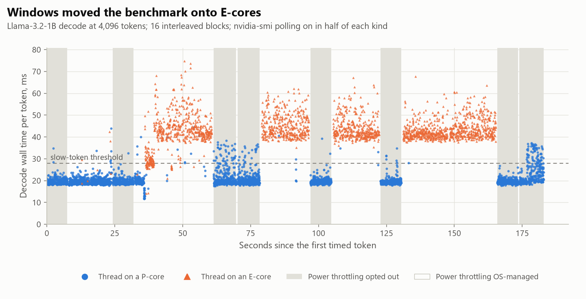
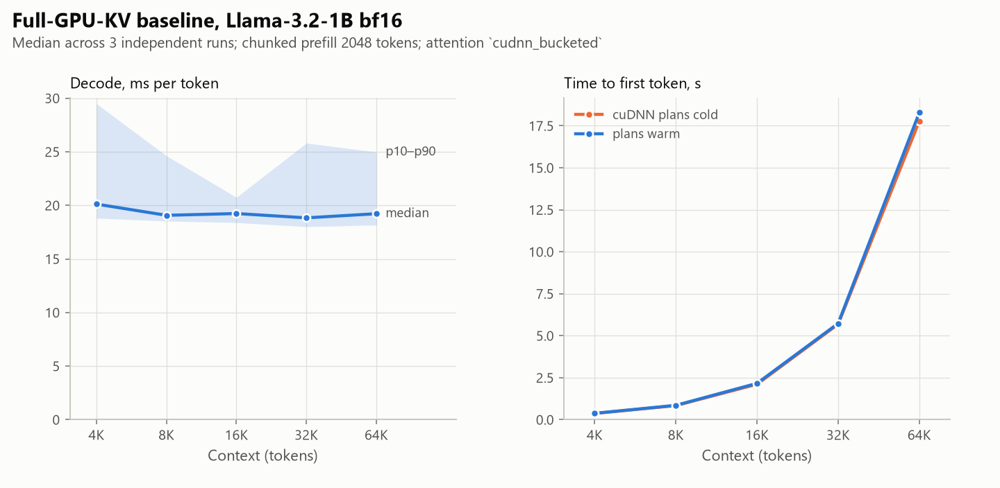
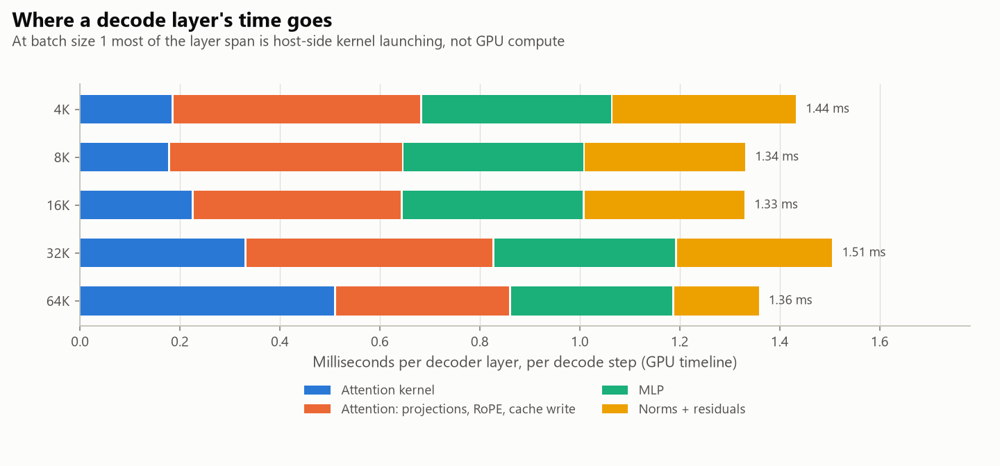
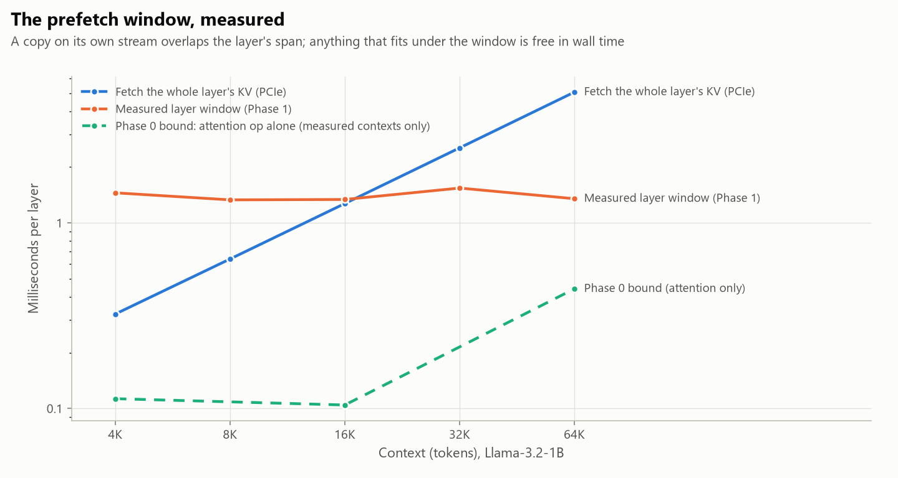

<!-- GENERATED by scripts/render_docs.py from docs/templates/PHASE_1.md.tmpl. Edit the template, not this file. Numbers come from results/**/metrics.json. -->

# Phase 1 gate report: trustworthy baseline

**Status: complete. Stopped at the gate, and Phase 2 has not started.**

Phase 1 built the full-GPU KV reference (policy ladder rung 1) and the instruments every
later policy is judged with. Two of those instruments failed their own validation on the
first try. Both failures are reported below with the data that exposed them, because each
would otherwise have become a false finding in Phase 2.

## Gate checklist (CLAUDE.md rule 3)

- [x] **Tests run.** `pytest`: runtime correctness against transformers' eager attention on a tiny Llama (chunked prefill, decode, every attention strategy with garbage padding), cache round-trip, bit-exact repeatability of the quality kernel, streaming vs full comparison, doc freshness.
- [x] **Real experiment run.** `scripts/01_baseline.py`, runs [1, 2, 3], launched detached, each from a clean tree (provenance below). Supporting experiments: quality reference, kernel repeatability, latency regimes, core affinity.
- [x] **Phase doc written.** This file.
- [x] **Committed and pushed.**

## Deliverables (IMPLEMENTATION_PLAN §7)

| # | Scope item | Delivered |
|---|---|---|
| 1 | Llama-3.2-1B-Instruct, bf16 | `lazykv/generate.py`; weights from the ungated `unsloth/Llama-3.2-1B-Instruct` mirror, pinned to revision `5a8abab4a5d6f164389b1079fb721cfab8d7126c` |
| 2 | Chunked prefill, last-position logits | `prefill()`; peak allocated memory at 65,536 tokens is 4.81 GiB |
| 3 | Explicit, verified attention kernel | `lazykv/attention.py`: every strategy checked against float32 attention at startup; `cudnn_bucketed` pinned; bucketed decode keeps cuDNN plans cached |
| 4 | TTFT, per-token distribution, per-layer split | CUDA events on forward hooks (`lazykv/profiling.py`); results below |
| 5 | Teacher-forced KL and top-1, validated against itself | `lazykv/quality.py`; the self-comparison **failed** on the first run, see finding 4 |
| 6 | 4K–32K (64K if it runs), 3 runs, interleaved, telemetry | 4K–65,536 tokens, 3 independent runs, randomized interleaving, nvidia-smi telemetry |

## Headline findings

1. **The full cache runs to 65,536 tokens on this GPU, and decode does not slow down with context.**
   Decode is 49.7 tokens/s at 4,096 tokens and
   52.0 tokens/s at 65,536. Per-token time at
   65,536 is 0.96× that at 4,096. TTFT at 65,536
   tokens is 18.3 s.
2. **The prefetch window is 3–13× wider than Phase 0's lower bound.**
   A decoder layer spans 1.33 ms–1.54 ms
   on the GPU timeline at every context length. At the measured pinned H2D bandwidth, the KV of
   17,152–19,870
   tokens of one layer fits inside that span: **27% of a
   65,536-token context**, against 8.6% estimated in Phase 0.
   **Caveat:** at batch size 1 the span is mostly host-side kernel launching. Anything that
   removes host overhead (CUDA graphs, fused kernels) shrinks the window along with it.
3. **Decode is host-bound, so a residency policy cannot beat the full cache on latency here.**
   The attention kernel's share of a layer grows from 13%
   at 4,096 tokens to 38% at 65,536, yet
   per-token time stays flat (finding 1). The GPU finishes its work inside the time Python
   takes to launch it. On Llama-3.2-1B at batch size 1, shrinking the attended KV saves memory,
   not time. Every later latency comparison measures how much overhead a policy **adds**. This does
   not change the research question (the GPU budget was already an imposed constraint, per
   Phase 0), but it rules out a speed-up claim for this model. See the owner decisions below.
4. **Negative result: the reference was not repeatable on the fast kernel.** Running the
   same configuration twice gave top-1 agreement of
   97.3%–99.2%
   and mean KL of 5.3e-04–7.7e-04 nats.
   Cause: cuDNN's single-query SDPA returns different bits for identical inputs on
   11 of
   1,024 real decode calls.
   The memory-efficient kernel is bit-repeatable, so quality is now scored on it, and the
   reference is bit-identical to itself at every measured context (§2).
5. **Negative result: Windows moved the benchmark onto E-cores.** Under the OS's default power
   throttling, the detached benchmark process ran slower tokens almost entirely on E-cores:
   2.08× the median and
   2.13× the p90 of the opted-out
   condition. nvidia-smi polling had no effect (1.00×).
   The first baseline mixed both regimes. All timing benchmarks now opt out, and the baseline
   was rerun.

<picture>
  <source media="(prefers-color-scheme: dark)" srcset="../figures/p1_latency_regimes-dark.png">
  
</picture>

## 1. Baseline

Medians across independent runs, with the range across runs in parentheses. Decode is
measured after 5 warmup steps over
128 tokens, synchronizing once per token as a real
generator must. Prefill chunk 2048 tokens.

| Context | Decode / token | p10 / p90 | Tokens/s | TTFT, plans cold | TTFT, plans warm | Prefill tok/s (warm) | Peak allocated | GPU KV resident |
| ---: | ---: | ---: | ---: | ---: | ---: | ---: | ---: | ---: |
| 4,096 | 20.1 ms (19.3 ms–21.2 ms) | 18.8 ms / 29.5 ms | 49.7 (47.2–51.7) | 0.37 s (0.37 s–0.38 s) | 0.38 s (0.37 s–0.38 s) | 10,801 (10,692–10,998) | 4.52 GiB | 132 MiB |
| 8,192 | 19.1 ms (19 ms–20.5 ms) | 18.5 ms / 24.6 ms | 52.4 (48.7–52.6) | 0.84 s (0.83 s–0.87 s) | 0.86 s (0.84 s–0.87 s) | 9,580 (9,454–9,781) | 4.52 GiB | 260 MiB |
| 16,384 | 19.2 ms (18.8 ms–24.2 ms) | 18.4 ms / 20.7 ms | 52.0 (41.4–53.3) | 2.11 s (2.11 s–2.18 s) | 2.16 s (2.11 s–2.20 s) | 7,574 (7,462–7,782) | 4.53 GiB | 516 MiB |
| 32,768 | 18.8 ms (18.5 ms–19.1 ms) | 18 ms / 25.8 ms | 53.1 (52.2–53.9) | 5.69 s (5.68 s–5.89 s) | 5.73 s (5.68 s–5.85 s) | 5,715 (5,604–5,766) | 4.62 GiB | 1 GiB |
| 65,536 | 19.2 ms (18.5 ms–19.4 ms) | 18.2 ms / 25 ms | 52.0 (51.4–54.1) | 17.78 s (17.77 s–18.44 s) | 18.28 s (17.67 s–18.46 s) | 3,584 (3,551–3,708) | 4.81 GiB | 2 GiB |

<picture>
  <source media="(prefers-color-scheme: dark)" srcset="../figures/p1_baseline_latency-dark.png">
  
</picture>

### Per-layer decode split

CUDA events on forward hooks. Hooks add host overhead, so the profiled steps are separate from
the timed ones and the overhead ratio is reported.

| Context | Whole layer | Attention kernel | Attention: proj + RoPE + cache write | MLP | Norms + residual | Kernel share | Profiler overhead |
| ---: | ---: | ---: | ---: | ---: | ---: | ---: | ---: |
| 4,096 | 1453 µs (1420 µs–1511 µs) | 188 µs | 498 µs | 381 µs | 370 µs | 13% | 1.21× |
| 8,192 | 1331 µs (1293 µs–1355 µs) | 180 µs | 467 µs | 363 µs | 325 µs | 14% | 1.21× |
| 16,384 | 1338 µs (1275 µs–1343 µs) | 228 µs | 418 µs | 364 µs | 324 µs | 17% | 1.20× |
| 32,768 | 1541 µs (1325 µs–1610 µs) | 333 µs | 497 µs | 365 µs | 315 µs | 22% | 1.22× |
| 65,536 | 1350 µs (1347 µs–1704 µs) | 512 µs | 350 µs | 326 µs | 174 µs | 38% | 1.22× |

<picture>
  <source media="(prefers-color-scheme: dark)" srcset="../figures/p1_layer_split-dark.png">
  
</picture>

### The prefetch window (answers IMPLEMENTATION_PLAN §3.2)

Pinned H2D 26.52 GB/s and per-transfer overhead from Phase 0;
2 KiB of KV per token per layer.

| Context | Measured layer window | Phase 0 bound (attention only) | Window ÷ bound | Tokens fetchable in window | Share of context | Phase 0 share | Fetch whole layer |
| ---: | ---: | ---: | ---: | ---: | ---: | ---: | ---: |
| 4,096 | 1.45 ms | 0.113 ms | 12.9× | 18,727 | 457% | 33.7% | 0.323 ms |
| 8,192 | 1.33 ms | – | – | 17,152 | 209% | – | 0.639 ms |
| 16,384 | 1.34 ms | 0.104 ms | 12.8× | 17,235 | 105% | 7.7% | 1.27 ms |
| 32,768 | 1.54 ms | – | – | 19,870 | 61% | – | 2.54 ms |
| 65,536 | 1.35 ms | 0.441 ms | 3.1× | 17,402 | 27% | 8.6% | 5.07 ms |

<picture>
  <source media="(prefers-color-scheme: dark)" srcset="../figures/p1_window-dark.png">
  
</picture>

### Attention strategies, verified at startup

| Strategy | Correct | Rel. err decode | Rel. err prefill | Median call, KV growing by 1/step | Max call |
| --- | --- | ---: | ---: | ---: | ---: |
| `cudnn_bucketed` | yes | 2.7e-03 | 1.8e-03 | 0.198 ms | 42.4 ms |
| `cudnn` | yes | 2.7e-03 | 1.8e-03 | 37.9 ms | 42.1 ms |
| `efficient` | yes | 2.7e-03 | 1.8e-03 | 1.68 ms | 4.6 ms |
| `math` | yes | 2.7e-03 | 1.8e-03 | 2.96 ms | 9.36 ms |

## 2. Quality harness and its noise floor

Teacher-forced through the decode path, 256
continuation positions per context. The reference is the full cache on
`efficient`. Confidence intervals are
bootstraps over positions, which are not independent, so they understate uncertainty.

| Context | Comparison | Positions | Top-1 agreement [95% CI] | Mean KL, nats [95% CI] | Max KL | Bit-identical |
| ---: | --- | ---: | ---: | ---: | ---: | --- |
| 4,096 | Reference vs itself, fresh cache | 256 | 100.0% [100.0, 100.0] | 0.00e+00 [0.0e+00, 0.0e+00] | 0.00e+00 | **yes** |
| 4,096 | Prefill chunk 2048 vs 256 | 256 | 97.3% [95.3, 98.8] | 1.02e-03 [9.0e-04, 1.1e-03] | 7.54e-03 | no |
| 4,096 | `cudnn_bucketed` vs reference | 256 | 96.1% [93.8, 98.4] | 9.91e-04 [8.8e-04, 1.1e-03] | 8.40e-03 | no |
| 4,096 | Stock transformers sdpa + DynamicCache vs reference | 256 | 97.3% [95.3, 99.2] | 8.78e-04 [8.0e-04, 9.7e-04] | 3.66e-03 | no |
| 4,096 | `cudnn_bucketed` vs itself (the speed path's floor) | 256 | 97.7% [95.7, 99.2] | 8.49e-04 [7.6e-04, 9.5e-04] | 5.50e-03 | no |
| 4,096 | Math kernel vs reference (chunk 256) | 256 | 97.7% [95.7, 99.2] | 1.02e-03 [9.0e-04, 1.2e-03] | 7.97e-03 | no |
| 16,384 | Reference vs itself, fresh cache | 256 | 100.0% [100.0, 100.0] | 0.00e+00 [0.0e+00, 0.0e+00] | 0.00e+00 | **yes** |
| 16,384 | Prefill chunk 2048 vs 256 | 256 | 97.7% [95.7, 99.2] | 1.19e-03 [1.0e-03, 1.3e-03] | 6.87e-03 | no |
| 16,384 | `cudnn_bucketed` vs reference | 256 | 98.0% [96.1, 99.6] | 1.14e-03 [9.8e-04, 1.3e-03] | 1.34e-02 | no |
| 16,384 | Stock transformers sdpa + DynamicCache vs reference | 256 | 98.0% [96.1, 99.6] | 1.11e-03 [9.8e-04, 1.2e-03] | 7.29e-03 | no |
| 16,384 | `cudnn_bucketed` vs itself (the speed path's floor) | 256 | 99.2% [98.0, 100.0] | 7.93e-04 [6.8e-04, 9.1e-04] | 6.19e-03 | no |
| 16,384 | Math kernel vs reference (chunk 256) | 256 | 98.4% [96.9, 99.6] | 1.15e-03 [9.8e-04, 1.4e-03] | 2.10e-02 | no |
| 32,768 | Reference vs itself, fresh cache | 256 | 100.0% [100.0, 100.0] | 0.00e+00 [0.0e+00, 0.0e+00] | 0.00e+00 | **yes** |
| 32,768 | Prefill chunk 2048 vs 256 | 256 | 98.8% [97.3, 100.0] | 1.27e-03 [1.1e-03, 1.4e-03] | 8.63e-03 | no |
| 32,768 | `cudnn_bucketed` vs reference | 256 | 98.4% [96.5, 99.6] | 1.22e-03 [1.1e-03, 1.4e-03] | 7.36e-03 | no |
| 32,768 | `cudnn_bucketed` vs itself (the speed path's floor) | 256 | 97.7% [95.7, 99.2] | 9.03e-04 [8.0e-04, 1.0e-03] | 5.53e-03 | no |
| 32,768 | Math kernel vs reference (chunk 256) | 256 | 98.4% [96.9, 99.6] | 1.17e-03 [1.0e-03, 1.3e-03] | 8.30e-03 | no |

**How to read this.** Only the first row per context is required to be exact, and it is. Every
other row compares two computations that are each exact up to bf16 rounding, yet they agree
on top-1 at only 96.1%–98.8%
of positions, with mean KL 8.8e-04–1.3e-03.
That band is the size of pure numerical noise on this model. **A Phase 2+ policy scored on the
quality kernel against this reference has a zero noise floor. A policy effect smaller than this
band would still be invisible if the policy changed kernels or chunking**, so policies must be
scored with both held fixed.

### What the first run showed

The first quality run used the fast kernel as the reference. Its self-comparison:

| Context | Comparison | Positions | Top-1 agreement [95% CI] | Mean KL, nats [95% CI] | Max KL | Bit-identical |
| ---: | --- | ---: | ---: | ---: | ---: | --- |
| 4,096 | `cudnn_bucketed` reference vs itself | 256 | 97.3% [94.9, 99.2] | 7.55e-04 [6.7e-04, 8.4e-04] | 4.18e-03 | no |
| 16,384 | `cudnn_bucketed` reference vs itself | 256 | 99.2% [98.0, 100.0] | 5.30e-04 [4.5e-04, 6.2e-04] | 5.02e-03 | no |
| 32,768 | `cudnn_bucketed` reference vs itself | 256 | 98.0% [96.1, 99.6] | 7.66e-04 [6.7e-04, 8.7e-04] | 5.38e-03 | no |

### Kernel repeatability, in situ

`scripts/01_kernel_repeatability.py` re-executes every decode attention call of the real model
on its live inputs, with a prefill-sized call in between, and compares the outputs bit for bit.

| Context | Strategy | Decode attention calls | Re-executions each | Calls with >1 distinct output | Share | Layers affected |
| ---: | --- | ---: | ---: | ---: | ---: | --- |
| 4,096 | `cudnn_bucketed` | 512 | 4 | **7** | 1.4% | 4, 8, 11, 13, 14 |
| 4,096 | `cudnn` | 512 | 4 | **4** | 0.8% | 1, 8, 13 |
| 4,096 | `efficient` | 512 | 4 | 0 | 0.0% | – |
| 4,096 | `math` | 512 | 4 | 0 | 0.0% | – |
| 16,384 | `cudnn_bucketed` | 512 | 4 | **4** | 0.8% | 2, 4, 10, 13 |
| 16,384 | `cudnn` | 512 | 4 | **4** | 0.8% | 2, 6, 7, 14 |
| 16,384 | `efficient` | 512 | 4 | 0 | 0.0% | – |
| 16,384 | `math` | 512 | 4 | 0 | 0.0% | – |

The differing outputs are all equally accurate. Relative error against float64 attention on
the same inputs is 1.7e-03–3.6e-03
across 38 variant outputs, and
variants differ from each other by at most 1.2e-03
of the output's magnitude. This is rounding, not a wrong answer, but 16 layers compound it into
visible top-1 flips. Before this script existed, scratch diagnostics (not retained, so no numbers
are quoted) had ruled out the other explanations. Prefill logits were bit-identical between runs.
Divergence started at a layer whose inputs were bit-identical. It persisted under
`CUDA_LAUNCH_BLOCKING=1`, with synchronization before or after the call, with fresh input
allocations, and with `torch.backends.cudnn.deterministic` and `torch.use_deterministic_algorithms`.

## 3. Host scheduling: the latency regimes

`scripts/01_latency_regimes.py`: 4 repeats of a
2×2 design at 4,096 tokens, interleaved and randomized.
A token counts as slow above 27.84 ms
(a token is slow if its wall latency exceeds 1.5x the 10th percentile of all tokens measured).

| Power throttling | nvidia-smi polling | Tokens | Median | p90 | Slow tokens | Slow share per block, in run order | Tokens on P-cores | Slow tokens on P-cores |
| --- | --- | ---: | ---: | ---: | ---: | --- | ---: | ---: |
| OS-managed | on | 1,536 | 39.6 ms | 49.5 ms | 60% | 0%, 42%, 99%, 100% | 38% | 1% |
| OS-managed | off | 1,536 | 40.9 ms | 49.6 ms | 74% | 2%, 96%, 100%, 100% | 26% | 1% |
| Opted out | on | 1,536 | 19.5 ms | 24.6 ms | 6% | 1%, 5%, 1%, 19% | 100% | 100% |
| Opted out | off | 1,536 | 19.3 ms | 21.6 ms | 4% | 0%, 12%, 2%, 0% | 100% | 100% |

Under OS-managed throttling, the slowdown switched on after the first round and stayed on. Slow tokens ran on
P-cores 1.0%
of the time. CPU frequency did not explain it: "% Processor Performance" had a median of
155% during
slow tokens and 153%
during fast ones. With throttling opted out, a residual
4.9% of tokens are
still slow, all on P-cores. That residual is unexplained and remains in the reported baseline.

### Effect on the baseline

Same code, same contexts. The only change is the throttling opt-out. The first baseline was not
uniformly slower. Which conditions landed on E-cores depended on when Windows reclassified the
process, so the size of the error varied by context and was not always in the same direction. That arbitrariness, not any single
ratio, is why the first baseline cannot be used.

| Context | Median, OS-managed (first baseline) | Median, opted out (reported baseline) | Before ÷ after | p90 before | p90 after |
| ---: | ---: | ---: | ---: | ---: | ---: |
| 4,096 | 22.7 ms (22.4 ms–23.9 ms) | 20.1 ms (19.3 ms–21.2 ms) | 1.13× | 34.9 ms | 29.5 ms |
| 8,192 | 23.4 ms (18.1 ms–26.2 ms) | 19.1 ms (19 ms–20.5 ms) | 1.23× | 34.2 ms | 24.6 ms |
| 16,384 | 24.9 ms (18.1 ms–27 ms) | 19.2 ms (18.8 ms–24.2 ms) | 1.29× | 35.5 ms | 20.7 ms |
| 32,768 | 18.4 ms (17.3 ms–25.5 ms) | 18.8 ms (18.5 ms–19.1 ms) | 0.98× | 19.1 ms | 25.8 ms |
| 65,536 | 22.5 ms (20.3 ms–24.9 ms) | 19.2 ms (18.5 ms–19.4 ms) | 1.17× | 27.9 ms | 25 ms |

### Core affinity, before and after

| Affinity | Median, throttling opted out | p10 / p90 | Median, OS-managed (first run) | p10 / p90 |
| --- | ---: | ---: | ---: | ---: |
| Default scheduling | 19.1 ms | 18.4 ms / 20.6 ms | 27 ms | 18.5 ms / 35.5 ms |
| P-cores only | 19.8 ms | 18.6 ms / 26.2 ms | 25.9 ms | 18.4 ms / 35.9 ms |
| E-cores only | 40.8 ms | 38.4 ms / 46.7 ms | 40.7 ms | 37.4 ms / 47.9 ms |

## Other incidents fixed during Phase 1 (from commit history; no numbers retained)

- **Silent spill to shared system memory.** Under WDDM, running out of dedicated VRAM does not
  raise OOM; the first 64K condition ran for minutes partly backed by system RAM. It was stopped
  and discarded. The allocator is now capped at the dedicated VRAM that is free at startup, and
  every condition records the process's shared-memory growth, allocator retries, and OOMs.
- **cuDNN plan rebuilds per decode token.** A growing KV length is a new shape every step, and
  each cuDNN plan build cost far more than the attention it served. The bucketed strategy pads
  the KV view to 1,024-token buckets and masks the padding, so a plan is built once per bucket.
- **NaN logits from recycled memory.** Bucketed decode reads padding rows, and `-inf` masking
  cannot neutralize NaN. KV storage is now zero-initialized, and a test poisons the allocator to guard it.
- **Quality run killed for low host RAM.** Comparisons now stream one position at a time on
  the GPU, and peak working set is recorded per context.

## Deviations from the plan

| Plan said | What happened | Reason |
|---|---|---|
| Validate the quality harness against itself; expect exact | Failed on the fast kernel; quality is now scored on `efficient` | cuDNN decode not repeatable (finding 4) |
| Per-token latency distribution | Reported only after the throttling opt-out; first baseline kept as a negative result | E-core migration (finding 5) |
| Attention kernel picked by speed at startup | Speed path pinned to `cudnn_bucketed`, quality path pinned to `efficient` | Speed and repeatability favor different kernels |
| Weights from `meta-llama` or mirror, owner's choice | Ungated `unsloth` mirror, pinned revision | No HF token available |

## Implications for Phase 2

- **Score every policy on the quality kernel with fixed chunking,** or its quality delta is
  indistinguishable from noise of the size shown in §2.
- **Opt out of power throttling** in every timing process, and record it in `metrics.json`.
- **Budget the manager's Python overhead against a 20.12 ms token.**
  Most of that is already host-side launching, and block bookkeeping runs on the same host thread.
  Since decode is host-bound, manager overhead is the dominant latency cost a policy can add.
- **The window arithmetic favors layer-ahead prefetch more than Phase 0 assumed,** but it rests
  on host overhead. If Phase 4 reaches for CUDA graphs to cut decode latency, re-measure the window.

## Run provenance

Baseline runs:

| Run | Finished (UTC) | Commit | Uncommitted tracked changes |
| --- | --- | --- | --- |
| 1 | 2026-09-14T18:32:07+00:00 | `e22dc3e` | no |
| 2 | 2026-09-14T18:35:18+00:00 | `e22dc3e` | no |
| 3 | 2026-09-14T18:38:29+00:00 | `e22dc3e` | no |

Supporting experiments:

| Experiment | Finished (UTC) | Commit | Uncommitted tracked changes |
| --- | --- | --- | --- |
| Quality reference | 2026-09-14T18:15:36+00:00 | `dc0f164` | no |
| Kernel repeatability | 2026-09-14T18:28:51+00:00 | `e22dc3e` | no |
| Latency regimes | 2026-09-14T18:23:15+00:00 | `f83121a` | no |
| Core affinity | 2026-09-14T18:39:43+00:00 | `e22dc3e` | no |
| Quality reference, first run (negative result) | 2026-09-14T16:32:50+00:00 | `f2992fc` | yes |
| Core affinity, before the throttling fix (negative result) | 2026-09-14T16:24:59+00:00 | `c3a91de` | yes |
| Baseline run 1, before the throttling fix (negative result) | 2026-09-14T16:16:00+00:00 | `c3a91de` | yes |
| Baseline run 2, before the throttling fix (negative result) | 2026-09-14T16:19:43+00:00 | `c3a91de` | yes |
| Baseline run 3, before the throttling fix (negative result) | 2026-09-14T16:23:30+00:00 | `c3a91de` | yes |

## Open decisions for the owner

1. **Accept the two measurement changes:** scoring quality on the memory-efficient kernel, and opting benchmark processes out of Windows power throttling.
2. **License** for the public repository (still open from Phase 0).
3. **Weights source:** Phase 1 used the ungated `unsloth` mirror at a pinned revision. Confirm, or provide an HF token for `meta-llama`.
4. **Latency framing (finding 3).** On the 1B model, residency policies can only add latency versus the full cache. Options: (a) keep the 1B study and report latency as overhead added; (b) also bring in a model where KV attention dominates decode, such as the 3B stress model, which needs `bitsandbytes` NF4 (a new dependency) and was planned for Phase 5; (c) revisit the decode loop's host overhead first (e.g. CUDA graphs). Changing the model or scope is a research-direction change (rule 8), so this is not assumed.
