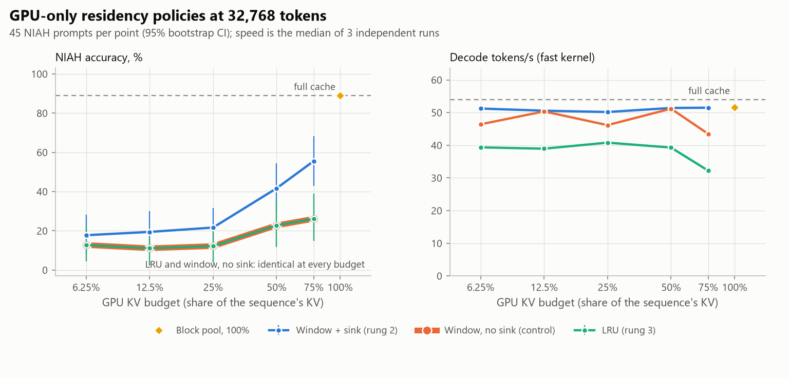
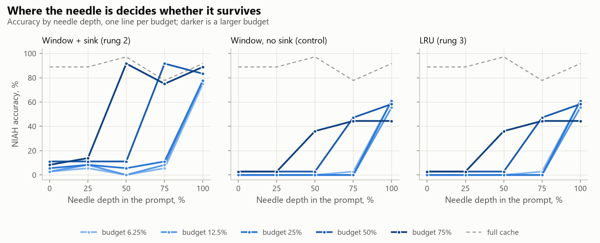
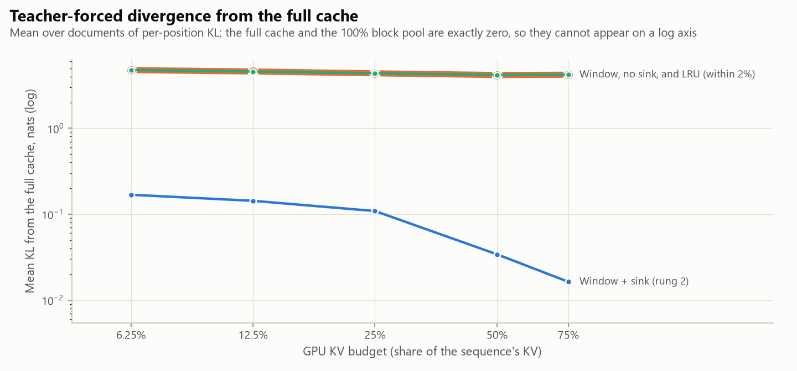

<!-- GENERATED by scripts/render_docs.py from docs/templates/PHASE_2.md.tmpl. Edit the template, not this file. Numbers come from results/**/metrics.json. -->

# Phase 2 gate report: blocks and GPU-only policies

**Status: complete. The gate deliverables are done (tests, experiment, this report, commit).**

Phase 2 built the block-granular, fixed-budget GPU KV pool and the first two eviction rungs
of the policy ladder, and swept them at 32,768 tokens against the full cache.
Nothing is offloaded yet: an evicted block is gone. The results set the floor that
query-aware selection (Phase 3) and the CPU tier (Phase 4) have to beat.

## Gate checklist (CLAUDE.md rule 3)

- [x] **Tests run.** `pytest`: a 100% pool matches the full cache; after many evictions, each slot's layer-0 keys equal the full cache's keys for the logical block the slot table names; a first decode step over a window+sink pool matches an independently built reference far more closely than a wrong-position one (verified by mutation: breaking position tracking fails both tests); storage is bucket-aligned; LRU victim order. All earlier tests still pass.
- [x] **Real experiment run.** `scripts/02_policy_quality.py` (NIAH and teacher-forced divergence) and `scripts/02_budget_speed.py` (3 independent runs), launched detached from a clean tree. Provenance below.
- [x] **Phase doc written.** This file.
- [x] **Committed and pushed.**

## What was built

| Piece | Where | Design choice and why |
|---|---|---|
| Block pool | `lazykv/blocks.py` | Resident KV is always one contiguous prefix of a preallocated tensor: sealed blocks, then the tail block being filled. Attention gets a plain view (no mask, no gather), so the kernel verified in Phase 1 is reused unchanged, and at a fixed budget the shape stays within one cuDNN plan bucket. |
| Eviction | `lazykv/blocks.py` | The tail seals lazily when the next token needs room: into a free slot in place, or copied over the policy's victim. That is one 64-token copy per 64 decode steps. |
| Prefill | `lazykv/sweep.py` | Exact, into the full cache. Policies act at the prefill→decode boundary and during decode, so every condition starts from the same prefill, which is computed once per prompt. Peak memory during prefill is the full KV. |
| Rung 2: window + sink | `lazykv/policies.py` | First block (holds BOS and the chat header) plus the most recent blocks. |
| Rung 3: LRU | `lazykv/policies.py` | A block is "used" at a step when some query head gives it more than a uniform share of attention, observed through the attention function. No history exists at the boundary, so prompt blocks are kept by recency. |
| Control: window, no sink | `lazykv/policies.py` | LRU's boundary choice without LRU, to separate the two effects. |
| NIAH | `lazykv/niah.py` | Single, multi-key and multi-value needles adapted from RULER (arXiv 2404.06654), assembled at the token level to an exact length, chat date pinned. |

Budgets are fractions of the whole sequence's KV (prompt plus generated tokens); the tail block
counts against the budget. Block size is 64 tokens; the block-size sweep is scheduled for Phase 4.

## Headline findings

1. **No GPU-only policy reaches the brief's headline target.** None retains ≥ 99% of the full
   cache's NIAH accuracy at any budget below 100%. The best is window + sink, at
   63% retention with a
   75% budget.
2. **Without the attention sink, the model breaks.** The no-sink window agrees with the full cache on
   12.5%–17.2%
   of teacher-forced tokens at every budget, even the largest. Window + sink keeps
   80.9%–93.6%.
   Even when the needle is inside the window (depth 100%),
   NIAH accuracy is 44%–61%
   without the sink and 75%–89% with it.
3. **LRU is the no-sink window.** Of 225 NIAH prompt × budget
   pairs, 0 score differently from the control, and
   teacher-forced KL differs by at most 0.4%.
   Block-level LRU cannot help in a GPU-only cache: every prompt block it evicts at the boundary
   is gone before any use could be observed, and the few decode-time evictions do not change
   answers. This was predicted when the policy was written. It is kept as the measured result,
   not tuned away.
4. **Eviction is nearly free in latency; observing attention is not.** Window policies run at
   1.05–1.07×
   the full cache's per-token time, with 0.96–1.11 ms
   of manager host time per token. LRU runs at 1.32–1.67×,
   and 4.9–5.9 ms
   of its time per token goes to observing attention. As Phase 1 predicted for a host-bound decode,
   the added cost is kernel launches, not GPU work. Phase 3's selection and H2O-style scoring
   will pay the same kind of cost.
5. **The pool itself is exact and cheap.** At 100% budget, its worst-document teacher-forced KL against the
   full cache is 0.0e+00 with top-1 agreement
   100.0%. 0
   NIAH prompts score differently, and it runs at 1.05× the full cache's per-token time.

<picture>
  <source media="(prefers-color-scheme: dark)" srcset="../figures/p2_pareto-dark.png">
  
</picture>

## 1. NIAH retrieval

45 prompts per condition at 32,768 tokens: every combination of
3 needle kinds, 5 depths and 3 samples. Scored on the repeatable quality kernel. The full cache scores
88.9% [82%, 95%]:
100% single, 93% multi-key,
73% multi-value. Retention divides by that. CIs are bootstraps over
prompts; prompts share a haystack book, so they understate uncertainty.

| Policy | Budget | Resident at answer | Accuracy [95% CI] | Retention | single | multikey | multivalue | depth 0% | depth 25% | depth 50% | depth 75% | depth 100% |
| --- | ---: | ---: | ---: | ---: | ---: | ---: | ---: | ---: | ---: | ---: | ---: | ---: |
| Block pool, 100% | 100% | 100.0% | 88.9% [82, 95] | 100.0% | 100% | 93% | 73% | 89% | 89% | 97% | 78% | 92% |
| Full cache (rung 1) | 100% | 100.0% | 88.9% [82, 95] | 100.0% | 100% | 93% | 73% | 89% | 89% | 97% | 78% | 92% |
| LRU (rung 3) | 75% | 74.8% | 26.1% [15, 39] | 29.4% | 60% | 13% | 5% | 3% | 3% | 36% | 44% | 44% |
| LRU (rung 3) | 50% | 49.8% | 22.8% [12, 36] | 25.6% | 40% | 20% | 8% | 3% | 3% | 3% | 47% | 58% |
| LRU (rung 3) | 25% | 24.8% | 12.2% [4, 22] | 13.8% | 20% | 13% | 3% | 0% | 0% | 0% | 0% | 61% |
| LRU (rung 3) | 12.5% | 12.3% | 11.1% [2, 20] | 12.5% | 20% | 13% | 0% | 0% | 0% | 0% | 0% | 56% |
| LRU (rung 3) | 6.25% | 6.1% | 12.8% [4, 22] | 14.4% | 20% | 13% | 5% | 0% | 0% | 0% | 3% | 61% |
| Window, no sink (control) | 75% | 74.8% | 26.1% [15, 39] | 29.4% | 60% | 13% | 5% | 3% | 3% | 36% | 44% | 44% |
| Window, no sink (control) | 50% | 49.8% | 22.8% [12, 36] | 25.6% | 40% | 20% | 8% | 3% | 3% | 3% | 47% | 58% |
| Window, no sink (control) | 25% | 24.8% | 12.2% [4, 22] | 13.8% | 20% | 13% | 3% | 0% | 0% | 0% | 0% | 61% |
| Window, no sink (control) | 12.5% | 12.3% | 11.1% [2, 20] | 12.5% | 20% | 13% | 0% | 0% | 0% | 0% | 0% | 56% |
| Window, no sink (control) | 6.25% | 6.1% | 12.8% [4, 22] | 14.4% | 20% | 13% | 5% | 0% | 0% | 0% | 3% | 61% |
| Window + sink (rung 2) | 75% | 74.8% | 55.6% [43, 68] | 62.5% | 60% | 53% | 53% | 8% | 14% | 92% | 75% | 89% |
| Window + sink (rung 2) | 50% | 49.8% | 41.7% [29, 54] | 46.9% | 40% | 40% | 45% | 11% | 11% | 11% | 92% | 83% |
| Window + sink (rung 2) | 25% | 24.8% | 21.7% [12, 32] | 24.4% | 20% | 20% | 25% | 6% | 8% | 6% | 11% | 78% |
| Window + sink (rung 2) | 12.5% | 12.3% | 19.4% [9, 30] | 21.9% | 20% | 20% | 18% | 3% | 8% | 0% | 8% | 78% |
| Window + sink (rung 2) | 6.25% | 6.1% | 17.8% [8, 28] | 20.0% | 20% | 20% | 13% | 3% | 6% | 0% | 6% | 75% |

<picture>
  <source media="(prefers-color-scheme: dark)" srcset="../figures/p2_depth-dark.png">
  
</picture>

Depth explains the window results mechanically. A window with budget *f* keeps roughly the last
*f* of the prompt, plus the sink. Needles earlier than that are evicted at the boundary and cannot be found.

## 2. Teacher-forced divergence

2 passages of 32,768 tokens from a second book, 256 continuation positions each,
compared with the full cache's distributions from the same prefill.

| Policy | Budget | Top-1 agreement (mean of documents) | Worst document | Mean KL, nats | Worst document KL | Bit-identical |
| --- | ---: | ---: | ---: | ---: | ---: | --- |
| Block pool, 100% | 100% | 100.0% | 100.0% | 0.00e+00 | 0.00e+00 | **yes** |
| Full cache (rung 1) | 100% | 100.0% | 100.0% | 0.00e+00 | 0.00e+00 | **yes** |
| LRU (rung 3) | 75% | 16.6% | 15.2% | 4.21e+00 | 4.33e+00 | no |
| LRU (rung 3) | 50% | 17.0% | 16.4% | 4.19e+00 | 4.32e+00 | no |
| LRU (rung 3) | 25% | 13.9% | 12.1% | 4.37e+00 | 4.55e+00 | no |
| LRU (rung 3) | 12.5% | 13.9% | 12.5% | 4.58e+00 | 4.75e+00 | no |
| LRU (rung 3) | 6.25% | 12.7% | 11.3% | 4.78e+00 | 4.94e+00 | no |
| Window, no sink (control) | 75% | 16.6% | 15.2% | 4.21e+00 | 4.32e+00 | no |
| Window, no sink (control) | 50% | 17.2% | 16.0% | 4.18e+00 | 4.31e+00 | no |
| Window, no sink (control) | 25% | 14.1% | 12.5% | 4.37e+00 | 4.54e+00 | no |
| Window, no sink (control) | 12.5% | 14.3% | 12.9% | 4.59e+00 | 4.74e+00 | no |
| Window, no sink (control) | 6.25% | 12.5% | 10.9% | 4.76e+00 | 4.93e+00 | no |
| Window + sink (rung 2) | 75% | 93.6% | 93.0% | 1.63e-02 | 2.17e-02 | no |
| Window + sink (rung 2) | 50% | 91.2% | 89.5% | 3.41e-02 | 4.45e-02 | no |
| Window + sink (rung 2) | 25% | 84.6% | 82.4% | 1.09e-01 | 1.28e-01 | no |
| Window + sink (rung 2) | 12.5% | 82.6% | 81.2% | 1.43e-01 | 1.56e-01 | no |
| Window + sink (rung 2) | 6.25% | 80.9% | 80.5% | 1.68e-01 | 1.72e-01 | no |

<picture>
  <source media="(prefers-color-scheme: dark)" srcset="../figures/p2_kl-dark.png">
  
</picture>

## 3. Speed

Fast kernel, power throttling opted out, 3 independent runs; each run prefills
once per repeat and runs every condition in shuffled order from it. Conditions that spilled into shared
system memory: 0.

| Policy | Budget | Decode / token (range over runs) | Tokens/s | ÷ full | p90 | Manager host time / token | of which attention observation | Boundary build | Resident KV | Peak allocated | Spill |
| --- | ---: | ---: | ---: | ---: | ---: | ---: | ---: | ---: | ---: | ---: | --- |
| Block pool, 100% | 100% | 19.41 ms (19.05 ms–24.89 ms) | 51.5 | 1.05× | 29.30 ms | 1.03 ms | 0.00 ms | 25.46 ms | 1,028 MiB | 4.47 GiB | no |
| Full cache (rung 1) | 100% | 18.54 ms (18.17 ms–18.84 ms) | 53.9 | 1.00× | 21.00 ms | – | – | – | 1,028 MiB | 3.4 GiB | no |
| LRU (rung 3) | 75% | 31.02 ms (23.78 ms–38.15 ms) | 32.2 | 1.67× | 38.12 ms | 7.12 ms | 5.91 ms | 25.25 ms | 768 MiB | 4.2 GiB | no |
| LRU (rung 3) | 50% | 25.45 ms (25.35 ms–25.77 ms) | 39.3 | 1.37× | 30.45 ms | 6.00 ms | 4.97 ms | 15.99 ms | 512 MiB | 3.94 GiB | no |
| LRU (rung 3) | 25% | 24.51 ms (24.24 ms–34.02 ms) | 40.8 | 1.32× | 36.63 ms | 6.84 ms | 5.68 ms | 10.14 ms | 254 MiB | 3.65 GiB | no |
| LRU (rung 3) | 12.5% | 25.67 ms (24.69 ms–26.29 ms) | 39.0 | 1.38× | 30.35 ms | 6.26 ms | 5.22 ms | 8.18 ms | 126 MiB | 3.53 GiB | no |
| LRU (rung 3) | 6.25% | 25.41 ms (24.75 ms–28.12 ms) | 39.4 | 1.37× | 27.28 ms | 5.94 ms | 4.93 ms | 11.03 ms | 62 MiB | 3.46 GiB | no |
| Window, no sink (control) | 75% | 23.00 ms (19.85 ms–26.40 ms) | 43.5 | 1.24× | 33.32 ms | 1.15 ms | 0.00 ms | 21.63 ms | 768 MiB | 4.2 GiB | no |
| Window, no sink (control) | 50% | 19.53 ms (19.18 ms–20.57 ms) | 51.2 | 1.05× | 25.85 ms | 1.03 ms | 0.00 ms | 12.48 ms | 512 MiB | 3.94 GiB | no |
| Window, no sink (control) | 25% | 21.66 ms (19.87 ms–28.46 ms) | 46.2 | 1.17× | 27.00 ms | 1.04 ms | 0.00 ms | 8.25 ms | 254 MiB | 3.65 GiB | no |
| Window, no sink (control) | 12.5% | 19.86 ms (19.04 ms–26.39 ms) | 50.4 | 1.07× | 24.24 ms | 0.99 ms | 0.00 ms | 5.11 ms | 126 MiB | 3.53 GiB | no |
| Window, no sink (control) | 6.25% | 21.55 ms (19.86 ms–27.12 ms) | 46.4 | 1.16× | 33.54 ms | 1.10 ms | 0.00 ms | 5.56 ms | 62 MiB | 3.46 GiB | no |
| Window + sink (rung 2) | 75% | 19.42 ms (19.19 ms–22.39 ms) | 51.5 | 1.05× | 20.93 ms | 0.96 ms | 0.00 ms | 19.85 ms | 768 MiB | 4.2 GiB | no |
| Window + sink (rung 2) | 50% | 19.45 ms (19.24 ms–19.53 ms) | 51.4 | 1.05× | 21.17 ms | 0.97 ms | 0.00 ms | 12.20 ms | 512 MiB | 3.94 GiB | no |
| Window + sink (rung 2) | 25% | 19.93 ms (19.72 ms–25.87 ms) | 50.2 | 1.07× | 33.83 ms | 1.11 ms | 0.00 ms | 9.40 ms | 254 MiB | 3.65 GiB | no |
| Window + sink (rung 2) | 12.5% | 19.77 ms (19.50 ms–26.49 ms) | 50.6 | 1.07× | 22.16 ms | 0.97 ms | 0.00 ms | 5.27 ms | 126 MiB | 3.53 GiB | no |
| Window + sink (rung 2) | 6.25% | 19.52 ms (19.20 ms–19.65 ms) | 51.2 | 1.05× | 26.02 ms | 0.99 ms | 0.00 ms | 5.38 ms | 62 MiB | 3.46 GiB | no |

## 4. The smallest budget that keeps accuracy (brief §B8)

| Policy | Smallest budget retaining ≥ 99% of full-cache NIAH accuracy | Tokens/s there | Best retention measured |
| --- | ---: | ---: | ---: |
| Window + sink (rung 2) | **none below 100%** | – | 62.5% at 75% |
| Window, no sink (control) | **none below 100%** | – | 29.4% at 75% |
| LRU (rung 3) | **none below 100%** | – | 29.4% at 75% |

## Incidents fixed during Phase 2

- **Pool storage ending mid-bucket.** The bucketed cuDNN decode pads its view to the next bucket
  boundary *inside existing storage*. A pool sized to its budget ended short of that boundary, so every
  step fell back to unbucketed cuDNN and rebuilt a plan per token. In the 4K smoke test that made decode
  several times slower (smoke output not retained, so no number is quoted). Storage is now rounded up to a
  bucket, and a test guards it.
- **LRU observer copying the cache.** The first full run's LRU observer cast every resident key
  to float32 and broadcast a matmul over the query-group axis, copying the resident keys several
  times per layer per token. Its latency grew with the budget. After the fix, the whole sweep was
  rerun from one commit. The pre-fix results are kept in `results/phase2/*_observer_fp32/` and are
  not used in any table here.
- **Chat template date.** The Llama 3.2 template stamps today's date, which would change prompts
  and their lengths from day to day. It is pinned.

## Deviations from the plan

| Plan said | What happened | Reason |
|---|---|---|
| Rungs 2 and 3 | Plus a no-sink window control | LRU's boundary choice drops the sink; the control shows that this accounts for the whole LRU result |
| Budget sweep at 32K | 75% to 6.25%, plus the full cache and a 100% pool | 100% for an evicting policy is the pool, measured once |
| (not specified) | Prefill exact; policies act from the boundary on | One prefill serves every condition, and prefill approximation is kept out of the comparison. Consequence: prefill still needs the full KV once |
| NIAH "single and multi-needle" | Single, multi-key and multi-value | RULER's task definitions |

## Implications for Phase 3

- **Keep the sink in every policy.** Losing it dominates everything else measured here.
- **Boundary decisions matter most.** GPU-only eviction spends almost its whole error budget at the
  prefill→decode boundary, before a query exists. Query-aware selection with nothing evicted (rung 5)
  removes that: blocks stay resident and each step picks among them.
- **Selection must be cheap in kernel launches,** not just in GPU work. LRU's observer already costs
  several milliseconds per token on this host-bound decode.

## Run provenance

| Experiment | Finished (UTC) | Commit | Uncommitted tracked changes |
| --- | --- | --- | --- |
| Policy quality (NIAH + teacher-forced) | 2026-09-15T22:46:24+00:00 | `5b1c5ef` | no |
| Budget speed run 1 | 2026-09-15T22:51:08+00:00 | `5b1c5ef` | no |
| Budget speed run 2 | 2026-09-15T22:55:58+00:00 | `5b1c5ef` | no |
| Budget speed run 3 | 2026-09-15T23:00:41+00:00 | `5b1c5ef` | no |
