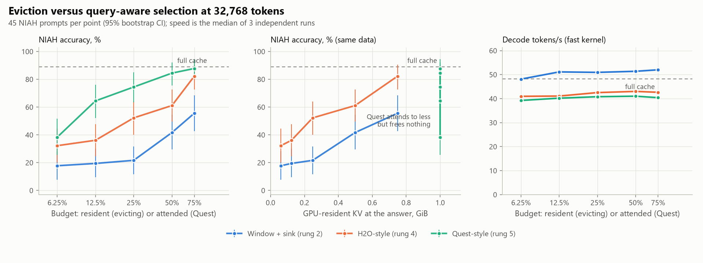
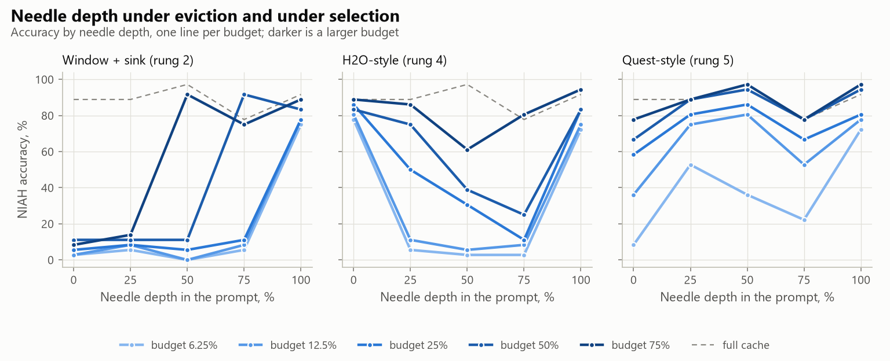
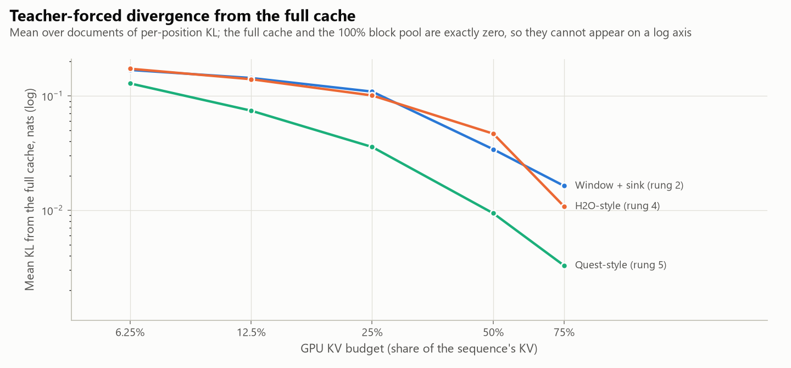

<!-- GENERATED by scripts/render_docs.py from docs/templates/PHASE_3.md.tmpl. Edit the template, not this file. Numbers come from results/**/metrics.json. -->

# Phase 3 gate report: attention-score eviction and query-aware selection

**Status: complete. The gate deliverables are done (tests, experiment, this report, commit).**

Phase 3 added the two policies that decide *which* blocks matter rather than *where* they sit:
rung 4 ranks blocks by the attention they received during the prompt (H2O-style), and rung 5
scores every block against the current query at every decode step and attends to the top ones
(Quest-style). Both were swept at 32,768 tokens against the full
cache and against Phase 2's best policy, window + sink, re-measured in the same run.

Rung 5 evicts nothing: every block stays resident and the budget is what it *attends to*. Until
the CPU tier arrives in Phase 4, it buys accuracy, not memory. The report keeps those two axes
separate everywhere.

## Gate checklist (CLAUDE.md rule 3)

- [x] **Tests run.** `pytest`: the Quest bound dominates every dot product in its block; the gathered set is sink + top-K + current block with the unfilled tail masked, and its attention output matches an explicit reference on both the fast and the quality kernel; a budget that covers every block falls back to dense and is bit-identical; stride-1 prefill scoring equals exact attention column sums across chunks; H2O keeps heavy and recent blocks, never evicts inside its recent window (verified by mutation), and carries the tail's mass into the block it seals. All Phase 0-2 tests still pass.
- [x] **Real experiment run.** `scripts/02_policy_quality.py --config configs/phase3.yaml` and `scripts/02_budget_speed.py --config configs/phase3.yaml` (3 independent runs), launched detached from a clean tree. Provenance below.
- [x] **Phase doc written.** This file.
- [x] **Committed and pushed.**

## What was built

| Piece | Where | Design choice and why |
|---|---|---|
| Rung 4: H2O-style eviction | `lazykv/policies.py` (`H2O`) | Heavy hitters by accumulated attention mass plus a recent window, half the slots each (H2O's equal split). The sink is **not** forced: whether accumulated mass keeps it is a measurement, reported below. |
| Prefill attention mass | `lazykv/scoring.py` | H2O sums the prompt's whole attention matrix. At 32,768 tokens that matrix cannot be materialized, and the exact prefill uses fused kernels that never produce it. Every 32th prompt query is scored instead, causally masked, and scaled by the stride. A stride-1 test checks the estimator against exact column sums. |
| Rung 5: Quest-style selection | `lazykv/selection.py` (`QuestView`) | Per-block key element-wise min/max; each step bounds q·k per block and attends the top-K per KV head, plus the sink and the block being filled. The first 2 layers stay dense, as in Quest. |
| Selector hook | `lazykv/attention.py` | The selector hands attention a constant-shape gathered KV and an additive mask. Constant shape keeps the cuDNN plan cached (Phase 1), so this path needs no bucketing. |
| Attention observation | `lazykv/blocks.py` | The pool now hands each policy the step's attention probabilities and lets it reduce them (LRU: a per-slot use flag, with the same operations as Phase 2; H2O: summed mass). |

Budgets, block size (64 tokens), prompts, needle set and decode
lengths are Phase 2's, so the two phases are directly comparable.

## Deviations from the published methods

| Paper | Here | Why |
|---|---|---|
| H2O scores every prompt query | A systematic sample: every 32th | The full attention matrix is unaffordable at this context; the sample is scaled back up, and a ranking is unchanged by a constant factor |
| H2O keeps scores per head, per token | Summed over heads, per block | The pool's slot table is shared by a layer's heads |
| Quest uses 16-token pages | 64-token blocks | Rungs differ in policy, not block size; the block-size sweep is Phase 4 |
| Quest uses a sparse attention kernel | Gather + masked dense attention | Custom kernels are out of scope (brief §B9). Rung 5's latency here is an upper bound on what a sparse kernel would pay |

## Headline findings

1. **Query-aware selection is worth far more than any eviction rule, and still misses the target.**
   Attending only to the blocks the current query scores highest, under a
   75% attended budget, retains
   98.8% of the full cache's NIAH accuracy,
   against 62.5% for window + sink at the same
   budget. It is the closest any rung has come to the brief's ≥ 99% target and it does not reach it:
   **no policy yet meets the headline target at any budget below 100%.**
2. **Both new rungs beat Phase 2's best policy at every budget, measured pairwise.** Every condition
   answers the same prompts from the same prefill, so the comparison is a paired difference. Quest-style
   selection is +20.6 pp to
   +52.8 pp ahead of window + sink across the budgets, and
   H2O-style eviction +14.4 pp to
   +30.6 pp ahead, with 95% intervals that exclude zero at
   every budget for both (table in §1).
3. **The three policies fail in different places, and depth shows it.** Averaged over the interior needle
   depths, window + sink scores 4%–60%,
   H2O 4%–76%,
   and Quest 37%–88%.
   At the *start* of the prompt the order reverses: H2O scores
   78%–89%
   there against Quest's 8%–78%
   and the window's 3%–11%.
   Accumulated attention is biased toward early positions, because an early key is visible to every later
   query, so H2O keeps the beginning and the recent window and loses the middle. Selection keeps whatever
   the current query points at, wherever it is, and only fails when the budget is too small to hold it.
4. **H2O keeps the attention sink without being told to.** The policy has no sink rule; block 0 stayed
   resident in all 16 layers at every budget. Phase 2 had to hard-code the sink
   to keep a window usable; an attention-mass ranking discovers it.
5. **An attended budget is not a memory budget.** Rung 5 evicts nothing: its GPU-resident KV is
   100% of the sequence at every budget, and it pays a gather
   of the attended set in every selecting layer at every step. What Phase 3 measures is how much accuracy a
   query-aware *choice* retains; turning that choice into memory savings is Phase 4's CPU tier.
6. **Both rungs cost host time, as Phase 1 predicted for a host-bound decode.** H2O's manager costs
   4.7–5.9 ms
   per token and Quest's selector 5.6–6.6 ms,
   against 1.0–1.0 ms
   for a plain window. Scoring the prompt for H2O also adds
   1.19× to prefill
   (5.66 s → 6.70 s).
7. **Negative result on the reference, not on the policies: the full cache's own latency is unstable.**
   Per-repeat medians for the full cache span
   18.37 ms–31.45 ms
   in this phase and 18.10 ms–27.39 ms
   in Phase 2, while every *policy* condition shared by the two phases reproduces within a few percent
   (§6). The ÷ full column therefore carries that spread, and absolute per-token times are the quantity to
   compare across phases. The cause is not yet identified; it is logged rather than smoothed over.

<picture>
  <source media="(prefers-color-scheme: dark)" srcset="../figures/p3_pareto-dark.png">
  
</picture>

## 1. NIAH retrieval

45 prompts per condition at
32,768 tokens: every combination of
3 needle kinds, 5 depths and
3 samples, scored on the repeatable quality kernel. The full cache scores
88.9% [82%, 95%].
"Resident at answer" is what the policy keeps in VRAM; for rung 5 that is everything, and its
budget appears in the attended column instead.

| Policy | Budget | Resident at answer | Accuracy [95% CI] | Retention | single | multikey | multivalue | depth 0% | depth 25% | depth 50% | depth 75% | depth 100% |
| --- | ---: | ---: | ---: | ---: | ---: | ---: | ---: | ---: | ---: | ---: | ---: | ---: |
| Block pool, 100% | 100% | 100.0% | 88.9% [82, 95] | 100.0% | 100% | 93% | 73% | 89% | 89% | 97% | 78% | 92% |
| Full cache (rung 1) | 100% | 100.0% | 88.9% [82, 95] | 100.0% | 100% | 93% | 73% | 89% | 89% | 97% | 78% | 92% |
| H2O-style (rung 4) | 75% | 74.8% | 82.2% [73, 91] | 92.5% | 93% | 80% | 73% | 89% | 86% | 61% | 81% | 94% |
| H2O-style (rung 4) | 50% | 49.8% | 61.1% [49, 73] | 68.8% | 67% | 67% | 50% | 83% | 75% | 39% | 25% | 83% |
| H2O-style (rung 4) | 25% | 24.8% | 52.2% [40, 64] | 58.8% | 60% | 53% | 43% | 86% | 50% | 31% | 11% | 83% |
| H2O-style (rung 4) | 12.5% | 12.3% | 36.1% [24, 48] | 40.6% | 40% | 40% | 28% | 81% | 11% | 6% | 8% | 75% |
| H2O-style (rung 4) | 6.25% | 6.1% | 32.2% [20, 44] | 36.3% | 40% | 40% | 17% | 78% | 6% | 3% | 3% | 72% |
| Quest-style (rung 5) | 75% | 100.0% | 87.8% [81, 94] | 98.8% | 100% | 87% | 77% | 78% | 89% | 97% | 78% | 97% |
| Quest-style (rung 5) | 50% | 100.0% | 84.4% [76, 92] | 95.0% | 93% | 87% | 73% | 67% | 89% | 94% | 78% | 94% |
| Quest-style (rung 5) | 25% | 100.0% | 74.4% [63, 85] | 83.8% | 93% | 73% | 57% | 58% | 81% | 86% | 67% | 81% |
| Quest-style (rung 5) | 12.5% | 100.0% | 64.4% [52, 76] | 72.5% | 93% | 53% | 47% | 36% | 75% | 81% | 53% | 78% |
| Quest-style (rung 5) | 6.25% | 100.0% | 38.3% [26, 52] | 43.1% | 60% | 33% | 22% | 8% | 53% | 36% | 22% | 72% |
| Window + sink (rung 2) | 75% | 74.8% | 55.6% [43, 68] | 62.5% | 60% | 53% | 53% | 8% | 14% | 92% | 75% | 89% |
| Window + sink (rung 2) | 50% | 49.8% | 41.7% [29, 54] | 46.9% | 40% | 40% | 45% | 11% | 11% | 11% | 92% | 83% |
| Window + sink (rung 2) | 25% | 24.8% | 21.7% [12, 32] | 24.4% | 20% | 20% | 25% | 6% | 8% | 6% | 11% | 78% |
| Window + sink (rung 2) | 12.5% | 12.3% | 19.4% [9, 30] | 21.9% | 20% | 20% | 18% | 3% | 8% | 0% | 8% | 78% |
| Window + sink (rung 2) | 6.25% | 6.1% | 17.8% [8, 28] | 20.0% | 20% | 20% | 13% | 3% | 6% | 0% | 6% | 75% |

Every condition decodes the same prompts from the same prefill, so policies are compared pairwise,
against window + sink at the same budget, rather than by overlapping intervals:

| Accuracy difference [95% CI] (prompts better↑ worse↓) | budget 6.25% | budget 12.5% | budget 25% | budget 50% | budget 75% |
| --- | ---: | ---: | ---: | ---: | ---: |
| H2O-style (rung 4) − Window + sink (rung 2) | +14.4 pp [+5, +26] (10↑ 3↓) | +16.7 pp [+8, +28] (12↑ 1↓) | +30.6 pp [+18, +44] (20↑ 1↓) | +19.4 pp [+1, +37] (19↑ 8↓) | +26.7 pp [+10, +43] (20↑ 3↓) |
| Quest-style (rung 5) − Window + sink (rung 2) | +20.6 pp [+10, +33] (13↑ 2↓) | +45.0 pp [+32, +59] (26↑ 2↓) | +52.8 pp [+39, +67] (30↑ 2↓) | +42.8 pp [+28, +58] (27↑ 3↓) | +32.2 pp [+21, +45] (20↑ 0↓) |

<picture>
  <source media="(prefers-color-scheme: dark)" srcset="../figures/p3_depth-dark.png">
  
</picture>

## 2. Teacher-forced divergence

2 passages of 32,768 tokens from a
second book, 256 continuation positions each, compared with the
full cache's distributions from the same prefill.

| Policy | Budget | Top-1 agreement (mean of documents) | Worst document | Mean KL, nats | Worst document KL | Bit-identical |
| --- | ---: | ---: | ---: | ---: | ---: | --- |
| Block pool, 100% | 100% | 100.0% | 100.0% | 0.00e+00 | 0.00e+00 | **yes** |
| Full cache (rung 1) | 100% | 100.0% | 100.0% | 0.00e+00 | 0.00e+00 | **yes** |
| H2O-style (rung 4) | 75% | 95.1% | 93.8% | 1.08e-02 | 1.08e-02 | no |
| H2O-style (rung 4) | 50% | 90.0% | 88.7% | 4.67e-02 | 5.12e-02 | no |
| H2O-style (rung 4) | 25% | 84.0% | 81.6% | 1.01e-01 | 1.09e-01 | no |
| H2O-style (rung 4) | 12.5% | 82.6% | 82.4% | 1.40e-01 | 1.46e-01 | no |
| H2O-style (rung 4) | 6.25% | 80.7% | 80.5% | 1.73e-01 | 1.80e-01 | no |
| Quest-style (rung 5) | 75% | 96.7% | 95.7% | 3.29e-03 | 3.37e-03 | no |
| Quest-style (rung 5) | 50% | 95.1% | 94.9% | 9.41e-03 | 9.59e-03 | no |
| Quest-style (rung 5) | 25% | 90.8% | 90.2% | 3.57e-02 | 3.68e-02 | no |
| Quest-style (rung 5) | 12.5% | 86.3% | 86.3% | 7.42e-02 | 7.92e-02 | no |
| Quest-style (rung 5) | 6.25% | 79.3% | 78.1% | 1.28e-01 | 1.30e-01 | no |
| Window + sink (rung 2) | 75% | 93.6% | 93.0% | 1.63e-02 | 2.17e-02 | no |
| Window + sink (rung 2) | 50% | 91.2% | 89.5% | 3.41e-02 | 4.45e-02 | no |
| Window + sink (rung 2) | 25% | 84.6% | 82.4% | 1.09e-01 | 1.28e-01 | no |
| Window + sink (rung 2) | 12.5% | 82.6% | 81.2% | 1.43e-01 | 1.56e-01 | no |
| Window + sink (rung 2) | 6.25% | 80.9% | 80.5% | 1.68e-01 | 1.72e-01 | no |

<picture>
  <source media="(prefers-color-scheme: dark)" srcset="../figures/p3_kl-dark.png">
  
</picture>

## 3. What H2O's ranking actually kept

| H2O-style, NIAH prompts | budget 6.25% | budget 12.5% | budget 25% | budget 50% | budget 75% |
| --- | ---: | ---: | ---: | ---: | ---: |
| Layers keeping block 0 (worst prompt), of 16 | 16 | 16 | 16 | 16 | 16 |
| Prompt blocks evicted at the boundary, all layers (median) | 7,696 | 7,184 | 6,160 | 4,112 | 2,064 |
| Decode-time evictions, all layers (median) | 32 | 32 | 32 | 32 | 32 |

## 4. Speed

Fast kernel, power throttling opted out, 3 independent runs.
Conditions that spilled into shared system memory: 0.

| Policy | Budget | Decode / token (range over runs) | Tokens/s | ÷ full | p90 | Manager host time / token | of which attention observation | Boundary build | Resident KV | Peak allocated | Spill |
| --- | ---: | ---: | ---: | ---: | ---: | ---: | ---: | ---: | ---: | ---: | --- |
| Block pool, 100% | 100% | 18.93 ms (18.77 ms–28.91 ms) | 52.8 | 0.91× | 30.36 ms | 1.08 ms | 0.00 ms | 26.83 ms | 1,028 MiB | 4.47 GiB | no |
| Full cache (rung 1) | 100% | 20.77 ms (18.79 ms–23.92 ms) | 48.2 | 1.00× | 24.98 ms | – | – | – | 1,028 MiB | 3.4 GiB | no |
| H2O-style (rung 4) | 75% | 23.46 ms (22.90 ms–28.54 ms) | 42.6 | 1.13× | 26.36 ms | 4.72 ms | 3.71 ms | 27.25 ms | 768 MiB | 4.21 GiB | no |
| H2O-style (rung 4) | 50% | 23.25 ms (23.24 ms–24.49 ms) | 43.0 | 1.12× | 27.34 ms | 4.93 ms | 3.89 ms | 20.42 ms | 512 MiB | 3.95 GiB | no |
| H2O-style (rung 4) | 25% | 23.52 ms (23.09 ms–24.65 ms) | 42.5 | 1.13× | 24.96 ms | 5.17 ms | 4.14 ms | 17.41 ms | 254 MiB | 3.66 GiB | no |
| H2O-style (rung 4) | 12.5% | 24.35 ms (23.88 ms–24.45 ms) | 41.1 | 1.17× | 25.93 ms | 5.25 ms | 4.20 ms | 13.33 ms | 126 MiB | 3.53 GiB | no |
| H2O-style (rung 4) | 6.25% | 24.42 ms (23.67 ms–39.03 ms) | 41.0 | 1.18× | 42.07 ms | 5.93 ms | 4.82 ms | 18.56 ms | 62 MiB | 3.47 GiB | no |
| Quest-style (rung 5) | 75% | 24.76 ms (24.05 ms–25.89 ms) | 40.4 | 1.19× | 25.37 ms | 6.28 ms | – | 3.79 ms | 1,028 MiB | 3.46 GiB | no |
| Quest-style (rung 5) | 50% | 24.38 ms (23.82 ms–26.64 ms) | 41.0 | 1.17× | 36.06 ms | 6.59 ms | – | 3.76 ms | 1,028 MiB | 3.45 GiB | no |
| Quest-style (rung 5) | 25% | 24.51 ms (24.13 ms–24.69 ms) | 40.8 | 1.18× | 25.75 ms | 5.57 ms | – | 3.85 ms | 1,028 MiB | 3.43 GiB | no |
| Quest-style (rung 5) | 12.5% | 24.88 ms (24.34 ms–25.97 ms) | 40.2 | 1.20× | 25.97 ms | 5.56 ms | – | 3.74 ms | 1,028 MiB | 3.42 GiB | no |
| Quest-style (rung 5) | 6.25% | 25.48 ms (24.77 ms–37.55 ms) | 39.2 | 1.23× | 27.75 ms | 5.85 ms | – | 3.77 ms | 1,028 MiB | 3.42 GiB | no |
| Window + sink (rung 2) | 75% | 19.23 ms (19.18 ms–19.31 ms) | 52.0 | 0.93× | 26.42 ms | 1.01 ms | 0.00 ms | 19.45 ms | 768 MiB | 4.2 GiB | no |
| Window + sink (rung 2) | 50% | 19.46 ms (19.25 ms–19.74 ms) | 51.4 | 0.94× | 24.29 ms | 0.99 ms | 0.00 ms | 12.79 ms | 512 MiB | 3.95 GiB | no |
| Window + sink (rung 2) | 25% | 19.63 ms (19.43 ms–25.08 ms) | 50.9 | 0.95× | 21.73 ms | 0.97 ms | 0.00 ms | 6.72 ms | 254 MiB | 3.66 GiB | no |
| Window + sink (rung 2) | 12.5% | 19.56 ms (19.55 ms–20.07 ms) | 51.1 | 0.94× | 23.85 ms | 0.99 ms | 0.00 ms | 4.93 ms | 126 MiB | 3.53 GiB | no |
| Window + sink (rung 2) | 6.25% | 20.78 ms (19.81 ms–24.90 ms) | 48.1 | 1.00× | 24.63 ms | 1.01 ms | 0.00 ms | 5.93 ms | 62 MiB | 3.46 GiB | no |

## 5. The smallest budget that keeps accuracy (brief §B8)

| Policy | Smallest budget retaining ≥ 99% of full-cache NIAH accuracy | Tokens/s there | Best retention measured |
| --- | ---: | ---: | ---: |
| Window + sink (rung 2) | **none below 100%** | – | 62.5% at 75% |
| H2O-style (rung 4) | **none below 100%** | – | 92.5% at 75% |
| Quest-style (rung 5) | **none below 100%** | – | 98.8% at 75% |

## 6. Reproducibility against Phase 2

Phase 3 re-measured the full cache, the 100% block pool and window + sink at every budget. Quality is
deterministic on the repeatable kernel, so these should be identical, and they are: of
315 shared NIAH prompt × condition pairs,
0 scored differently, and the largest teacher-forced
difference across 14 shared conditions is
0.0e+00 nats of KL. Speed is not deterministic; the table
below is the check on it.

| Condition measured in both phases | Budget | Phase 2 decode / token | Phase 3 decode / token | Phase 3 ÷ Phase 2 |
| --- | ---: | ---: | ---: | ---: |
| Block pool, 100% | 100% | 19.41 ms (19.05 ms–24.89 ms) | 18.93 ms (18.77 ms–28.91 ms) | 0.976× |
| Full cache (rung 1) | 100% | 18.54 ms (18.17 ms–18.84 ms) | 20.77 ms (18.79 ms–23.92 ms) | 1.120× |
| Window + sink (rung 2) | 75% | 19.42 ms (19.19 ms–22.39 ms) | 19.23 ms (19.18 ms–19.31 ms) | 0.990× |
| Window + sink (rung 2) | 50% | 19.45 ms (19.24 ms–19.53 ms) | 19.46 ms (19.25 ms–19.74 ms) | 1.000× |
| Window + sink (rung 2) | 25% | 19.93 ms (19.72 ms–25.87 ms) | 19.63 ms (19.43 ms–25.08 ms) | 0.985× |
| Window + sink (rung 2) | 12.5% | 19.77 ms (19.50 ms–26.49 ms) | 19.56 ms (19.55 ms–20.07 ms) | 0.989× |
| Window + sink (rung 2) | 6.25% | 19.52 ms (19.20 ms–19.65 ms) | 20.78 ms (19.81 ms–24.90 ms) | 1.065× |

## Run provenance

| Experiment | Finished (UTC) | Commit | Uncommitted tracked changes |
| --- | --- | --- | --- |
| Policy quality (NIAH + teacher-forced) | 2026-09-15T23:59:58+00:00 | `be4b108` | no |
| Budget speed run 1 | 2026-09-16T00:05:14+00:00 | `be4b108` | no |
| Budget speed run 2 | 2026-09-16T00:10:32+00:00 | `be4b108` | no |
| Budget speed run 3 | 2026-09-16T00:16:01+00:00 | `be4b108` | no |
