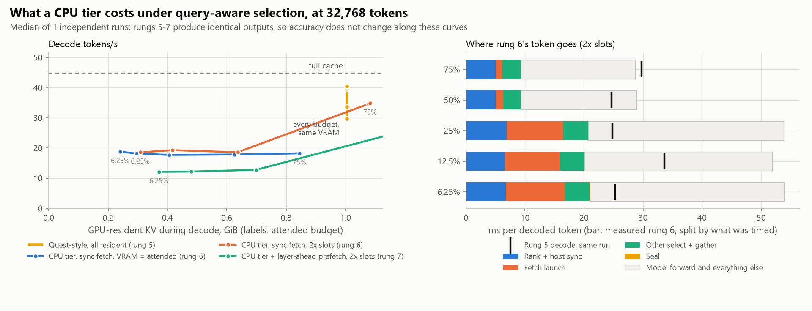
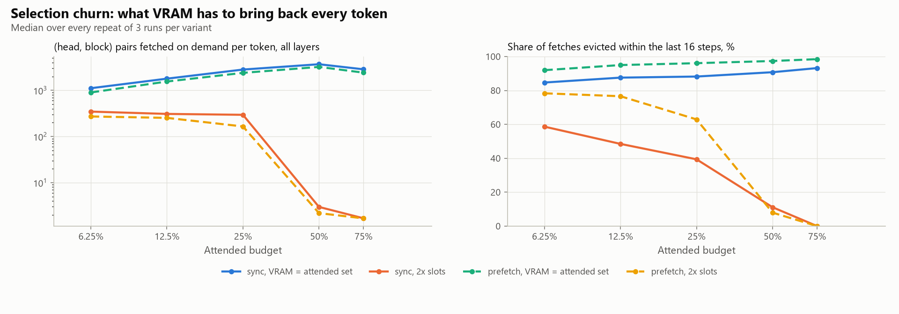
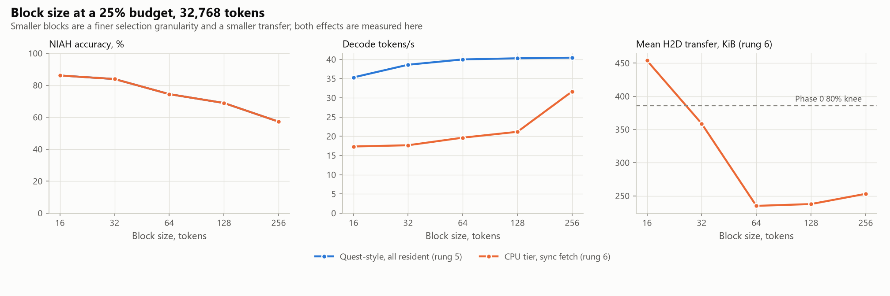

<!-- GENERATED by scripts/render_docs.py from docs/templates/PHASE_4.md.tmpl. Edit the template, not this file. Numbers come from results/**/metrics.json. -->

# Phase 4 gate report: the CPU tier, synchronous fetch and layer-ahead prefetch

**Status: complete. The gate deliverables are done (tests, experiment, this report, commit).**

Phase 3 ended with a result that was half a result: query-aware selection (rung 5) retained
98.8% of the full cache's NIAH accuracy while
attending to a quarter of the sequence — but it *evicted nothing*, so its budget bought accuracy,
not memory. Phase 4 puts the blocks it does not attend to in pinned host RAM and brings them back
on demand (rung 6) or one layer ahead on a copy stream (rung 7).

Because rungs 6 and 7 use rung 5's selection unchanged — same block metadata, same bound, same
top-K, same gather order — their outputs should be *identical*, not merely close. That is the
first thing measured, and it holds: the tier is a memory mechanism with no quality axis of its own.

## Gate checklist (CLAUDE.md rule 3)

- [x] **Tests run.** `pytest`: the tier reproduces rung 5 bit for bit on both kernels, with and without prefetch, under both fetch modes and with spare slots; the host pool holds exactly the KV rung 5 writes, for prompt blocks and for blocks sealed during decode; `admit` coalesces pairs that are consecutive in both pools into one transfer, evicts only outside the current selection, fills empty slots before occupied ones, and refuses a budget that covers every block; `close()` removes every prefetch hook. All Phase 0-3 tests still pass.
- [x] **Real experiment run.** `scripts/02_policy_quality.py --config configs/phase4.yaml` and `scripts/02_budget_speed.py --config configs/phase4.yaml` (3 runs at 2× slots, 3 with VRAM holding exactly the attended set), launched detached from a clean tree. Provenance below.
- [x] **Phase doc written.** This file.
- [x] **Committed and pushed.**

## What was built

| Piece | Where | Design choice and why |
|---|---|---|
| Pinned host pools | `lazykv/tiered.py` (`allocate_host_pools`) | One pinned tensor per selecting layer, `[blocks, heads, 2, block_size, head_dim]`, so one (head, block) pair is contiguous and a run of pairs is one transfer. Allocated once per process: pinning 1,052 MiB inside a timed condition would measure the allocator, not the policy. |
| Residency unit | `lazykv/tiered.py` (`TieredLayer`) | Per (layer, **KV head**, block). Selection is per head, so a per-block unit would have to hold the union of all heads' choices — up to 8× the attended set on this model. |
| Seal-time D2H only | `TieredLayer._seal` | KV is immutable once written and Phase 0 measured one copy engine, so each block is copied to host exactly once, when it seals, and never written back on eviction. |
| Rung 6: synchronous fetch | `TieredCache.select` | Bound, rank, bring the missing pairs in on the compute stream, then attend. Victims: least recently selected slots outside the current selection. |
| Rung 7: layer-ahead prefetch | `TieredCache._make_hook` | A forward pre-hook on layer L speculates layer L+1's query from L's input hidden state (InfiniGen's premise that the residual stream changes little between adjacent layers), through L+1's own norm, `q_proj` and RoPE, and issues the copies on a separate stream while L computes. |
| Two fetch mechanisms | `TieredLayer.admit` | `runs`: one H2D per run of pairs consecutive in both pools. `gather`: a host-side gather into pinned staging, one H2D per layer, then a device scatter. The probe below chose between them by measurement. |
| Overlap and thrash instrumentation | `TierCounters`, `TieredCache.overlap` | CUDA events on every prefetch copy and on the compute stream from launch until the target layer selects; re-fetches of pairs evicted within the last 16 steps are counted as thrash. |

Context, budgets, block size (64 tokens), prompts, needle set and
decode lengths are Phase 2's and Phase 3's, so every phase is directly comparable, and rung 5 is
re-measured inside this run.

## Headline findings

1. **The tier is exact: it changes where KV lives, not what the model says.** Across
   225 prompt × budget NIAH
   cells per policy, rungs 6 and 7 produced
   **0 answers** different from rung 5,
   and the largest teacher-forced KL difference against rung 5 was
   **0.0e+00 nats**. The accuracy column of §1 is
   rung 5's column, re-measured.
2. **The attended budget is now a memory budget.** With VRAM sized to the attended set, rung 6 holds
   415 MiB at a 25% budget and
   247 MiB at 6.25%, against rung
   5's 1,028 MiB for the same answers. What
   remains is dominated by the 2 dense layers Quest's method
   keeps fully resident, which no budget touches, plus the block metadata and staging buffers the tier
   itself needs. **The 2× slot variant only saves VRAM at budgets of 25% and below**
   (37% at 25%,
   69% at 6.25%): above that
   its slot count is capped at the number of blocks, every block stays resident, and it costs *more*
   VRAM than rung 5 (negative savings in §3).
3. **The price is latency, and it is large.** Rung 6 decodes at
   18.6 tokens/s at a 25% budget
   against rung 5's 40.3 and the full
   cache's 52.0. Every selecting layer must bring
   its top-K indices to the host before it can decide what to fetch, and that host round trip, not
   the PCIe transfer, is the dominant new cost (§3).
4. **Ten times fewer fetches, almost the same latency.** Doubling the slots at a 25% budget cuts
   on-demand fetches from
   2,828 pairs per token
   to 295, and decode speed
   moves from 17.7 to
   18.6 tokens/s. An order of magnitude
   less traffic is worth a few percent of latency, which is the clearest single statement that the
   transfers are not what this design pays for.
5. **Selection churns, and spare VRAM absorbs the churn.** With VRAM holding exactly the attended set,
   3,692 (head, block)
   pairs per token have to be re-fetched at the worst budget, and
   93% of those fetches are
   blocks evicted within the previous 16 steps. Doubling the slots cuts fetches to
   3–347
   per token and thrash to 11%–59%.
6. **Negative result: layer-ahead prefetch never stalls and still loses.** Every prefetch copy
   finished inside the window it was launched into
   (100%–100%
   of the copy inside the window, copies of
   0.39–0.83 ms
   against windows of
   3.70–6.82 ms),
   so the transfer is fully hidden — exactly what Phase 0's overlap measurement predicted. It still
   makes decode slower, because speculating costs a second host round trip per layer and its
   precision is only
   31%–39%:
   the wrong guesses evict blocks the real selection then has to fetch back. **On a host-bound
   decode, hiding a transfer that was never the bottleneck buys nothing.**
7. **The bottleneck moved from PCIe to the host, and the numbers say so.** At a 25% budget rung 6
   moves 4.6 MiB per token in
   14 transfers, which at
   the Phase 0 pinned-H2D asymptote is under a millisecond of link time, while ranking and its host
   sync alone cost
   5.0–6.8 ms
   per token. This is the same host-bound regime Phase 1 measured for plain decode, now with 14
   extra synchronizations in it.

<picture>
  <source media="(prefers-color-scheme: dark)" srcset="../figures/p4_tradeoff-dark.png">
  
</picture>

## 1. NIAH retrieval

The same 45 prompts per condition as Phases 2 and 3,
at 32,768 tokens, scored on the repeatable quality kernel.

| Policy | Budget | Resident at answer | Accuracy [95% CI] | Retention | single | multikey | multivalue | depth 0% | depth 25% | depth 50% | depth 75% | depth 100% |
| --- | ---: | ---: | ---: | ---: | ---: | ---: | ---: | ---: | ---: | ---: | ---: | ---: |
| Block pool, 100% | 100% | 100.0% | 88.9% [82, 95] | 100.0% | 100% | 93% | 73% | 89% | 89% | 97% | 78% | 92% |
| Full cache (rung 1) | 100% | 100.0% | 88.9% [82, 95] | 100.0% | 100% | 93% | 73% | 89% | 89% | 97% | 78% | 92% |
| Quest-style (rung 5) | 75% | 100.0% | 87.8% [81, 94] | 98.8% | 100% | 87% | 77% | 78% | 89% | 97% | 78% | 97% |
| Quest-style (rung 5) | 50% | 100.0% | 84.4% [76, 92] | 95.0% | 93% | 87% | 73% | 67% | 89% | 94% | 78% | 94% |
| Quest-style (rung 5) | 25% | 100.0% | 74.4% [63, 85] | 83.8% | 93% | 73% | 57% | 58% | 81% | 86% | 67% | 81% |
| Quest-style (rung 5) | 12.5% | 100.0% | 64.4% [52, 76] | 72.5% | 93% | 53% | 47% | 36% | 75% | 81% | 53% | 78% |
| Quest-style (rung 5) | 6.25% | 100.0% | 38.3% [26, 52] | 43.1% | 60% | 33% | 22% | 8% | 53% | 36% | 22% | 72% |
| CPU tier + prefetch (rung 7) | 75% | 114.4% | 87.8% [81, 94] | 98.8% | 100% | 87% | 77% | 78% | 89% | 97% | 78% | 97% |
| CPU tier + prefetch (rung 7) | 50% | 113.9% | 84.4% [76, 92] | 95.0% | 93% | 87% | 73% | 67% | 89% | 94% | 78% | 94% |
| CPU tier + prefetch (rung 7) | 25% | 70.2% | 74.4% [63, 85] | 83.8% | 93% | 73% | 57% | 58% | 81% | 86% | 67% | 81% |
| CPU tier + prefetch (rung 7) | 12.5% | 48.3% | 64.4% [52, 76] | 72.5% | 93% | 53% | 47% | 36% | 75% | 81% | 53% | 78% |
| CPU tier + prefetch (rung 7) | 6.25% | 37.4% | 38.3% [26, 52] | 43.1% | 60% | 33% | 22% | 8% | 53% | 36% | 22% | 72% |
| CPU tier, sync fetch (rung 6) | 75% | 108.0% | 87.8% [81, 94] | 98.8% | 100% | 87% | 77% | 78% | 89% | 97% | 78% | 97% |
| CPU tier, sync fetch (rung 6) | 50% | 107.5% | 84.4% [76, 92] | 95.0% | 93% | 87% | 73% | 67% | 89% | 94% | 78% | 94% |
| CPU tier, sync fetch (rung 6) | 25% | 63.7% | 74.4% [63, 85] | 83.8% | 93% | 73% | 57% | 58% | 81% | 86% | 67% | 81% |
| CPU tier, sync fetch (rung 6) | 12.5% | 41.9% | 64.4% [52, 76] | 72.5% | 93% | 53% | 47% | 36% | 75% | 81% | 53% | 78% |
| CPU tier, sync fetch (rung 6) | 6.25% | 30.9% | 38.3% [26, 52] | 43.1% | 60% | 33% | 22% | 8% | 53% | 36% | 22% | 72% |

"Resident at answer" is everything the tier keeps in VRAM for decode — slot pools, the per-block key
min/max metadata, and the pinned-gather staging buffers — as a share of the sequence's KV bytes. It
exceeds 100% for rungs 6 and 7 at the largest budgets, where 2× slots is capped at the block count so
every block is resident *and* the metadata and staging are paid on top. The memory case for the tier
is the 25%-and-below rows, and the `= attended` rows of §3.

Rungs 6 and 7 are rung 5's selection over a CPU tier, so their rows should be identical to rung 5's,
not similar to them. Measured:

| Policy | NIAH answers differing from rung 5 (prompt × budget) | Largest teacher-forced KL difference | Largest top-1 difference |
| --- | ---: | ---: | ---: |
| CPU tier, sync fetch (rung 6) | 0 of 225 | 0.0e+00 | 0.00 pp |
| CPU tier + prefetch (rung 7) | 0 of 225 | 0.0e+00 | 0.00 pp |

## 2. Teacher-forced divergence

| Policy | Budget | Top-1 agreement (mean of documents) | Worst document | Mean KL, nats | Worst document KL | Bit-identical |
| --- | ---: | ---: | ---: | ---: | ---: | --- |
| Block pool, 100% | 100% | 100.0% | 100.0% | 0.00e+00 | 0.00e+00 | **yes** |
| Full cache (rung 1) | 100% | 100.0% | 100.0% | 0.00e+00 | 0.00e+00 | **yes** |
| Quest-style (rung 5) | 75% | 96.7% | 95.7% | 3.29e-03 | 3.37e-03 | no |
| Quest-style (rung 5) | 50% | 95.1% | 94.9% | 9.41e-03 | 9.59e-03 | no |
| Quest-style (rung 5) | 25% | 90.8% | 90.2% | 3.57e-02 | 3.68e-02 | no |
| Quest-style (rung 5) | 12.5% | 86.3% | 86.3% | 7.42e-02 | 7.92e-02 | no |
| Quest-style (rung 5) | 6.25% | 79.3% | 78.1% | 1.28e-01 | 1.30e-01 | no |
| CPU tier + prefetch (rung 7) | 75% | 96.7% | 95.7% | 3.29e-03 | 3.37e-03 | no |
| CPU tier + prefetch (rung 7) | 50% | 95.1% | 94.9% | 9.41e-03 | 9.59e-03 | no |
| CPU tier + prefetch (rung 7) | 25% | 90.8% | 90.2% | 3.57e-02 | 3.68e-02 | no |
| CPU tier + prefetch (rung 7) | 12.5% | 86.3% | 86.3% | 7.42e-02 | 7.92e-02 | no |
| CPU tier + prefetch (rung 7) | 6.25% | 79.3% | 78.1% | 1.28e-01 | 1.30e-01 | no |
| CPU tier, sync fetch (rung 6) | 75% | 96.7% | 95.7% | 3.29e-03 | 3.37e-03 | no |
| CPU tier, sync fetch (rung 6) | 50% | 95.1% | 94.9% | 9.41e-03 | 9.59e-03 | no |
| CPU tier, sync fetch (rung 6) | 25% | 90.8% | 90.2% | 3.57e-02 | 3.68e-02 | no |
| CPU tier, sync fetch (rung 6) | 12.5% | 86.3% | 86.3% | 7.42e-02 | 7.92e-02 | no |
| CPU tier, sync fetch (rung 6) | 6.25% | 79.3% | 78.1% | 1.28e-01 | 1.30e-01 | no |

## 3. What the tier does per token

"Pairs" are (KV head, block) units: the residency unit. "Thrash" is the share of on-demand fetches
that bring back a pair evicted within the previous 16 steps. The two VRAM-slot variants are the
same sweep run twice: slots for exactly the attended set, and slots for twice it.

| Policy | VRAM slots | Budget | K / slots per head | Resident KV | Decode / token (range over runs) | ÷ rung 5 | Hit rate | Pairs fetched / token | MiB fetched / token | H2D transfers / token | Thrash | Rank + sync, ms | Other select, ms | Prefetch host, ms | Prefetch precision / coverage |
| --- | --- | ---: | ---: | ---: | ---: | ---: | ---: | ---: | ---: | ---: | ---: | ---: | ---: | ---: | ---: |
| CPU tier, sync fetch (rung 6) | 2× slots | 75% | 383 / 513 | 1,108 MiB | 28.7 ms (28.7 ms–29.2 ms) | 1.03× | 100.0% | 2 | 0.0 | 0.2 | 0% | 5.1 | 4.2 | – | – |
| CPU tier, sync fetch (rung 6) | 2× slots | 50% | 255 / 510 | 1,103 MiB | 29.0 ms (28.9 ms–29.9 ms) | 1.19× | 100.0% | 3 | 0.0 | 1.4 | 11% | 5.0 | 4.3 | – | – |
| CPU tier, sync fetch (rung 6) | 2× slots | 25% | 126 / 252 | 652 MiB | 53.8 ms (52.1 ms–53.9 ms) | 2.17× | 97.9% | 295 | 4.6 | 14.0 | 39% | 6.7 | 13.7 | – | – |
| CPU tier, sync fetch (rung 6) | 2× slots | 12.5% | 62 / 124 | 428 MiB | 51.9 ms (51.6 ms–52.3 ms) | 2.01× | 95.6% | 309 | 4.8 | 14.0 | 48% | 6.6 | 13.4 | – | – |
| CPU tier, sync fetch (rung 6) | 2× slots | 6.25% | 30 / 60 | 316 MiB | 53.8 ms (50.8 ms–53.9 ms) | 2.13× | 89.7% | 347 | 5.4 | 14.0 | 59% | 6.8 | 14.0 | – | – |
| CPU tier + prefetch (rung 7) | 2× slots | 75% | 383 / 513 | 1,173 MiB | 41.3 ms (41.2 ms–42.1 ms) | 1.48× | 100.0% | 2 | 0.0 | 0.2 | 0% | 4.8 | 4.5 | 11.1 | 0% / 0% |
| CPU tier + prefetch (rung 7) | 2× slots | 50% | 255 / 510 | 1,167 MiB | 41.4 ms (41.4 ms–42.3 ms) | 1.70× | 100.0% | 2 | 0.0 | 0.7 | 8% | 5.0 | 4.3 | 11.3 | 31% / 15% |
| CPU tier + prefetch (rung 7) | 2× slots | 25% | 126 / 252 | 716 MiB | 78.3 ms (77.8 ms–80.5 ms) | 3.16× | 98.8% | 165 | 2.6 | 13.8 | 63% | 6.7 | 13.6 | 25.4 | 35% / 47% |
| CPU tier + prefetch (rung 7) | 2× slots | 12.5% | 62 / 124 | 492 MiB | 79.0 ms (78.9 ms–82.1 ms) | 3.06× | 96.3% | 253 | 4.0 | 14.0 | 77% | 6.5 | 13.9 | 25.4 | 36% / 44% |
| CPU tier + prefetch (rung 7) | 2× slots | 6.25% | 30 / 60 | 380 MiB | 81.1 ms (80.1 ms–82.6 ms) | 3.22× | 91.9% | 272 | 4.2 | 14.0 | 78% | 6.6 | 14.3 | 25.8 | 39% / 43% |
| CPU tier, sync fetch (rung 6) | = attended | 75% | 383 / 383 | 865 MiB | 54.9 ms (54.6 ms–56.2 ms) | 1.98× | 93.3% | 2,866 | 44.8 | 14.0 | 93% | 7.0 | 17.7 | – | – |
| CPU tier, sync fetch (rung 6) | = attended | 50% | 255 / 255 | 641 MiB | 56.6 ms (56.0 ms–57.0 ms) | 2.17× | 87.1% | 3,692 | 57.7 | 14.0 | 91% | 6.8 | 18.1 | – | – |
| CPU tier, sync fetch (rung 6) | = attended | 25% | 126 / 126 | 415 MiB | 56.5 ms (53.5 ms–56.8 ms) | 2.20× | 80.0% | 2,828 | 44.2 | 14.0 | 88% | 6.7 | 17.1 | – | – |
| CPU tier, sync fetch (rung 6) | = attended | 12.5% | 62 / 62 | 303 MiB | 53.6 ms (52.4 ms–55.0 ms) | 2.09× | 74.1% | 1,796 | 28.1 | 14.0 | 88% | 6.5 | 15.7 | – | – |
| CPU tier, sync fetch (rung 6) | = attended | 6.25% | 30 / 30 | 247 MiB | 53.2 ms (53.0 ms–55.4 ms) | 2.08× | 66.8% | 1,115 | 17.4 | 14.0 | 85% | 6.7 | 15.1 | – | – |
| CPU tier + prefetch (rung 7) | = attended | 75% | 383 / 383 | 913 MiB | 92.3 ms (90.5 ms–93.3 ms) | 3.33× | 94.3% | 2,426 | 37.9 | 14.0 | 98% | 6.8 | 20.7 | 30.4 | 61% / 47% |
| CPU tier + prefetch (rung 7) | = attended | 50% | 255 / 255 | 689 MiB | 91.5 ms (89.4 ms–92.6 ms) | 3.51× | 88.7% | 3,231 | 50.5 | 14.0 | 97% | 6.8 | 20.3 | 30.4 | 55% / 44% |
| CPU tier + prefetch (rung 7) | = attended | 25% | 126 / 126 | 463 MiB | 86.4 ms (85.3 ms–88.3 ms) | 3.37× | 83.0% | 2,398 | 37.5 | 14.0 | 96% | 6.6 | 17.9 | 28.5 | 53% / 43% |
| CPU tier + prefetch (rung 7) | = attended | 12.5% | 62 / 62 | 351 MiB | 85.1 ms (83.8 ms–85.5 ms) | 3.31× | 77.6% | 1,556 | 24.3 | 14.0 | 95% | 6.6 | 16.6 | 27.4 | 49% / 41% |
| CPU tier + prefetch (rung 7) | = attended | 6.25% | 30 / 30 | 295 MiB | 83.9 ms (83.4 ms–84.4 ms) | 3.28× | 73.2% | 902 | 14.1 | 14.0 | 92% | 6.7 | 15.9 | 26.8 | 49% / 42% |

The boundary cost the tier adds once per prompt is the prefill→decode D2H copy:
896 MiB in
66.04 ms–69.13 ms,
against a prefill of several seconds. Host RAM held for the pools is
1,052 MiB pinned.

<picture>
  <source media="(prefers-color-scheme: dark)" srcset="../figures/p4_fetch-dark.png">
  
</picture>

## 4. Speed

Fast kernel, power throttling opted out, 3 independent runs at 2×
slots. Conditions that spilled into shared system memory:
0.

| Policy | Budget | Decode / token (range over runs) | Tokens/s | ÷ full | p90 | Manager host time / token | of which attention observation | Boundary build | Resident KV | Peak allocated | Spill |
| --- | ---: | ---: | ---: | ---: | ---: | ---: | ---: | ---: | ---: | ---: | --- |
| Block pool, 100% | 100% | 19.55 ms (18.83 ms–19.81 ms) | 51.2 | 1.02× | 20.70 ms | 0.93 ms | 0.00 ms | 32.35 ms | 1,028 MiB | 4.59 GiB | no |
| Full cache (rung 1) | 100% | 19.24 ms (19.11 ms–22.32 ms) | 52.0 | 1.00× | 20.94 ms | – | – | – | 1,028 MiB | 3.52 GiB | no |
| Quest-style (rung 5) | 75% | 27.85 ms (27.69 ms–29.77 ms) | 35.9 | 1.45× | 30.73 ms | 5.92 ms | – | 3.96 ms | 1,028 MiB | 3.59 GiB | no |
| Quest-style (rung 5) | 50% | 24.40 ms (24.16 ms–24.67 ms) | 41.0 | 1.27× | 25.55 ms | 5.89 ms | – | 3.95 ms | 1,028 MiB | 3.57 GiB | no |
| Quest-style (rung 5) | 25% | 24.79 ms (24.77 ms–25.30 ms) | 40.3 | 1.29× | 34.27 ms | 6.09 ms | – | 3.96 ms | 1,028 MiB | 3.55 GiB | no |
| Quest-style (rung 5) | 12.5% | 25.77 ms (24.80 ms–33.64 ms) | 38.8 | 1.34× | 29.66 ms | 5.96 ms | – | 4.67 ms | 1,028 MiB | 3.55 GiB | no |
| Quest-style (rung 5) | 6.25% | 25.23 ms (24.68 ms–25.44 ms) | 39.6 | 1.31× | 27.24 ms | 5.68 ms | – | 3.90 ms | 1,028 MiB | 3.54 GiB | no |
| CPU tier + prefetch (rung 7) | 75% | 41.30 ms (41.17 ms–42.11 ms) | 24.2 | 2.15× | 44.31 ms | 20.36 ms | – | 108.58 ms | 1,173 MiB | 4.54 GiB | no |
| CPU tier + prefetch (rung 7) | 50% | 41.38 ms (41.35 ms–42.32 ms) | 24.2 | 2.15× | 46.61 ms | 20.57 ms | – | 109.53 ms | 1,167 MiB | 4.54 GiB | no |
| CPU tier + prefetch (rung 7) | 25% | 78.32 ms (77.81 ms–80.51 ms) | 12.8 | 4.07× | 92.82 ms | 44.86 ms | – | 100.02 ms | 716 MiB | 4.1 GiB | no |
| CPU tier + prefetch (rung 7) | 12.5% | 78.98 ms (78.91 ms–82.05 ms) | 12.7 | 4.10× | 93.96 ms | 46.10 ms | – | 93.48 ms | 492 MiB | 3.88 GiB | no |
| CPU tier + prefetch (rung 7) | 6.25% | 81.13 ms (80.06 ms–82.55 ms) | 12.3 | 4.22× | 94.77 ms | 46.92 ms | – | 93.04 ms | 380 MiB | 3.77 GiB | no |
| CPU tier, sync fetch (rung 6) | 75% | 28.69 ms (28.67 ms–29.22 ms) | 34.9 | 1.49× | 31.49 ms | 9.35 ms | – | 114.45 ms | 1,108 MiB | 4.54 GiB | no |
| CPU tier, sync fetch (rung 6) | 50% | 28.99 ms (28.90 ms–29.92 ms) | 34.5 | 1.51× | 34.91 ms | 9.39 ms | – | 106.49 ms | 1,103 MiB | 4.54 GiB | no |
| CPU tier, sync fetch (rung 6) | 25% | 53.78 ms (52.10 ms–53.87 ms) | 18.6 | 2.79× | 63.91 ms | 20.48 ms | – | 94.41 ms | 652 MiB | 4.1 GiB | no |
| CPU tier, sync fetch (rung 6) | 12.5% | 51.87 ms (51.57 ms–52.30 ms) | 19.3 | 2.70× | 63.66 ms | 20.07 ms | – | 91.85 ms | 428 MiB | 3.88 GiB | no |
| CPU tier, sync fetch (rung 6) | 6.25% | 53.77 ms (50.78 ms–53.86 ms) | 18.6 | 2.79× | 64.71 ms | 20.60 ms | – | 93.24 ms | 316 MiB | 3.77 GiB | no |

## 5. Prefetch overlap, measured inside real decode

For every prefetch that moved bytes: the copy's interval on the copy stream against the compute
stream's interval from the launch until the target layer began selecting.

| VRAM slots | Budget | Prefetches timed | Copy inside the window (median) | Copies fully inside | Copy duration | Window (launch → target layer) | Target layer waited | Wait p90 |
| --- | ---: | ---: | ---: | ---: | ---: | ---: | ---: | ---: |
| 2× slots | 50% | 417 | 100% (p10 100%) | 99.5% | 0.39 ms (p90 0.54) | 3.70 ms | 0.0% | 0.00 ms |
| 2× slots | 25% | 5,577 | 100% (p10 100%) | 99.9% | 0.73 ms (p90 1.06) | 6.38 ms | 0.0% | 0.00 ms |
| 2× slots | 12.5% | 5,586 | 100% (p10 100%) | 99.9% | 0.83 ms (p90 1.08) | 6.82 ms | 0.0% | 0.00 ms |
| 2× slots | 6.25% | 5,586 | 100% (p10 100%) | 99.9% | 0.78 ms (p90 1.07) | 6.64 ms | 0.0% | 0.00 ms |
| = attended | 75% | 5,586 | 100% (p10 100%) | 99.9% | 1.37 ms (p90 1.70) | 7.24 ms | 0.0% | 0.00 ms |
| = attended | 50% | 5,586 | 100% (p10 100%) | 100.0% | 1.51 ms (p90 1.90) | 7.53 ms | 0.0% | 0.00 ms |
| = attended | 25% | 5,586 | 100% (p10 100%) | 100.0% | 1.33 ms (p90 1.63) | 7.17 ms | 0.0% | 0.00 ms |
| = attended | 12.5% | 5,586 | 100% (p10 100%) | 99.9% | 1.08 ms (p90 1.32) | 6.96 ms | 0.0% | 0.00 ms |
| = attended | 6.25% | 5,586 | 100% (p10 100%) | 99.9% | 0.90 ms (p90 1.15) | 6.81 ms | 0.0% | 0.00 ms |

## 6. Block size

Block size is swept once, at one budget, for rung 5 and rung 6, because it is two things at once: the
granularity of the selection (a smaller block means the top-K covers less irrelevant KV) and the size
of a transfer (a smaller block sits further below the PCIe efficiency knee Phase 0 measured). Rung 5
isolates the first effect, rung 6 pays both.

| Block size | Policy | K blocks | Decode / token | Tokens/s | Manager host / token | NIAH accuracy | Retention | Mean KL | Pairs fetched / token | MiB fetched / token | Mean transfer, KiB | Thrash |
| ---: | --- | ---: | ---: | ---: | ---: | ---: | ---: | ---: | ---: | ---: | ---: | ---: |
| 16 | Quest-style (rung 5) | – | 28.3 ms | 35.3 | 7.1 ms | not measured | not measured | not measured | – | – | – | – |
| 16 | CPU tier, sync fetch (rung 6) | 512 | 57.7 ms | 17.3 | 25.8 ms | not measured | not measured | not measured | 1,588 | 6.2 | 454 | 42% |

<picture>
  <source media="(prefers-color-scheme: dark)" srcset="../figures/p4_blocksize-dark.png">
  
</picture>

## 7. The design probe that chose this configuration

The first implementation sent one transfer per fetched pair and gave VRAM exactly the attended set.
It was slow, and the counters said why, so four configurations were measured at one repeat each
before the gate sweep. They are reported because they are the evidence for the gate's configuration,
and because the first two rows are the honest starting point.

| Probe | Policy | Budget | Fetch | K / slots | Decode / token | Rung 5, same run | Full cache, same run | Pairs fetched / token | H2D transfers / token | Thrash | Fetch launch host time | Prefetch precision |
| --- | --- | ---: | --- | ---: | ---: | ---: | ---: | ---: | ---: | ---: | ---: | ---: |
| `probe_gather_spare0` | CPU tier, sync fetch (rung 6) | 25% | gather | 126 / 126 | 53.3 ms | 24.2 ms | 18.0 ms | 2,861 | 14 | 86% | 12.3 ms | – |
| `probe_gather_spare0` | CPU tier, sync fetch (rung 6) | 6.25% | gather | 30 / 30 | 54.7 ms | 24.3 ms | 18.0 ms | 1,156 | 14 | 79% | 10.9 ms | – |
| `probe_gather_spare0` | CPU tier + prefetch (rung 7) | 25% | gather | 126 / 126 | 85.9 ms | 24.2 ms | 18.0 ms | 2,335 | 14 | 94% | 11.9 ms | 56% |
| `probe_gather_spare0` | CPU tier + prefetch (rung 7) | 6.25% | gather | 30 / 30 | 78.5 ms | 24.3 ms | 18.0 ms | 908 | 14 | 90% | 10.1 ms | 50% |
| `probe_gather_spare1` | CPU tier, sync fetch (rung 6) | 25% | gather | 126 / 252 | 50.2 ms | 23.8 ms | 29.8 ms | 273 | 14 | 28% | 9.0 ms | – |
| `probe_gather_spare1` | CPU tier, sync fetch (rung 6) | 6.25% | gather | 30 / 60 | 49.2 ms | 24.2 ms | 29.8 ms | 381 | 14 | 53% | 9.6 ms | – |
| `probe_gather_spare1` | CPU tier + prefetch (rung 7) | 25% | gather | 126 / 252 | 79.7 ms | 23.8 ms | 29.8 ms | 155 | 14 | 57% | 7.9 ms | 39% |
| `probe_gather_spare1` | CPU tier + prefetch (rung 7) | 6.25% | gather | 30 / 60 | 80.2 ms | 24.2 ms | 29.8 ms | 290 | 14 | 72% | 9.4 ms | 41% |
| `probe_per_pair_transfers` | CPU tier, sync fetch (rung 6) | 25% | runs | 126 / 126 | 85.6 ms | 25.1 ms | 18.5 ms | 2,862 | 2,859 | 86% | 51.6 ms | – |
| `probe_per_pair_transfers` | CPU tier, sync fetch (rung 6) | 6.25% | runs | 30 / 30 | 52.0 ms | 25.1 ms | 18.5 ms | 1,153 | 1,151 | 79% | 23.4 ms | – |
| `probe_per_pair_transfers` | CPU tier + prefetch (rung 7) | 25% | runs | 126 / 126 | 154.5 ms | 25.1 ms | 18.5 ms | 2,355 | 2,353 | 95% | 43.2 ms | 54% |
| `probe_per_pair_transfers` | CPU tier + prefetch (rung 7) | 6.25% | runs | 30 / 30 | 85.8 ms | 25.1 ms | 18.5 ms | 895 | 893 | 91% | 18.9 ms | 50% |
| `probe_runs_spare0` | CPU tier, sync fetch (rung 6) | 25% | runs | 126 / 126 | 87.9 ms | 24.3 ms | 17.6 ms | 2,863 | 2,860 | 86% | 54.4 ms | – |
| `probe_runs_spare0` | CPU tier, sync fetch (rung 6) | 6.25% | runs | 30 / 30 | 49.6 ms | 23.9 ms | 17.6 ms | 1,151 | 1,149 | 79% | 22.5 ms | – |
| `probe_runs_spare0` | CPU tier + prefetch (rung 7) | 25% | runs | 126 / 126 | 153.6 ms | 24.3 ms | 17.6 ms | 2,336 | 2,334 | 94% | 43.4 ms | 55% |
| `probe_runs_spare0` | CPU tier + prefetch (rung 7) | 6.25% | runs | 30 / 30 | 82.2 ms | 23.9 ms | 17.6 ms | 896 | 894 | 91% | 18.5 ms | 50% |
| `probe_runs_spare1` | CPU tier, sync fetch (rung 6) | 25% | runs | 126 / 252 | 35.8 ms | 24.3 ms | 18.4 ms | 273 | 273 | 28% | 9.4 ms | – |
| `probe_runs_spare1` | CPU tier, sync fetch (rung 6) | 6.25% | runs | 30 / 60 | 38.6 ms | 25.2 ms | 18.4 ms | 425 | 425 | 50% | 11.7 ms | – |
| `probe_runs_spare1` | CPU tier + prefetch (rung 7) | 25% | runs | 126 / 252 | 55.7 ms | 24.3 ms | 18.4 ms | 144 | 144 | 56% | 6.4 ms | 38% |
| `probe_runs_spare1` | CPU tier + prefetch (rung 7) | 6.25% | runs | 30 / 60 | 64.1 ms | 25.2 ms | 18.4 ms | 294 | 294 | 72% | 9.5 ms | 41% |

`probe_per_pair_transfers` and `probe_runs_spare0` are the same configuration measured twice, which
is the only repeatability estimate these single-repeat probes have.

## 8. What this says about Phase 5, and one question for the owner

Rung 8 (int8 warm/cold tiers) attacks **bytes moved**, and §3 says bytes moved are not what costs
time on this machine: 4.6 MiB per token
is well inside the link's budget, while the per-layer host round trip that decides *what* to move
costs 5.0–6.8 ms.
The honest expectation is therefore that rung 8 will not improve latency here, and the experiment
should be framed as a capacity result.

The lever that would matter is taking the residency decision off the host critical path, which is a
redesign rather than a rung on the ladder (CLAUDE.md rule 8: that decision belongs to the owner, not
to this phase).

## 9. Headline number (brief §B8)

| Policy | Smallest budget retaining ≥ 99% of full-cache NIAH accuracy | Tokens/s there | Best retention measured |
| --- | ---: | ---: | ---: |
| Quest-style (rung 5) | **none below 100%** | – | 98.8% at 75% |
| CPU tier, sync fetch (rung 6) | **none below 100%** | – | 98.8% at 75% |
| CPU tier + prefetch (rung 7) | **none below 100%** | – | 98.8% at 75% |

## 10. Provenance

| Experiment | Finished (UTC) | Commit | Uncommitted tracked changes |
| --- | --- | --- | --- |
| Policy quality (NIAH + teacher-forced) | 2026-09-17T18:50:06+00:00 | `c8971b7` | no |
| Budget speed, 2x slots, run 1 | 2026-09-17T18:57:59+00:00 | `c8971b7` | no |
| Budget speed, 2x slots, run 2 | 2026-09-17T19:14:46+00:00 | `c8971b7` | no |
| Budget speed, 2x slots, run 3 | 2026-09-17T19:31:34+00:00 | `c8971b7` | no |
| Budget speed, VRAM = attended, run 1 | 2026-09-17T19:07:03+00:00 | `c8971b7` | no |
| Budget speed, VRAM = attended, run 2 | 2026-09-17T19:23:53+00:00 | `c8971b7` | no |
| Budget speed, VRAM = attended, run 3 | 2026-09-17T19:40:40+00:00 | `c8971b7` | no |
