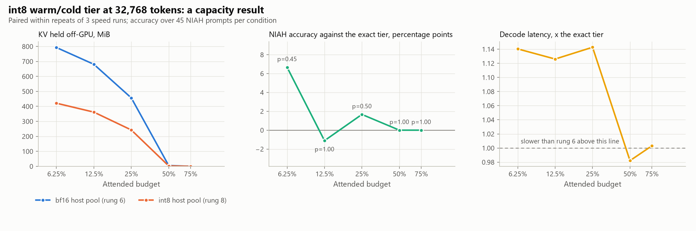

<!-- GENERATED by scripts/render_docs.py from docs/templates/PHASE_5.md.tmpl. Edit the template, not this file. Numbers come from results/**/metrics.json. -->

# Phase 5 gate report: the int8 warm/cold tier

**Status: running. Findings are written against the completed sweep before this phase is closed.**

Phase 4 put the blocks rung 5 does not attend to in pinned host RAM and brought them back on
demand. It also measured, in §3 and §7 of that report, that the decode is **host-bound**: at a 25%
budget rung 6 moved 4.6 MiB per token,
under a millisecond of link time at the Phase 0 pinned-H2D asymptote, while the per-layer host
round trip that decides *what* to move cost
5.0–6.8 ms.

Rung 8 narrows the warm/cold tier to int8. It attacks bytes moved, which Phase 4 put on the record
as *not* the constraint on this machine. It is run anyway, for two reasons that have nothing to do
with latency:

- It is a **capacity** result. Host RAM is 16 GiB in
  1 DIMM, and the host pool is the thing that
  bounds how much context this design can hold at all.
- It is the **first tier rung with a quality axis of its own.** Rungs 6 and 7 were bit-identical to
  rung 5 and §1 of Phase 4 was a check, not a finding. Rung 8 is approximate, so its accuracy has to
  be measured against the exact tier rather than asserted.

The prediction on the record before the run, from Phase 4 §8: rung 8 will not improve latency here.
§6 below is where that prediction meets the measurement.

## Gate checklist (CLAUDE.md rule 3)

- [x] **Tests run.** `pytest`: int8 records round-trip within one quantization level of each group's range, a key-channel outlier does not degrade its neighbours, a constant group is exact, and packing on the GPU agrees with packing on the host to within a level (it is *not* bit-identical, and the test says so); the tier's resident slots hold exactly what a fetch would produce, the sink stays exact because it never leaves VRAM, the Quest bound covers the dequantized keys rather than the exact ones, decode differs from the exact tier but stays bounded, and both a `runs` fetch and a bf16 host pool are refused. All Phase 0-4 tests still pass.
- [ ] **Real experiment run.** `scripts/02_policy_quality.py --config configs/phase5.yaml` and `scripts/02_budget_speed.py --config configs/phase5.yaml` (not measured runs), launched detached from a clean tree. Provenance below.
- [ ] **Phase doc written.** This file, re-read against the finished run.
- [ ] **Committed and pushed.**

## What was built

| Piece | Where | Design choice and why |
|---|---|---|
| int8 record | `lazykv/quant.py` (`pack`, `unpack`) | Keys quantized per head_dim channel, values per token, asymmetric (min/max), following KIVI (arXiv 2402.02750): key outliers sit in a few channels that are large across every token, value outliers are per token. Both payloads and all four scale arrays go into **one contiguous uint8 record per (block, head)**, so the tier's transfer machinery sees only a different record width and Phase 4's gather path carries over unchanged. |
| Scale precision | `lazykv/quant.py` (`SCALE_DTYPE`) | float16, not bf16. bf16 has 8 mantissa bits, the same as the int8 payload it scales, so a bf16 scale would contribute about as much error as the quantization; float16's 11 bits make it negligible and KV magnitudes here are far inside its range. |
| Hot tier stays exact | `TieredLayer.__init__` | The VRAM slot pool is still the model's dtype, and the sink (block 0) is never written by `admit`, so it is permanently hot and never narrowed. "fp16 hot, int8 warm/cold" in the brief's words. |
| Metadata from dequantized keys | `TieredLayer.__init__`, `TieredLayer._seal` | The Quest bound and the slots seeded at the boundary are built from the *dequantized* keys, not the originals. Otherwise a block's contents would depend on whether it happened to be resident, evicting and re-fetching would silently change what the model attends to, and the bound would not bound the keys actually attended. |
| Gather-only fetch | `TieredLayer.admit` | `runs` writes host bytes straight into their slots, which needs the two pools to share a layout. An int8 record has to land in a device staging buffer and be widened from there, so rung 8 always uses Phase 4's chosen `gather` path. |
| Built on rung 6, not rung 7 | `TieredCache.policy_name` | The ladder writes rung 8 as "rung 7 + mixed precision". Phase 4 measured rung 7 slower than rung 6 with no quality difference, so stacking rung 8 on it would confound the capacity result with a known latency penalty. The substitution is stated rather than made silently. |

Context, budgets, block size (not measured tokens), prompts, needle set and
decode lengths are Phase 4's, so rung 6 is re-measured inside this run and the two rungs are compared
within one process on identical prefills.

<picture>
  <source media="(prefers-color-scheme: dark)" srcset="../figures/p5_capacity-dark.png">
  
</picture>

## 1. Capacity: what the narrower record actually saves

A bf16 pair at this geometry is 2 × block_size × head_dim × 2 bytes. An int8 record is half that
plus the scale arrays — per channel for keys, per token for values — so the saving is a little under
2×, and the exact figure is a property of the block geometry, not of the data.

_not measured_

"Stored ratio" is what the host pool holds for the same blocks. "Pairs fetched ratio" is *not* the
record ratio, and the difference is the interesting part: rung 8 quantizes the block metadata as
well as the blocks, so its Quest bound ranks blocks slightly differently and it fetches a different
number of pairs. Bytes moved per token is the product of the two.

## 2. NIAH retrieval

The same not measured prompts per condition as Phases 2-4, at
not measured tokens, scored on the repeatable quality kernel.

_not measured_

## 3. Divergence from the exact tier

Rung 6 is bit-identical to rung 5 (Phase 4 §1), so it is this phase's exact reference and every row
below is rung 8 against a tier that made exactly rung 5's choices.

_not measured_

"Broken / fixed" splits the prompts whose answer changed into those that went from right to wrong and
those that went the other way. A quantization that is *noise* rather than *damage* produces both;
reporting only the net change would hide that distinction.

## 4. Teacher-forced divergence

_not measured_

## 5. What the tier does per token

"Pairs" are (KV head, block) units: the residency unit. "Pair on the wire" is the record width that
actually crosses the link, which is the one column where the two rungs differ by construction.

_not measured_

## 6. Speed, and where the time goes

Fast kernel, power throttling opted out, not measured independent runs.
Conditions that spilled into shared system memory:
not measured.

_not measured_

Ranking is unchanged between the two rungs by construction — same bound, same top-K, same host sync
— so any latency difference has to appear in the fetch path, where rung 8 dequantizes, or in the
seal path, where it quantizes. Measured per budget, paired within each repeat:

_not measured_

## 7. What this says about Phase 6

_Written against the finished run._

## 8. Headline number (brief §B8)

_not measured_

## 9. Provenance

_not measured_
