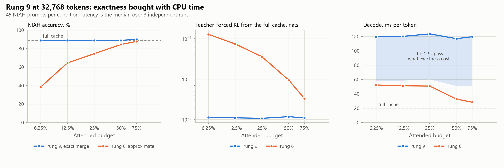

<!-- GENERATED by scripts/render_docs.py from docs/templates/PHASE_7.md.tmpl. Edit the template, not this file. Numbers come from results/**/metrics.json. -->

# Phase 7 gate report: rung 9, and what exactness costs

**Status: complete. The gate deliverables are done (tests, experiment, this report, commit).**

Rung 9 was the one rung of the brief's ladder (§B8) that Phases 2-6 left unbuilt, and
`docs/FINDINGS.md` carried it as a limitation. It is the other answer to the question the whole
study is built on. Rungs 2-8 answer "this block is not in VRAM" by **not attending to it**, and the
accuracy column of every earlier phase is the price of that answer. Rung 9 answers it by
**attending to the block where it already lives** — on the CPU — and merging the two partial
attentions with their log-sum-exp normalizers. Softmax is associative under that rescaling, so the
result is the full cache's attention and only O(head_dim) bytes come back per query head.

The reason it is worth measuring is not that it is likely to be fast. Phase 0 §5 measured CPU
attention and `docs/IMPLEMENTATION_PLAN.md` §3.3 put the expected outcome on the record before any
of it was built: (c) "cannot be the main path for long contexts", because its cost scales with
*all* non-resident tokens and exactness forbids skipping any. The reason to run it is that it is
the only rung that can clear the brief's headline bar below a full budget, and the study's answer
to §B8 was **none** until it was measured.

## Gate checklist (CLAUDE.md rule 3)

- [x] **Tests run.** `pytest`: the merge algebra reconstructs attention over a key set split in
  two, an empty partial contributes nothing instead of a nan, the merge is not a plain average,
  per-head exclusion removes exactly the blocks named; end to end, rung 9 reproduces a full cache
  on the same forced tokens, sits closer to it than rung 6 does, keeps its float32 mirror equal to
  what a fetch would produce, and refuses a quantized pool or a prefetch. All Phase 0-6 tests pass.
- [x] **Real experiment run.** `scripts/02_policy_quality.py --config configs/phase7.yaml` and
  `scripts/02_budget_speed.py --config configs/phase7.yaml`
  (3 runs), launched detached from a worktree pinned at the commit
  under test. Two supporting experiments ran afterwards, at a later commit, and §9 says so: the
  layout benchmark behind §1 (`scripts/04_cpu_layout.py`) and the CPU-thread sweep in §7.
- [x] **Phase doc written.** This file, re-read against the finished run.
- [x] **Committed and pushed.**

## What was built

| Piece | Where | Design choice and why |
|---|---|---|
| Log-sum-exp merge | `lazykv/exact.py` (`merge_lse`) | FlashAttention's rescaling identity (arXiv 2205.14135) applied across a device boundary, as ring attention (arXiv 2310.01889) applies it across accelerators; both recorded in `docs/RELATED_WORK.md` §6b. Weights are computed by subtracting the *combined* log-sum-exp rather than by exponentiating each one, so a partial over an empty key set passes lse = -inf and contributes zero instead of a nan. That case is not hypothetical: at a budget where the selection covers every sealed block, the CPU side has no columns left. |
| CPU partial attention | `lazykv/exact.py` (`cpu_partial_attention`) | One batched GEMM over all KV heads, not a loop over them. The loop is 1.8x the batched pass at this context and far worse at short ones, where its Python and small-matrix overhead is larger than the arithmetic it wraps. Batched, the pass is memory-bound, which is the floor. |
| float32 mirror, contiguous per head | `lazykv/exact.py` (`_Mirror`) | The tier's pinned pool is bf16 laid out `[blocks, heads, 2, block_size, head_dim]`, so one head's keys are not a matrix there at all. §1 measures what that costs on this geometry; the short version is that attending in place is 30x slower, and the mirror is the honest price of avoiding it. |
| Masking, not gathering | `lazykv/exact.py` (`_excluded`) | The CPU pass scores every sealed block and sets the GPU-held ones to -inf. Gathering only the cold blocks would make the pass proportional to the budget, but gathering them *is* the strided case above. The consequence — the CPU cost does not respond to the budget — is a measured finding in §4, not an oversight. |
| The GPU keeps its own kernel | `lazykv/exact.py` (`_gpu_lse`) | SDPA does not return a log-sum-exp, so the GPU half's is recomputed with one extra query-key product over the *gathered* set only. Rung 9's GPU path is therefore bit-identical to rung 6's, and the two columns differ by the merge and nothing else. |
| Built on rung 6 | `ExactTieredCache`, which refuses `prefetch` and `quant` | A quantized warm tier would reintroduce the approximation the rung exists to remove. A prefetch changes which blocks are *resident*, not which are *attended* — rung 9 attends to all of them either way — so it would add a variable and buy nothing. Both are refused rather than silently ignored. |

Context, budgets, block size (64 tokens), prompts, needle set and
decode lengths are Phase 4's, so rung 6 is re-measured inside this run and the two rungs are
compared within one process on identical prefills.

## Headline findings

1. **Rung 9 is the first rung to clear the brief's bar below a full budget.** Its NIAH retention is
   100.0%–101.3%
   across every budget measured, including
   100.0% at a 6.25% budget where rung 6
   retains 43.1%. Seven rungs and four
   gates answered §B8 with *none*; this one answers it with a budget.

   **Where that retention reads above 100%, it is rounding, not a gain.** Rung 9 reproduces the full
   cache; it cannot beat it. A prompt sitting on a near-tie can land either way once the GPU's bf16
   half and the CPU's float32 half are summed in a different order, and on this sweep one did, in
   the flattering direction. §3 reports the changed answers in both directions for that reason.
2. **"Exact" is a claim about the algebra, and the measurement says so.** Rung 9 is not bit-identical
   to the full cache: the GPU half runs the bf16 kernel over the gathered set, the CPU half runs
   float32 over the rest, and the two are summed in a different order and rounded once more.
   Teacher-forced KL from the full cache is
   1.1e-03–1.2e-03
   nats, against
   3.3e-03–1.3e-01
   for rung 6 on the same documents — a factor of
   3–114.
   Reporting it as zero would be the gameable version.
3. **The price is decode latency, and it is large.** Rung 9 decodes
   2.28–4.23×
   rung 6's time and
   6.1–6.5×
   the full cache's, adding
   67–91 ms
   per token. §4 shows that
   93%–112%
   of that lands in the merge, so nothing is hiding elsewhere.
4. **The price is also host RAM, and that is the part a reader would miss.** The float32 mirror is
   1,848 MiB on top of the tier's
   988 MiB of pinned pools, on a machine with
   16 GiB in
   1 DIMM. Rung 9 frees exactly the VRAM
   rung 6 frees, and spends
   4.0–7.5 MiB
   of host RAM for each MiB of VRAM it frees against the full cache. The frontier's x axis is
   GPU-resident KV, so that cost is invisible there and has to be said in words.
5. **The CPU pass barely responds to the budget, and neither does rung 9's decode.** The pass costs
   61–69 ms
   per token across a twelve-fold range of budgets, a spread of
   1.13×, and the whole rung decodes at
   6.1–6.5×
   the full cache at every one of them. That is the design note in `lazykv/exact.py` meeting the
   data: the pass masks the resident blocks instead of gathering the cold ones, so exactness costs
   the same whether VRAM holds a lot or a little. **The practical consequence is the useful one: if
   you are going to pay for rung 9 at all, take the smallest budget, because the larger ones cost
   the same and free less VRAM.** The residual upward trend is the masking scatter, which writes
   K × block_size columns per head and so does grow with the budget — the matmul underneath it does
   not.
6. **Only 113.8 KiB per token comes back
   from the CPU.** That is brief §B1(c)'s claim, confirmed: the merge moves O(head_dim) per query
   head, not O(block_bytes). Rung 6 moves
   4.6 MiB per token at a 25% budget to
   do a worse job, so rung 9 moves something like two orders of magnitude less data and is
   2.28× slower for it. The bytes on the wire were
   never the problem with this design. The arithmetic was.
7. **Phase 0's prediction about this rung held, which is worth noting because the others did not.**
   `docs/IMPLEMENTATION_PLAN.md` §3.3 costed CPU partial attention over every layer at
   31.66 ms per decoded token with
   16,384 non-resident tokens per layer and
   154.15 ms at 65,536, from a
   standalone benchmark with no model loaded. This study sits between those two points, and the
   cost measured inside a real decode is
   61–69 ms
   per token over 14 selecting layers. Phases 4, 5 and 6 each found an arithmetic prediction about
   the *tier* to be wrong; the arithmetic about raw CPU throughput was right, because it was a
   bandwidth estimate rather than a guess about where time goes.

<picture>
  <source media="(prefers-color-scheme: dark)" srcset="../figures/p7_exactness-dark.png">
  
</picture>

## 1. Why the mirror exists

Rung 9's one real memory cost is a float32 copy of the sealed KV, contiguous per KV head, at
136 MiB per selecting layer. Everything else it
does reuses rung 6's machinery. A cost that large has to be justified by a measurement rather than
by a sentence about cache lines, so the same pass was timed on the layouts it could have used
instead, at this study's geometry.

| Layout | ms per selecting layer | ms per token | x the mirror | at threads |
| --- | ---: | ---: | ---: | ---: |
| bf16, attended in the tier's pinned pool | 127.73 | 1,788 | 30.28x | 4 |
| float32, same layout | 15.68 | 219 | 3.72x | 8 |
| float32, contiguous per head | 4.06 | 57 | 0.96x | 8 |
| float32, the mirror as rung 9 holds it | 4.22 | 59 | 1.00x | 14 |
| float32 contiguous, per-head Python loop (the first implementation) | 7.67 | 107 | 1.82x | 4 |

Two results, both of which decided a line of code:

- **bf16 has no CPU GEMM on this part.** A Raptor Lake consumer CPU has neither AVX512 nor AMX, so
  a bf16 matmul is emulated, and attending to the tier's pool in its own dtype costs
  30× what the mirror costs. That is
  the difference between a rung that is slow and a rung that is not worth running.
- **Layout matters nearly as much as dtype.** Widening the same pool to float32 and attending in
  place is still 3.7× the mirror,
  because a KV head's keys are a strided batch of 64-row
  matrices there rather than one matrix, and the GEMM cannot stream them.

The mirror's slice is measured separately from a fresh contiguous allocation because that is what
rung 9 actually attends to: a prefix of a capacity-sized buffer rather than a tight one. The two
rows come out within noise of each other, so holding the mirror at the cache's capacity and slicing
it costs nothing measurable — which is worth knowing, because reallocating per condition would have
put the allocation inside the timed region.

The mirror row is also the cross-check on the decode measurement. It puts one layer's pass at
4.22 ms here, with no model
loaded; section 4 measures
4.37–4.93 ms
inside a real decode. Two instruments, built for different purposes, agreeing on a quantity neither
was written to check.

## 2. NIAH retrieval

The same 45 prompts per condition as Phases 2-5, at
32,768 tokens, scored on the repeatable quality kernel.

| Policy | Budget | Resident at answer | Accuracy [95% CI] | Retention | single | multikey | multivalue | depth 0% | depth 25% | depth 50% | depth 75% | depth 100% |
| --- | ---: | ---: | ---: | ---: | ---: | ---: | ---: | ---: | ---: | ---: | ---: | ---: |
| Block pool, 100% | 100% | 100.0% | 88.9% [82, 95] | 100.0% | 100% | 93% | 73% | 89% | 89% | 97% | 78% | 92% |
| Full cache (rung 1) | 100% | 100.0% | 88.9% [82, 95] | 100.0% | 100% | 93% | 73% | 89% | 89% | 97% | 78% | 92% |
| CPU tier + exact CPU merge (rung 9) | 75% | 108.0% | 90.0% [83, 96] | 101.3% | 100% | 93% | 77% | 89% | 89% | 97% | 78% | 97% |
| CPU tier + exact CPU merge (rung 9) | 50% | 107.5% | 88.9% [82, 95] | 100.0% | 100% | 93% | 73% | 89% | 89% | 97% | 78% | 92% |
| CPU tier + exact CPU merge (rung 9) | 25% | 63.7% | 88.9% [82, 95] | 100.0% | 100% | 93% | 73% | 89% | 89% | 97% | 78% | 92% |
| CPU tier + exact CPU merge (rung 9) | 12.5% | 41.9% | 88.9% [82, 95] | 100.0% | 100% | 93% | 73% | 89% | 89% | 97% | 78% | 92% |
| CPU tier + exact CPU merge (rung 9) | 6.25% | 30.9% | 88.9% [82, 95] | 100.0% | 100% | 93% | 73% | 89% | 89% | 97% | 78% | 92% |
| CPU tier, sync fetch (rung 6) | 75% | 108.0% | 87.8% [81, 94] | 98.8% | 100% | 87% | 77% | 78% | 89% | 97% | 78% | 97% |
| CPU tier, sync fetch (rung 6) | 50% | 107.5% | 84.4% [76, 92] | 95.0% | 93% | 87% | 73% | 67% | 89% | 94% | 78% | 94% |
| CPU tier, sync fetch (rung 6) | 25% | 63.7% | 74.4% [63, 85] | 83.8% | 93% | 73% | 57% | 58% | 81% | 86% | 67% | 81% |
| CPU tier, sync fetch (rung 6) | 12.5% | 41.9% | 64.4% [52, 76] | 72.5% | 93% | 53% | 47% | 36% | 75% | 81% | 53% | 78% |
| CPU tier, sync fetch (rung 6) | 6.25% | 30.9% | 38.3% [26, 52] | 43.1% | 60% | 33% | 22% | 8% | 53% | 36% | 22% | 72% |

## 3. Distance from the full cache

Rung 9's distance means nothing on its own — a reader shown "mean KL
1.2e-03" cannot tell whether that is close.
Rung 6 is measured on the same prompts and the same documents, and that is what makes it readable.

| Rung | Budget | NIAH answers differing from the full cache | of which broken / fixed | Mean NIAH score change | Teacher-forced KL | Top-1 agreement |
| --- | ---: | ---: | ---: | ---: | ---: | ---: |
| CPU tier + exact CPU merge (rung 9) | 75% | 1 of 45 | 0 / 1 | +1.1 pp | 1.09e-03 | 98.0% |
| CPU tier + exact CPU merge (rung 9) | 50% | 0 of 45 | 0 / 0 | +0.0 pp | 1.17e-03 | 98.0% |
| CPU tier + exact CPU merge (rung 9) | 25% | 0 of 45 | 0 / 0 | +0.0 pp | 1.06e-03 | 98.6% |
| CPU tier + exact CPU merge (rung 9) | 12.5% | 0 of 45 | 0 / 0 | +0.0 pp | 1.09e-03 | 98.2% |
| CPU tier + exact CPU merge (rung 9) | 6.25% | 0 of 45 | 0 / 0 | +0.0 pp | 1.12e-03 | 97.9% |
| CPU tier, sync fetch (rung 6) | 75% | 6 of 45 | 2 / 2 | -1.1 pp | 3.29e-03 | 96.7% |
| CPU tier, sync fetch (rung 6) | 50% | 9 of 45 | 5 / 2 | -4.4 pp | 9.41e-03 | 95.1% |
| CPU tier, sync fetch (rung 6) | 25% | 15 of 45 | 10 / 3 | -14.4 pp | 3.57e-02 | 90.8% |
| CPU tier, sync fetch (rung 6) | 12.5% | 23 of 45 | 18 / 3 | -24.4 pp | 7.42e-02 | 86.3% |
| CPU tier, sync fetch (rung 6) | 6.25% | 30 of 45 | 27 / 1 | -50.6 pp | 1.28e-01 | 79.3% |

Three things in this table are worth reading deliberately.

**Rung 9's NIAH column is a partition check that passed.**
1 of
225 scored answers differ from the
full cache, against
83 for rung 6 on the same prompts.
A set split that double-counted a block or dropped one would not produce that column; it would
produce something that looked like a slightly worse policy.

**Rung 9's KL does not move with the budget; rung 6's moves across two decades.** Rung 9 sits
between 1.1e-03 and
1.2e-03 nats at every budget, because its
residual is floating-point arithmetic rather than missing information, and arithmetic does not care
how much VRAM there is. Rung 6 runs from
3.3e-03 to
1.3e-01 over the same range, because its
residual *is* missing information. The flatness is the strongest single piece of evidence in this
report that rung 9 is doing what it claims.

**The ratio between them is a range, not an order of magnitude.** Rung 6 is
114× further from the full cache at
the tightest budget and only
3× further at the loosest, where it
is already attending to most of the sequence. Quoting the larger number alone would be the gameable
version of this result.

For scale on rung 9's own residual: its top-1 agreement with the full cache is
97.9%–98.6%,
and Phase 1 measured cuDNN's single-query decode disagreeing *with itself* on identical inputs at
97.3%–99.2%
top-1 agreement. Those are not the same measurement — quality here is scored on the repeatable
kernel, so rung 9's flips are its own arithmetic and not kernel noise — but they are the same size,
which is the right way to think about what "exact in the algebra" buys and does not buy.

"Broken / fixed" splits the prompts whose answer changed into those that went from right to wrong
and those that went the other way. A residual that is *rounding* rather than *damage* produces
both, in small numbers, and reporting only the net would hide that.

## 4. The price, and where it goes

| Budget | Rung 6, ms/token | Rung 9, ms/token | Added, ms | x rung 6 | x the full cache | Resident KV, MiB | Pinned host, MiB | float32 mirror, MiB |
| ---: | ---: | ---: | ---: | ---: | ---: | ---: | ---: | ---: |
| 75% | 28.30 | 119.73 | 91.43 | **4.23x** | 6.29x | 1,108 | 988 | 1,848 |
| 50% | 32.68 | 116.96 | 84.28 | **3.58x** | 6.15x | 1,103 | 988 | 1,848 |
| 25% | 50.84 | 123.65 | 72.80 | **2.43x** | 6.50x | 652 | 988 | 1,848 |
| 12.5% | 51.20 | 120.13 | 68.92 | **2.35x** | 6.31x | 428 | 988 | 1,848 |
| 6.25% | 52.36 | 119.47 | 67.10 | **2.28x** | 6.28x | 316 | 988 | 1,848 |

| Budget | CPU pass, ms/token | ms per selecting layer | Merge overhead, ms/token | Mirror write, ms/token | Share of the added time explained | Cold of attended token-heads per merge | Returned from the CPU, KiB/token |
| ---: | ---: | ---: | ---: | ---: | ---: | ---: | ---: |
| 75% | 69.08 | 4.93 | 16.08 | 0.02 | 93% | 65,821 of 262,429 | 113.75 |
| 50% | 66.00 | 4.71 | 13.38 | 0.02 | 94% | 131,357 of 262,429 | 113.75 |
| 25% | 63.38 | 4.53 | 13.32 | 0.02 | 105% | 197,405 of 262,429 | 113.75 |
| 12.5% | 61.54 | 4.40 | 13.87 | 0.02 | 109% | 230,173 of 262,429 | 113.75 |
| 6.25% | 61.12 | 4.37 | 13.85 | 0.02 | 112% | 246,557 of 262,429 | 113.75 |

The "cold of attended" column is the masking decision, in numbers. The CPU scores every sealed
block at every budget, and only the cold ones contribute; at a 75% budget three quarters of the work
is thrown away. Computing and discarding it is still cheaper than gathering the cold blocks out of
the tier's pinned layout, which is the strided case in "What was built" above. The cost of the
choice is visible in the other direction too: the pass gets slightly *slower* as the budget grows,
because the -inf scatter writes K x block_size columns per head while the matmul underneath it does
not change at all.

The "share of the added time explained" column is the guard on this table: the merge's own counter
against the wall-clock difference between the two rungs. It runs
0.93–1.12,
so the merge accounts for all of the added time and nothing is hiding elsewhere. (Above 1 is not a
contradiction: rung 6 and rung 9 are separate conditions in an interleaved sweep, so their wall
clocks carry independent run-to-run variation that the counter does not.)

**The merge overhead is the one identified inefficiency, and it is not the CPU pass.** Outside the
CPU attention, the merge costs
13–16 ms
per token: pulling the query to the host, blending, and recomputing the GPU half's log-sum-exp —
which materializes a float32 copy of the gathered keys, tens of MiB per layer at the larger budgets.
A kernel that returned its own log-sum-exp would remove most of it. That was not done here because
it means replacing the pinned attention kernel for rung 9 only, which would cost the property that
makes this comparison clean: rung 9's GPU path is bit-identical to rung 6's. The cost of keeping
that property is measured above rather than left implicit.

## 5. Teacher-forced divergence

| Policy | Budget | Top-1 agreement (mean of documents) | Worst document | Mean KL, nats | Worst document KL | Bit-identical |
| --- | ---: | ---: | ---: | ---: | ---: | --- |
| Block pool, 100% | 100% | 100.0% | 100.0% | 0.00e+00 | 0.00e+00 | **yes** |
| Full cache (rung 1) | 100% | 100.0% | 100.0% | 0.00e+00 | 0.00e+00 | **yes** |
| CPU tier + exact CPU merge (rung 9) | 75% | 98.0% | 97.3% | 1.09e-03 | 1.14e-03 | no |
| CPU tier + exact CPU merge (rung 9) | 50% | 98.0% | 97.7% | 1.17e-03 | 1.30e-03 | no |
| CPU tier + exact CPU merge (rung 9) | 25% | 98.6% | 98.0% | 1.06e-03 | 1.15e-03 | no |
| CPU tier + exact CPU merge (rung 9) | 12.5% | 98.2% | 98.0% | 1.09e-03 | 1.18e-03 | no |
| CPU tier + exact CPU merge (rung 9) | 6.25% | 97.9% | 97.7% | 1.12e-03 | 1.25e-03 | no |
| CPU tier, sync fetch (rung 6) | 75% | 96.7% | 95.7% | 3.29e-03 | 3.37e-03 | no |
| CPU tier, sync fetch (rung 6) | 50% | 95.1% | 94.9% | 9.41e-03 | 9.59e-03 | no |
| CPU tier, sync fetch (rung 6) | 25% | 90.8% | 90.2% | 3.57e-02 | 3.68e-02 | no |
| CPU tier, sync fetch (rung 6) | 12.5% | 86.3% | 86.3% | 7.42e-02 | 7.92e-02 | no |
| CPU tier, sync fetch (rung 6) | 6.25% | 79.3% | 78.1% | 1.28e-01 | 1.30e-01 | no |

## 6. Speed

Fast kernel, power throttling opted out, 3 independent runs.
Conditions that spilled into shared system memory:
0. CPU threads for the partial attention:
8, chosen from a standalone measurement on this
layout; §7 checks that choice inside a real decode.

| Policy | Budget | Decode / token (range over runs) | Tokens/s | ÷ full | p90 | Manager host time / token | of which attention observation | Boundary build | Resident KV | Peak allocated | Spill |
| --- | ---: | ---: | ---: | ---: | ---: | ---: | ---: | ---: | ---: | ---: | --- |
| Block pool, 100% | 100% | 18.89 ms (18.49 ms–26.35 ms) | 53.0 | 0.99× | 22.21 ms | 0.95 ms | 0.00 ms | 32.26 ms | 1,028 MiB | 4.59 GiB | no |
| Full cache (rung 1) | 100% | 19.03 ms (18.33 ms–27.86 ms) | 52.5 | 1.00× | 24.01 ms | – | – | – | 1,028 MiB | 3.52 GiB | no |
| CPU tier + exact CPU merge (rung 9) | 75% | 119.73 ms (119.38 ms–119.80 ms) | 8.4 | 6.29× | 130.08 ms | 96.50 ms | – | 375.24 ms | 1,108 MiB | 4.54 GiB | no |
| CPU tier + exact CPU merge (rung 9) | 50% | 116.96 ms (116.53 ms–117.52 ms) | 8.6 | 6.15× | 128.03 ms | 93.79 ms | – | 375.81 ms | 1,103 MiB | 4.54 GiB | no |
| CPU tier + exact CPU merge (rung 9) | 25% | 123.65 ms (118.96 ms–125.08 ms) | 8.1 | 6.50× | 134.48 ms | 98.83 ms | – | 367.29 ms | 652 MiB | 4.1 GiB | no |
| CPU tier + exact CPU merge (rung 9) | 12.5% | 120.13 ms (120.08 ms–124.55 ms) | 8.3 | 6.31× | 129.19 ms | 96.61 ms | – | 367.49 ms | 428 MiB | 3.88 GiB | no |
| CPU tier + exact CPU merge (rung 9) | 6.25% | 119.47 ms (116.94 ms–120.61 ms) | 8.4 | 6.28× | 128.34 ms | 95.34 ms | – | 368.21 ms | 316 MiB | 3.77 GiB | no |
| CPU tier, sync fetch (rung 6) | 75% | 28.30 ms (27.87 ms–28.58 ms) | 35.3 | 1.49× | 39.66 ms | 9.35 ms | – | 96.64 ms | 1,108 MiB | 4.54 GiB | no |
| CPU tier, sync fetch (rung 6) | 50% | 32.68 ms (29.44 ms–42.50 ms) | 30.6 | 1.72× | 48.50 ms | 10.40 ms | – | 91.33 ms | 1,103 MiB | 4.54 GiB | no |
| CPU tier, sync fetch (rung 6) | 25% | 50.84 ms (49.96 ms–52.01 ms) | 19.7 | 2.67× | 61.70 ms | 19.66 ms | – | 86.44 ms | 652 MiB | 4.1 GiB | no |
| CPU tier, sync fetch (rung 6) | 12.5% | 51.20 ms (51.15 ms–53.55 ms) | 19.5 | 2.69× | 62.41 ms | 19.96 ms | – | 84.35 ms | 428 MiB | 3.88 GiB | no |
| CPU tier, sync fetch (rung 6) | 6.25% | 52.36 ms (51.93 ms–52.54 ms) | 19.1 | 2.75× | 63.55 ms | 20.59 ms | – | 80.84 ms | 316 MiB | 3.77 GiB | no |

## 7. How many CPU threads, measured in situ

Phase 0 §5 timed CPU attention standalone and found the knee well below the 28 logical processors on
this part. It also put a caveat on the record without testing it: rung 9's threads would compete with
the Python cache manager, which is doing the tier's residency bookkeeping on the same cores at the
same time. This sweep is that caveat tested — the same condition, decoded at four thread counts.

| torch CPU threads | CPU pass, ms/token | Merge total, ms/token | Decode, ms/token | x the best |
| ---: | ---: | ---: | ---: | ---: |
| 4 | 79.04 | 92.83 | 136.45 | 1.03x |
| 8 **(best)** | 68.02 | 82.57 | 132.44 | 1.00x |
| 14 | 68.82 | 87.01 | 142.49 | 1.08x |
| 20 | 65.88 | 87.41 | 151.77 | 1.15x |

**The caveat was real, and the table shows it in the cleanest possible form.** The fastest *CPU
pass* is at 20 threads, and that
setting has the slowest *decode* — 1.15×
the best. Optimizing the pass in isolation would have picked it. The decode knee is at
8 threads, which is what
`configs/phase7.yaml` sets, and §1's standalone benchmark on an idle machine puts its own knee
somewhere else again (14). Three measurements, three
answers, and only one of them is measuring the thing that matters.

Worst against best is
1.15×, so the choice is worth making but
not worth agonizing over. These runs are an internal comparison and their absolute latencies are not
comparable with §4's: they ran later, at a different commit, with three conditions instead of twelve,
so they interleave less and carry their own thermal history.

## 8. What this says, next to the rest of the study

Phases 4, 5 and 6 found this decode to be bound by the host round trip that decides *what* to move,
not by moving it. Rung 9 does not escape that finding; it adds a second, larger host cost on top of
it. The two together say something the ladder was not designed to say but which every measurement
in it supports: **on this machine the scarce resource for a tiered KV cache is host-side work, in
whatever form, and the PCIe link that the design was built around is not scarce at all.**

What rung 9 buys is a real thing and the brief asked for it specifically: a budget at which
retrieval accuracy is the full cache's. What it costs is
6.1–6.5×
the full cache's decode latency and
1,848 MiB of extra host RAM per sweep. For a context
that still fits in VRAM, as this one does, that is not a trade anyone should take. For a context
that does not fit — which is the regime the tier exists for and which this study never reached,
because the 3B stress model was never run — it is the only rung on the ladder that keeps the
answers right, and that is worth having measured.

## 9. Provenance

| Experiment | Finished (UTC) | Commit | Uncommitted tracked changes |
| --- | --- | --- | --- |
| Policy quality (NIAH + teacher-forced) | 2026-09-21T16:31:10+00:00 | `8ef070f` | yes: `data/corpus/manifest.json` |
| Budget speed run 1 | 2026-09-21T16:39:03+00:00 | `8ef070f` | yes: `data/corpus/manifest.json` |
| Budget speed run 2 | 2026-09-21T16:46:50+00:00 | `8ef070f` | yes: `data/corpus/manifest.json` |
| Budget speed run 3 | 2026-09-21T16:54:34+00:00 | `8ef070f` | yes: `data/corpus/manifest.json` |
| CPU layout benchmark (§1) | 2026-09-21T17:04:52+00:00 | `481af75` | yes: `README.md`, `docs/FINDINGS.md`, `docs/RESEARCH_LOG.md`, `docs/figures/ladder_pareto-dark.png`, `docs/figures/ladder_pareto-light.png`, `docs/phases/PHASE_6.md`, `docs/templates/FINDINGS.md.tmpl`, `docs/templates/README.md.tmpl`, `docs/templates/RESEARCH_LOG.md.tmpl`, `results/ladder/metrics.json`, `scripts/analyze_phase7.py`, `scripts/make_figures.py`, `scripts/render_docs.py` |
| CPU thread sweep, 4 threads (§7) | 2026-09-21T16:57:31+00:00 | `481af75` | yes: `data/corpus/manifest.json` |
| CPU thread sweep, 8 threads (§7) | 2026-09-21T16:59:40+00:00 | `481af75` | yes: `data/corpus/manifest.json` |
| CPU thread sweep, 14 threads (§7) | 2026-09-21T17:01:54+00:00 | `481af75` | yes: `data/corpus/manifest.json` |
| CPU thread sweep, 20 threads (§7) | 2026-09-21T17:04:11+00:00 | `481af75` | yes: `data/corpus/manifest.json` |
