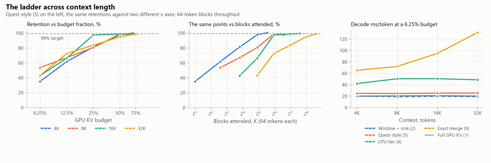

<!-- GENERATED by scripts/render_docs.py from docs/templates/PHASE_8.md.tmpl. Edit the template, not this file. Numbers come from results/**/metrics.json. -->

# Phase 8 gate report: the ladder across context length

**Status: complete. The gate deliverables are done (tests, experiment, this report, commit).**

Every number in Phases 2-7 was measured at 32,768 tokens. `docs/FINDINGS.md` §6 listed that as a
limitation, and brief §B8 asks for 4K, 8K, 16K, 32K "and 64K if it runs", so the axis was always
scheduled. What made it worth the machine time rather than a box to tick is that two of the study's
load-bearing claims are stated in a form that a single context cannot test.

The first is the headline itself. The brief asks for the "minimum GPU KV **budget**" retaining 99%
of baseline accuracy, and a budget here is a *fraction* of the sequence's KV, because a fraction is
what a VRAM budget is. Quest — whose selection criterion rung 5 uses — states the same quantity as a
**constant number of tokens**: `docs/RELATED_WORK.md` §4 records that it selects top-K pages "where
K is a preset constant (e.g. 128, 256)", and that its own sweeps move that constant up with context
(32-512 tokens at 10K, 256-4096 at 100K). Those two shapes agree at exactly one context and diverge
everywhere else. Until this phase, this study had only ever measured at that one context, so it had
no basis for preferring either.

The second is "this decode is host-bound", the result Phases 4-7 arrived at after five separate
attacks on bytes moved all failed to reduce latency. That diagnosis has a prediction: the manager
ranks every block on every step, so its cost should grow with the block count, which is to say with
context. §3 tests it.

## Gate checklist (CLAUDE.md rule 3)

- [x] **Tests run.** `pytest`: `collapse()` is tested against both hypotheses injected as ground
  truth, so the metric cannot be one that always favours K; against a singleton group, which has
  zero spread by construction and would otherwise flatter whichever collapse is sparser; and with
  the exact rung present, which must not enter the verdict. `_fit()` refuses two points, because any
  two fit a line exactly and the intercept is the quantity being claimed. `_margin_prompts()` counts
  one prompt as one. Three guards then hold the findings, including one that guards *against*
  overreading the headline. All Phase 0-7 tests still pass.
- [x] **Real experiment run.** `scripts/02_policy_quality.py` and `scripts/02_budget_speed.py` with
  `--config configs/phase8.yaml --context <c>`, once per context for quality and
  3 times per context for speed,
  launched detached from a worktree pinned at the commit under test. The 64K addendum in §4 ran
  afterwards at a later commit, from a second worktree, and the provenance table says so.
- [x] **Phase doc written.** This file, re-read against the finished run.
- [x] **Committed and pushed.**

## What was measured

| Axis | Setting | Why |
|---|---|---|
| Context | 4,096 · 8,192 · 16,384 · 32,768 tokens | Powers of two, so the budget grid's K values recur across contexts (below). 65,536 is addressed in §4. |
| Policies | Rungs 2, 5, 6 and 9 | The four distinct shapes on the Phase 7 frontier: the strong cheap baseline, the best approximating policy, the tier that turns rung 5's budget into a memory budget, and the exact rung. Rungs 3, 4, 7 and 8 were each measured dominated by one of these at 32K, and eight rungs across four contexts costs more than the question is worth. |
| Budgets | 75% · 50% · 25% · 12.5% · 6.25% | Phases 4-7's sweep, unchanged, so the 32,768 column overlaps them and can be checked against them (§5). |
| Block size | 64 tokens | Phase 4's chosen value, held fixed. This is what makes the block *count* proportional to context, which is what §1 is about. |
| Prompts | 45 NIAH prompts per condition | Phases 2-7's set, same book, depths, kinds and seed. |

**The matched design falls out of the budget grid rather than being built.** The selected blocks are
`K = floor(budget x context / block_size) - 2`, so halving the budget as the context doubles leaves K
unchanged: K=30 occurs at all four contexts, K=14 and K=62 at three each. The same retentions can
therefore be grouped two ways — by budget fraction and by K — with
15 groups each way, and no extra runs.

## 1. Which parameterization travels

Grouped by budget fraction, across the approximating rungs
(Window + sink (rung 2), Quest-style (rung 5) and CPU tier, sync fetch (rung 6)):

| Policy | Budget | Retention by context | Spread |
| --- | ---: | --- | ---: |
| Window + sink (rung 2) | 6.25% | 4K 15.7% · 8K 16.5% · 16K 19.5% · 32K 20.0% | 4.3 pp |
| Window + sink (rung 2) | 12.5% | 4K 17.4% · 8K 19.4% · 16K 20.8% · 32K 21.9% | 4.4 pp |
| Window + sink (rung 2) | 25% | 4K 21.5% · 8K 23.5% · 16K 24.7% · 32K 24.4% | 3.2 pp |
| Window + sink (rung 2) | 50% | 4K 43.0% · 8K 41.8% · 16K 46.8% · 32K 46.9% | 5.1 pp |
| Window + sink (rung 2) | 75% | 4K 61.0% · 8K 58.2% · 16K 65.6% · 32K 62.5% | 7.3 pp |
| Quest-style (rung 5) | 6.25% | 4K 34.9% · 8K 53.5% · 16K 42.9% · 32K 43.1% | 18.6 pp |
| Quest-style (rung 5) | 12.5% | 4K 61.6% · 8K 67.1% · 16K 66.2% · 32K 72.5% | 10.9 pp |
| Quest-style (rung 5) | 25% | 4K 81.4% · 8K 80.6% · 16K 97.4% · 32K 83.8% | 16.8 pp |
| Quest-style (rung 5) | 50% | 4K 97.7% · 8K 98.8% · 16K 98.7% · 32K 95.0% | 3.8 pp |
| Quest-style (rung 5) | 75% | 4K 100.6% · 8K 97.6% · 16K 99.4% · 32K 98.8% | 2.9 pp |
| CPU tier, sync fetch (rung 6) | 6.25% | 4K 34.9% · 8K 53.5% · 16K 42.9% · 32K 43.1% | 18.6 pp |
| CPU tier, sync fetch (rung 6) | 12.5% | 4K 61.6% · 8K 67.1% · 16K 66.2% · 32K 72.5% | 10.9 pp |
| CPU tier, sync fetch (rung 6) | 25% | 4K 81.4% · 8K 80.6% · 16K 97.4% · 32K 83.8% | 16.8 pp |
| CPU tier, sync fetch (rung 6) | 50% | 4K 97.7% · 8K 98.8% · 16K 98.7% · 32K 95.0% | 3.8 pp |
| CPU tier, sync fetch (rung 6) | 75% | 4K 100.6% · 8K 97.6% · 16K 99.4% · 32K 98.8% | 2.9 pp |
| CPU tier + exact CPU merge (rung 9) | 6.25% | 4K 100.0% · 8K 100.0% · 16K 100.0% · 32K 100.0% | 0.0 pp |
| CPU tier + exact CPU merge (rung 9) | 12.5% | 4K 100.6% · 8K 100.0% · 16K 100.0% · 32K 100.0% | 0.6 pp |
| CPU tier + exact CPU merge (rung 9) | 25% | 4K 100.0% · 8K 100.0% · 16K 100.0% · 32K 100.0% | 0.0 pp |
| CPU tier + exact CPU merge (rung 9) | 50% | 4K 100.0% · 8K 100.0% · 16K 99.4% · 32K 100.0% | 0.6 pp |
| CPU tier + exact CPU merge (rung 9) | 75% | 4K 100.0% · 8K 100.0% · 16K 100.0% · 32K 101.3% | 1.3 pp |

Grouped by the blocks actually attended:

| Policy | Blocks attended, K | Retention by context | Spread |
| --- | ---: | --- | ---: |
| Window + sink (rung 2) | 6 | 4K 17.4% · 8K 16.5% | 1.0 pp |
| Window + sink (rung 2) | 14 | 4K 21.5% · 8K 19.4% · 16K 19.5% | 2.1 pp |
| Window + sink (rung 2) | 30 | 4K 43.0% · 8K 23.5% · 16K 20.8% · 32K 20.0% | 23.0 pp |
| Window + sink (rung 2) | 62 | 8K 41.8% · 16K 24.7% · 32K 21.9% | 19.9 pp |
| Window + sink (rung 2) | 126 | 16K 46.8% · 32K 24.4% | 22.4 pp |
| Quest-style (rung 5) | 6 | 4K 61.6% · 8K 53.5% | 8.1 pp |
| Quest-style (rung 5) | 14 | 4K 81.4% · 8K 67.1% · 16K 42.9% | 38.5 pp |
| Quest-style (rung 5) | 30 | 4K 97.7% · 8K 80.6% · 16K 66.2% · 32K 43.1% | 54.5 pp |
| Quest-style (rung 5) | 62 | 8K 98.8% · 16K 97.4% · 32K 72.5% | 26.3 pp |
| Quest-style (rung 5) | 126 | 16K 98.7% · 32K 83.8% | 15.0 pp |
| CPU tier, sync fetch (rung 6) | 6 | 4K 61.6% · 8K 53.5% | 8.1 pp |
| CPU tier, sync fetch (rung 6) | 14 | 4K 81.4% · 8K 67.1% · 16K 42.9% | 38.5 pp |
| CPU tier, sync fetch (rung 6) | 30 | 4K 97.7% · 8K 80.6% · 16K 66.2% · 32K 43.1% | 54.5 pp |
| CPU tier, sync fetch (rung 6) | 62 | 8K 98.8% · 16K 97.4% · 32K 72.5% | 26.3 pp |
| CPU tier, sync fetch (rung 6) | 126 | 16K 98.7% · 32K 83.8% | 15.0 pp |
| CPU tier + exact CPU merge (rung 9) | 6 | 4K 100.6% · 8K 100.0% | 0.6 pp |
| CPU tier + exact CPU merge (rung 9) | 14 | 4K 100.0% · 8K 100.0% · 16K 100.0% | 0.0 pp |
| CPU tier + exact CPU merge (rung 9) | 30 | 4K 100.0% · 8K 100.0% · 16K 100.0% · 32K 100.0% | 0.0 pp |
| CPU tier + exact CPU merge (rung 9) | 62 | 8K 100.0% · 16K 100.0% · 32K 100.0% | 0.0 pp |
| CPU tier + exact CPU merge (rung 9) | 126 | 16K 99.4% · 32K 100.0% | 0.6 pp |

**The budget fraction is the better predictor, by a factor of
2.7.** Mean spread within a group is
8.7 pp by fraction against
23.6 pp by K, and the worst group follows
the same order (18.6 pp against
54.5 pp). So the brief's fraction-shaped
headline is the right shape, and a constant token budget is the one that does not travel across
context.

**That comparison is handicapped in favour of the losing side, which is why it is worth believing.**
Every by-fraction group spans all four contexts
(60 points over
15 groups), while the by-K groups span
42 points over the same number of
groups — fewer contexts per group. A spread is a max minus a min, so a group with more members can
only ever have a larger one. The fraction collapse wins while carrying that penalty.

**Neither is an invariant, and the residual is structured rather than noise.** The by-fraction
spread is small at generous budgets and grows as the budget tightens, which is what one would expect
if the fraction governs *until the absolute count gets small*: at a 6.25% budget, 4K selects two
blocks. So the honest statement is that the fraction is the better parameterization by a wide margin,
and that at the tight end of the sweep the absolute block count starts to reassert itself. Both
effects are visible in the left two panels of the figure, which are the same points against the two
axes.

<picture>
  <source media="(prefers-color-scheme: dark)" srcset="../figures/p8_context-dark.png">
  
</picture>

**Rung 9 is flat under both groupings**, at
0.5 pp by fraction and
0.2 pp by K. That is not evidence
for either parameterization — an exact rung has no reason to respond to either — and it is excluded
from the verdict above for that reason. It is reported because it is the context-sweep version of
Phase 7's exactness check: whatever the context, rung 9 reproduces the full cache.

## 2. The headline at every context, and why that is not a context dependence

| Policy | Context | Smallest budget retaining >= 99% | Best retention | at budget | Margin at best, prompts |
| --- | ---: | ---: | ---: | ---: | ---: |
| Window + sink (rung 2) | 4K | **none** | 61.0% | 75% | -16.3 |
| Window + sink (rung 2) | 8K | **none** | 58.2% | 75% | -17.3 |
| Window + sink (rung 2) | 16K | **none** | 65.6% | 75% | -12.9 |
| Window + sink (rung 2) | 32K | **none** | 62.5% | 75% | -14.6 |
| Quest-style (rung 5) | 4K | 75% | 100.6% | 75% | +0.7 |
| Quest-style (rung 5) | 8K | **none** | 98.8% | 50% | -0.1 |
| Quest-style (rung 5) | 16K | 75% | 99.4% | 75% | +0.1 |
| Quest-style (rung 5) | 32K | **none** | 98.8% | 75% | -0.1 |
| CPU tier, sync fetch (rung 6) | 4K | 75% | 100.6% | 75% | +0.7 |
| CPU tier, sync fetch (rung 6) | 8K | **none** | 98.8% | 50% | -0.1 |
| CPU tier, sync fetch (rung 6) | 16K | 75% | 99.4% | 75% | +0.1 |
| CPU tier, sync fetch (rung 6) | 32K | **none** | 98.8% | 75% | -0.1 |
| CPU tier + exact CPU merge (rung 9) | 4K | 6.25% | 100.6% | 12.5% | +0.7 |
| CPU tier + exact CPU merge (rung 9) | 8K | 6.25% | 100.0% | 6.25% | +0.4 |
| CPU tier + exact CPU merge (rung 9) | 16K | 6.25% | 100.0% | 6.25% | +0.4 |
| CPU tier + exact CPU merge (rung 9) | 32K | 6.25% | 101.3% | 75% | +0.9 |

The margin column is the one that matters, and it is why this section does not say what the budget
column appears to say. Read alone, the budget column says the query-aware rungs clear the brief's
99% bar at 4K and 16K and miss it at 8K and 32K — a context dependence. They do not. **At every
context those rungs land within one prompt of the bar**, the closest being
0.07 prompts, out of
45. Which side of the line they fall on
is decided by less than a single prompt changing its answer, and it alternates.

So the finding is not that the answer to §B8 changes with context. It is that **for the query-aware
rungs the §B8 bar is not resolvable at this sample size**, and four contexts is enough to demonstrate
that rather than merely suspect it. `docs/FINDINGS.md` already said the 32K miss was "one or two
prompts' worth"; this phase turns that caveat into a measurement by showing the verdict flipping
twice across contexts on less than one prompt each time.

The two rungs that *are* resolvable stay resolvable everywhere. The sliding window with a sink misses
the bar by 13 to 17 prompts at every context, and rung 9 clears it at the smallest budget swept at
every context. Those are the two statements this study can make about §B8 without a larger prompt
set.

## 3. What scales with context

| Policy | Budget | 4K ms | 8K ms | 16K ms | 32K ms | 32K / 4K | Manager cost at zero blocks |
| --- | ---: | ---: | ---: | ---: | ---: | ---: | ---: |
| Full cache (rung 1) | 100% | 19.8 | 18.6 | 19.3 | 18.9 | 0.95x | no manager |
| Window + sink (rung 2) | 75% | 19.3 | 20.2 | 19.9 | 19.9 | 1.03x | 99% |
| Window + sink (rung 2) | 50% | 19.9 | 19.3 | 21.7 | 19.7 | 0.99x | 107% |
| Window + sink (rung 2) | 25% | 19.4 | 19.0 | 20.3 | 19.8 | 1.02x | 105% |
| Window + sink (rung 2) | 12.5% | 20.1 | 19.5 | 20.6 | 19.9 | 0.99x | 98% |
| Window + sink (rung 2) | 6.25% | 20.0 | 20.3 | 20.6 | 20.0 | 1.00x | 104% |
| Quest-style (rung 5) | 75% | 28.1 | 24.9 | 24.8 | 25.0 | 0.89x | 88% |
| Quest-style (rung 5) | 50% | 25.5 | 26.1 | 25.3 | 24.8 | 0.97x | 103% |
| Quest-style (rung 5) | 25% | 25.4 | 26.3 | 27.9 | 25.8 | 1.02x | 108% |
| Quest-style (rung 5) | 12.5% | 25.2 | 26.3 | 25.8 | 25.6 | 1.02x | 120% |
| Quest-style (rung 5) | 6.25% | 24.9 | 24.7 | 25.3 | 25.5 | 1.02x | 103% |
| CPU tier, sync fetch (rung 6) | 75% | 28.8 | 28.4 | 28.8 | 31.6 | 1.10x | 76% |
| CPU tier, sync fetch (rung 6) | 50% | 29.6 | 27.3 | 29.3 | 28.8 | 0.97x | 95% |
| CPU tier, sync fetch (rung 6) | 25% | 49.8 | 50.2 | 51.0 | 49.1 | 0.99x | 88% |
| CPU tier, sync fetch (rung 6) | 12.5% | 51.3 | 50.4 | 52.3 | 48.8 | 0.95x | 98% |
| CPU tier, sync fetch (rung 6) | 6.25% | 42.0 | 50.5 | 50.6 | 48.6 | 1.16x | 84% |
| CPU tier + exact CPU merge (rung 9) | 75% | 57.1 | 66.8 | 90.3 | 132.9 | 2.33x | 23% |
| CPU tier + exact CPU merge (rung 9) | 50% | 57.1 | 64.9 | 92.2 | 130.3 | 2.28x | 25% |
| CPU tier + exact CPU merge (rung 9) | 25% | 61.1 | 69.6 | 94.2 | 136.5 | 2.23x | 28% |
| CPU tier + exact CPU merge (rung 9) | 12.5% | 61.1 | 68.5 | 93.9 | 134.2 | 2.19x | 27% |
| CPU tier + exact CPU merge (rung 9) | 6.25% | 65.3 | 72.0 | 94.8 | 131.3 | 2.01x | 30% |

**The full cache does not notice the context at all.** Its decode is
19.8 ms/token at 4K and
18.9 ms/token at 32K — a ratio of
0.95 for eight times the KV, which is to say
no change. On a memory-bandwidth-bound view of decode that ratio should be near eight. It is not,
because at this model size the per-layer fixed costs — kernel launches, Python, the cache's own
bookkeeping — dominate the KV reads across this entire range.

**The selecting rungs' manager cost is a constant, not a function of the blocks it ranks.** This is
the sharper version of the study's central result and the one thing here that changes how Phases 4-7
should be read. Their host-bound diagnosis was that the selection's round trip costs more than the
transfer it authorizes, and the natural reading of that is that ranking more blocks costs more, so
the problem grows with context. It does not. Fitting manager host time against block count puts
76%-120%
of the cost at *zero blocks*, and the per-block slope runs from
-2.4 to
8.0 µs — a range that straddles zero, so
this sweep cannot even establish its sign. Eight times the blocks to rank does not measurably cost
more.

**The consequence is that the tier's gap never closes.** At the tightest budget, rung 6 decodes
2.12x to
2.72x the full
cache's latency, and that penalty is the same at 4K as at 32K
(1.22x across
the whole range). **There is no short-context regime where the tiering is free, and no crossover.**
A constant per-layer overhead is the one shape a smaller context cannot help with and a better
eviction policy cannot avoid, because every selecting layer pays it once per token whatever it
selects. This is also why Phase 6's replay ablation — removing the per-layer host sync entirely —
was worth only 1.11-1.16x: it was attacking the right term, and that term is most of what is left.

**Rung 9 is the exception, and the contrast is what makes the paragraph above a measurement rather
than an adjective.** Its CPU pass attends to every non-resident block, so its cost *must* be
proportional to the block count, and it is:
145-160 µs
per block at an r² of at least
0.996, with only
23%-30%
of it constant. Its penalty against the full cache therefore *grows* with context, from
3.3x to
7.0x
(2.12x across
the sweep), where every other rung's is flat.

So the ladder splits cleanly in two along this axis, and the split is the trade rung 9 makes stated
in its own terms: the approximating rungs buy a constant-bound cost and pay for it in accuracy,
while the exact rung buys the accuracy back and pays a cost proportional to the context. Phase 7
measured that price at one length and called it 6.2x. It is 6.2x *at 32K*; it is
3.3x at 4K and
rising with the context, which is the caveat the single-context measurement could not carry.

## 4. 64K, and what had to be dropped to reach it

Brief §B8 asks for "64K if it runs". It does, but not with the sweep as it stands, and the reason is
worth more than the datum.

**The first attempt died in the control, not in the policy.** Every sweep condition is derived from
a `full` reference cache, and the sweep also builds a `block_full` control: a block pool at a 100%
budget, which isolates the pool's own overhead from any eviction. At 64K each of those is a
full-size copy of the KV — about 2 GiB — and together with the weights they exceed the allocator's
allowance before any policy is reached. The run raised `torch.OutOfMemoryError` inside
`BlockPoolCache.from_full` with 190 MiB free of a 6.59 GiB cap. So what does not fit at 64K on this
GPU is not the tier. It is *the experiment's own control*, which is a more specific statement than
"64K does not run" and a more useful one.

Dropping the control and keeping the reference (`--skip-block-full`, added for this) fits:

| Policy | Budget | Decode ms/token | Manager ms/token | Resident KV, MiB | Spilled |
| --- | ---: | ---: | ---: | ---: | ---: |
| Full cache (rung 1) | 100% | 18.9 | no manager | 2,052 | no |
| Quest-style (rung 5) | 25% | 23.9 | 5.7 | 2,052 | no |
| Quest-style (rung 5) | 12.5% | 24.4 | 5.7 | 2,052 | no |
| Quest-style (rung 5) | 6.25% | 25.0 | 5.8 | 2,052 | no |
| CPU tier, sync fetch (rung 6) | 25% | 52.8 | 22.1 | 1,241 | no |
| CPU tier, sync fetch (rung 6) | 12.5% | 53.5 | 22.2 | 793 | no |
| CPU tier, sync fetch (rung 6) | 6.25% | 48.8 | 20.6 | 569 | no |

**The two scaling claims of §3 survive another doubling.** The reference decodes
18.9 ms/token at 64K against
19.8 ms/token at 4K — a ratio
of 0.95 across a
16x span of context. The selecting rungs'
manager cost stays where it was rather than tracking the block count, which has now grown sixteenfold
since 4K.

**And the tier does what it is for.** At a
6.25% budget it holds
569 MiB of KV against the reference's
2,052 MiB, a
3.6x reduction, with no condition spilling to
shared memory. That is the memory result the whole tier exists to produce, at the longest context
this machine can hold — and §3's latency finding is the price of it.

**What this run is not.** One run rather than three, so it carries no spread; three budgets rather
than five; no block-pool control, by construction; and rung 9 omitted, because its float32 mirror is
sized from the sequence and would be roughly 3.7 GiB of host RAM at this length. It was also measured
at a later commit than the four-context sweep, which the provenance table records. It is quoted as
one more point on the context axis and nothing more; none of §1's or §2's conclusions rest on it.

## 5. Why this sweep can be spliced onto the ladder

The 32,768 column re-measures conditions Phases 4, 5 and 7 already published. That overlap is
deliberate: without it, a context sweep would be a separate study whose 32K point merely resembled
the one the rest of the ladder is built on.

| Condition | Phase 8 accuracy | Phase 7 accuracy | Gap | Tokens/s ratio |
| --- | ---: | ---: | ---: | ---: |
| block_full@1 | 88.9% | 88.9% | 0.00 pp | 1.024x |
| full@1 | 88.9% | 88.9% | 0.00 pp | 1.010x |
| tiered_exact@0.0625 | 88.9% | 88.9% | 0.00 pp | 1.099x |
| tiered_exact@0.125 | 88.9% | 88.9% | 0.00 pp | 1.117x |
| tiered_exact@0.25 | 88.9% | 88.9% | 0.00 pp | 1.104x |
| tiered_exact@0.5 | 88.9% | 88.9% | 0.00 pp | 1.114x |
| tiered_exact@0.75 | 90.0% | 90.0% | 0.00 pp | 1.110x |
| tiered_sync@0.0625 | 38.3% | 38.3% | 0.00 pp | 1.077x |
| tiered_sync@0.125 | 64.4% | 64.4% | 0.00 pp | 1.050x |
| tiered_sync@0.25 | 74.4% | 74.4% | 0.00 pp | 1.035x |
| tiered_sync@0.5 | 84.4% | 84.4% | 0.00 pp | 1.134x |
| tiered_sync@0.75 | 87.8% | 87.8% | 0.00 pp | 1.116x |

Accuracy reproduces to
0.00 pp across
12 overlapping conditions — the same
result to the last prompt, which is what `docs/FINDINGS.md` §5 found across every earlier pair of
phases and is what licenses putting them on one axis.

## 6. Limitations

- **One model and one task, still.** This phase moves context and nothing else. Llama-3.2-1B on
  needle-in-a-haystack remains the whole evidence base, and the 3B stress model in the brief is
  still unrun.
- **45 prompts is why §2 exists.** The
  per-condition confidence intervals span several percentage points, which is wider than the
  differences §1 and §2 turn on. §1 survives that because it compares *spreads across fifteen
  groups* rather than single conditions; §2 does not survive it, and says so.
- **Full-cache accuracy is not monotonic in context** — it is
  85.6% at 16K against
  88.9% at 32K. Retention normalizes
  each condition against the full cache *at its own context*, so this does not bias the comparison,
  but it is a direct reminder of the interval width above.
- **Block size is held at 64 tokens**, so "blocks attended" and
  "tokens attended" differ only by that constant here. A context sweep crossed with a block-size
  sweep would separate them; this one does not.

## Provenance

| Experiment | Finished (UTC) | Commit | Uncommitted tracked changes |
| --- | --- | --- | --- |
| Policy quality, 4K | 2026-09-22T12:52:26+00:00 | `7991111` | no |
| Budget speed, 4K, run 1 | 2026-09-22T14:51:19+00:00 | `7991111` | no |
| Budget speed, 4K, run 2 | 2026-09-22T15:25:13+00:00 | `7991111` | no |
| Budget speed, 4K, run 3 | 2026-09-22T16:00:13+00:00 | `7991111` | no |
| Policy quality, 8K | 2026-09-22T13:19:04+00:00 | `7991111` | no |
| Budget speed, 8K, run 1 | 2026-09-22T14:59:10+00:00 | `7991111` | no |
| Budget speed, 8K, run 2 | 2026-09-22T15:32:57+00:00 | `7991111` | no |
| Budget speed, 8K, run 3 | 2026-09-22T16:08:21+00:00 | `7991111` | no |
| Policy quality, 16K | 2026-09-22T13:52:49+00:00 | `7991111` | no |
| Budget speed, 16K, run 1 | 2026-09-22T15:07:49+00:00 | `7991111` | no |
| Budget speed, 16K, run 2 | 2026-09-22T15:41:52+00:00 | `7991111` | no |
| Budget speed, 16K, run 3 | 2026-09-22T16:17:17+00:00 | `7991111` | no |
| Policy quality, 32K | 2026-09-22T14:43:43+00:00 | `7991111` | no |
| Budget speed, 32K, run 1 | 2026-09-22T15:17:45+00:00 | `7991111` | no |
| Budget speed, 32K, run 2 | 2026-09-22T15:52:32+00:00 | `7991111` | no |
| Budget speed, 32K, run 3 | 2026-09-22T16:28:13+00:00 | `7991111` | no |
| Budget speed, 64K, run 1 (§4) | 2026-09-22T16:39:05+00:00 | `5c4851a` | no |
